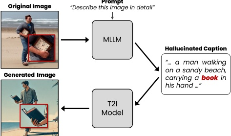

# ConVis: Contrastive Decoding with Hallucination Visualization for Mitigating Hallucinations in Multimodal Large Language Models

Yejì Park $ ^{*1} $, Deokyeong Lee $ ^{*1} $, Junsuk Choe $ ^{\dagger1} $, Buru Chang $ ^{\dagger2} $

 $ ^{1} $Sogang University

 $ ^{2} $Korea University

{yjparkm, plmft, jschoe}@sogang.ac.kr, buru_chang@korea.ac.kr

## Abstract

Hallucinations in Multimodal Large Language Models (MLLMs) where generated responses fail to accurately reflect the given image pose a significant challenge to their reliability. To address this, we introduce ConVis, a novel training-free contrastive decoding method. ConVis leverages a text-to-image (T2I) generation model to semantically reconstruct the given image from hallucinated captions. By comparing the contrasting probability distributions produced by the original and reconstructed images, ConVis enables MLLMs to capture visual contrastive signals that penalize hallucination generation. Notably, this method operates purely within the decoding process, eliminating the need for additional data or model updates. Our extensive experiments on five popular benchmarks demonstrate that ConVis effectively reduces hallucinations across various MLLMs, highlighting its potential to enhance model reliability.

## Introduction

Multimodal Large Language Models (MLLMs) (Dai et al. 2023; Liu et al. 2024b) are advanced language models capable of understanding both images and text, such as image captioning and visual question answering (VQA). While MLLMs have achieved significant success that utilize both visual and textual information, the issue of hallucination, where the models generate responses that do not align with the given image, has greatly undermined their reliability (Liu et al. 2023a; Sun et al. 2024). This problem poses a significant obstacle to adopting MLLMs in critical fields where reliability is crucial. For instance, in medical applications, it could lead to incorrect diagnoses (Liu et al. 2023b), while in MLLM-based autonomous systems, it might result in erroneous interpretations (Shao et al. 2024).

Recent research has been actively conducted to address this. WoodPecker (Yin et al. 2023) and LURE (Zhou et al. 2024) reduce hallucinations by post-processing the generated responses. Datasets such as LRV-Instruction (Liu et al. 2023a) and RLHF-V (Yu et al. 2024) have been proposed to mitigate hallucinations through instruction tuning of MLLMs. However, these studies often rely on external

Figure 1: The text-to-image model visualizes hallucinations (e.g., book') in the semantically reconstructed images based on the hallucinated caption, exhibiting differences (e.g., missing clock') from the original image.

APIs like GPT-3.5, require costly human feedback collection, and necessitate additional training of MLLMs.

In contrast, this paper focuses on decoding strategies that reduce hallucinations by intervening solely in the decoding process, without the need for additional data or model training. The following studies fall into this category: OPERA (Huang et al. 2024) imposes penalties on token generation that does not reference visual tokens. VCD (Leng et al. 2024) creates contrasting distributions using distorted images to reduce the model's reliance on statistical biases and priors that lead to hallucinations. HALC (Chen et al. 2024) corrects hallucinations by leveraging cues provided by visual information from various fields of view.

In this study, we propose a contrastive decoding method called ConVis (Contrastive Decoding with Hallucination Visualization), which can be applied to any existing MLLM without additional training. Inspired by the previous work (Kim et al. 2024), ConVis leverages text-to-image (T2I) generation models, specifically Hyper-SDXL (Ren et al. 2024), to capture visual contrast signals. The process begins with the MLLM generating a caption for the input image, after which the T2I model reconstructs an image based on this caption. As shown in Figure 1, if the generated caption contains hallucinations (e.g., a book'), there will be visual discrepancies between the original and reconstructed