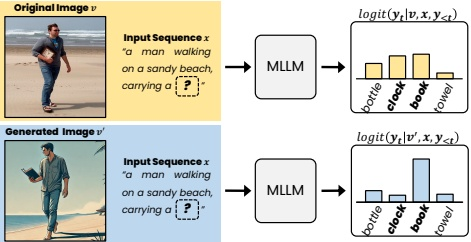

Figure 2: The original and reconstructed image generate the contrastive logit distribution for the hallucinated tokens (e.g., ‘book’). The reconstructed image tends to amplify the logits of tokens corresponding to the visualized hallucination.

images (e.g., a missing clock'). ConVis then uses the original and reconstructed images to compare the probability distributions (Figure 2), capturing visual contrast signals that highlight hallucinations. Based on these signals, ConVis penalizes the generation of hallucinations during the decoding process, reducing the hallucinations.

To validate the effectiveness of ConVis, we conduct experiments across five benchmarks: CHAIR (Rohrbach et al. 2018), HallusionBench (Guan et al. 2024), POPE (Li et al. 2023c), MME (Fu et al. 2023) and LLaVA-Bench (Liu et al. 2024b). The results consistently demonstrate that our decoding method reduces hallucinations while maintaining overall response generation performance across various MLLMs, including LLaVA-1.5 (Liu et al. 2024a), MiniGPT-4 (Zhu et al. 2024), and mPLUG-Owl2 (Ye et al. 2024).

Our contributions can be summarized as follows: (1) Propose ConVis, a novel contrastive decoding method that visualizes hallucinations using a T2I model. To the best of our knowledge, this is the first time a T2I model has been employed to mitigate hallucinations through a decoding strategy. (2) Conduct extensive experiments to validate the effectiveness of ConVis in reducing hallucinations. (3) Provide insights into how T2I models can serve as a valuable source of visual contrastive signals in decoding methods aimed at mitigating hallucinations.

## Related Work

## Multimodal Large Language Models

The emergence of LLMs has revolutionized the paradigm of Natural Language Processing (NLP). The significant success of LLMs in the NLP field has led to research on leveraging LLMs in the visual domain. Consequently, MLLMs that can simultaneously handle visual and textual data have recently been proposed. Specifically, to process visual information, LLaVA (Liu et al. 2024b) uses a CLIP vision encoder (Radford et al. 2021) and a linear layer to project images into the LLM's input embedding space. MiniGPT-4 (Zhu et al. 2024) employs a Q-Former (Li et al. 2023a) and a linear layer to project images into the LLM's input embedding space. Additionally, mPLUG-Owl2 (Lai et al. 2024) introduces a modality-adaptive module that preserves modality-specific features, allowing the model to excel in both multimodal and NLP tasks.

However, despite these efforts, misalignment between modalities can still occur for various reasons, leading to generated responses that do not correspond to the visual information. This phenomenon, known as hallucination, undermines the reliability of MLLMs and poses a significant challenge to their application in real-world scenarios.

## Hallucination Mitigation

To address the hallucination problem in MLLMs, several studies have been proposed recently. LURE (Zhou et al. 2024) and Woodpecker (Yin et al. 2023) employ post-processing methods to revise generated responses, either by training a revisor or using GPT-3.5-turbo (Brown et al. 2020). Fine-tuning approaches (Liu et al. 2023a; Yu et al. 2024) mitigate hallucinations through instruction tuning with additional data, but they require significant data collection and training resources. Given the large number of parameters in MLLMs, this is computationally inefficient.

Therefore, methods for improving the decoding process have recently received great attention due to the advantage that they do not require additional training. Specifically, OPERA (Huang et al. 2024) explores aggregation patterns that cause hallucinations. OPERA utilizes this insight to suppress the generation of tokens that exhibit these patterns. VCD (Leng et al. 2024) leverages the characteristic that the model tends to prioritize prior knowledge over visual information when responding to distorted images. As a result, the responses to the distorted image and the original image show significant differences in hallucinated tokens, and VCD contrasts these to mitigate the hallucinations. HALC (Chen et al. 2024) observes that when images with varying fields of view are input into the MLLM, the probability changes for ground truth tokens are much greater than for hallucinated tokens. This observation helps identify visual context candidates that clearly depict objects, and by contrasting these candidates, HALC reduces hallucinations.

Unlike existing techniques, we propose a new decoding method that utilizes a T2I model. Specifically, our approach visualizes hallucinations in the initially generated caption using a T2I model, then contrasts the responses generated from the reconstructed image with those from the original image. Through this process, we contrast distributions of the hallucinated tokens and effectively mitigate hallucinations.

## Methodology

## Preliminaries

Response Generation. The MLLM generates a response y corresponding to a given input image v and instruction text x. The input image is projected into visual tokens through an image encoder, and these tokens, along with the tokens corresponding to the instruction text, are fed into the LLM. The response is generated through autoregressive decoding according to the following equation:

 $$ y_{t}\sim p_{\theta}(\cdot|v,x,y_{<t})\propto\exp\left(f_{\theta}(\cdot|v,x,y_{<t})\right), $$ 