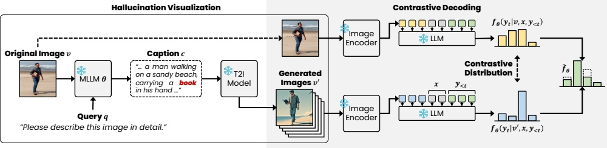

Figure 3: The original and generated image produce the contrastive distribution for the hallucinated tokens (e.g., ‘book’). The generated image tends to amplify the logits of tokens corresponding to the visualized hallucination.

where  $ \theta $ denotes the parameters of the MLLM,  $ y_t $ represents the  $ t $-th token of response, and  $ y_{<t} $ is the sequence of tokens generated up to time  $ t $.  $ f_\theta $ denotes the logit distribution generated by the MLLM. Hallucination refers to the phenomenon where the output  $ y $ generated by the MLLM does not correspond to the input image  $ v $. This study focuses on mitigating hallucinations while maintaining the overall performance of the MLLM as a language model.

Text-to-Image Generation. The core component of ConVis is the T2I model that generates images based on a given query. The goal of the T2I model is to create an image that accurately depicts the query. Among the recently proposed T2I models, we utilize Hyper-SDXL (Ren et al. 2024), an enhanced version of Stable Diffusion (Ho, Jain, and Abbeel 2020), which has demonstrated excellent T2I performance. The diffusion-based Hyper-SDXL model begins with a pure noise and progressively reconstructs it through an iterative reverse diffusion process which ultimately results in the generated image  $ v_{0}^{\prime} $.

## Hallucination Visualization

We hypothesize that the T2I model can help mitigate hallucinations by providing visual contrast signals during the decoding process. If the T2I model receives a caption generated by the MLLM that contains hallucinations, it will faithfully visualize those hallucinations in the generated image. We refer to this process as hallucination visualization.

To implement this, ConVis first generates an initial caption c for the original image v using a simple instruction text that directs the MLLM to describe the image. This process is illustrated in Figure 2. The T2I model then takes the caption c as a query and generates an image  $ v' $ based on it. If the caption contains hallucinations, these will be faithfully visualized in the generated image  $ v' $. Conversely, if the initial caption is accurate and free of hallucinations, the generated image will be semantically similar to the original image.

Diversity of Generated Images. Given that the current T2I model may not generate images that fully align with the captions, we address this limitation by increasing the diversity of the generated images using the following approaches: (1) We first generate a diverse set of n captions using Nucleus Decoding (Holtzman et al. 2020) instead of Greedy Decoding. (2) Then, the T2I model uses these n captions to generate n corresponding images. This approach increases coverage of the various potential hallucinations that the MLLM might generate by diversifying the captions. Additionally, by using multiple images instead of a single one, we enhance the robustness of our method against the T2I model's potential misalignment between the caption and the generated image due to its imperfect performance.

We have found these approaches to be effective, with detailed results available in the experiment section.

## Contrastive Decoding

Hallucinations in captions cause visual differences between the original image v and the generated image v'. We mitigate these hallucinations by capturing the visual contrast signals from these differences. To achieve this, during the decoding process, we utilize both the original image v and the n generated images to produce the logit distribution for each image. The final contrastive logit distribution  $ \hat{f}_{\theta} $ is derived by averaging the contrastive logit distributions between the original image and each generated image as follows:

 $$ \hat{f}_{\theta}=\frac{1}{n}\sum_{i=1}^{n}\Big((1+\alpha)f_{\theta}(\cdot|v,x,y_{<t})-\alpha f_{\theta}(\cdot|v_{i}^{\prime},x,y_{<t})\Big), $$ 

where  $ \alpha $ is a hyperparameter that controls the strength of the difference between the logit distributions from the original and generated images. The contrastive logit distribution  $ \hat{f}_{\theta} $ is used to generate the response y. For tokens associated with hallucinations, the contrastive logit distribution is significantly amplified compared to other tokens, allowing us to penalize these tokens and reduce the hallucinations.

Note that, Equation 2 is similar to the contrastive decoding methods used in VCD (Leng et al. 2024) and HALC (Chen et al. 2024). However, our method is distinguished from existing approaches by directly capturing visual contrastive signals from the hallucinations visualized by the T2I generative model.

## Experiments

Benchmarks. To evaluate the performance of our method, we conduct experiments on three benchmarks to evaluate the