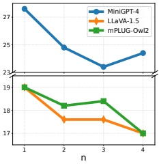
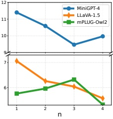
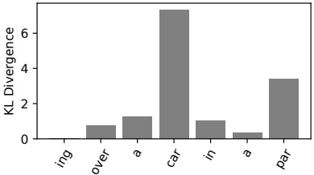

<table border=1 style='margin: auto; word-wrap: break-word;'><tr><td rowspan="2">T2I Model</td><td rowspan="2">CLIPScore  $ \uparrow $</td><td colspan="2">LLaVA-1.5</td><td colspan="2">mPLUG-Owl2</td><td colspan="2">MiniGPT-4</td></tr><tr><td style='text-align: center; word-wrap: break-word;'>CHAIRs  $ \downarrow $</td><td style='text-align: center; word-wrap: break-word;'>CHAIRI  $ \downarrow $</td><td style='text-align: center; word-wrap: break-word;'>CHAIRs  $ \downarrow $</td><td style='text-align: center; word-wrap: break-word;'>CHAIRI  $ \downarrow $</td><td style='text-align: center; word-wrap: break-word;'>CHAIRs  $ \downarrow $</td><td style='text-align: center; word-wrap: break-word;'>CHAIRI  $ \downarrow $</td></tr><tr><td style='text-align: center; word-wrap: break-word;'>Hyper-SD1.5</td><td style='text-align: center; word-wrap: break-word;'>30.87</td><td style='text-align: center; word-wrap: break-word;'>20.2</td><td style='text-align: center; word-wrap: break-word;'>6.6</td><td style='text-align: center; word-wrap: break-word;'>19.4</td><td style='text-align: center; word-wrap: break-word;'>6.4</td><td style='text-align: center; word-wrap: break-word;'>28.2</td><td style='text-align: center; word-wrap: break-word;'>11.8</td></tr><tr><td style='text-align: center; word-wrap: break-word;'>SDXL-Turbo</td><td style='text-align: center; word-wrap: break-word;'>32.33</td><td style='text-align: center; word-wrap: break-word;'>18.8</td><td style='text-align: center; word-wrap: break-word;'>6.6</td><td style='text-align: center; word-wrap: break-word;'>20.2</td><td style='text-align: center; word-wrap: break-word;'>6.68</td><td style='text-align: center; word-wrap: break-word;'>25.2</td><td style='text-align: center; word-wrap: break-word;'>9.9</td></tr><tr><td style='text-align: center; word-wrap: break-word;'>Hyper-SDXL</td><td style='text-align: center; word-wrap: break-word;'>32.85</td><td style='text-align: center; word-wrap: break-word;'>17</td><td style='text-align: center; word-wrap: break-word;'>5.6</td><td style='text-align: center; word-wrap: break-word;'>17</td><td style='text-align: center; word-wrap: break-word;'>5.3</td><td style='text-align: center; word-wrap: break-word;'>24.4</td><td style='text-align: center; word-wrap: break-word;'>10.0</td></tr></table>

Table 6: Our performance when differentiating the T2I models for visualizing hallucinations. We generate captions with nucleus sampling and set max new token for 64 and generate the image with those captions. Inference step for diffusion set to be all 1.

<table border=1 style='margin: auto; word-wrap: break-word;'><tr><td style='text-align: center; word-wrap: break-word;'>Captioning by</td><td style='text-align: center; word-wrap: break-word;'>LLaVA-1.5</td><td style='text-align: center; word-wrap: break-word;'>mPLUG-Owl2</td><td style='text-align: center; word-wrap: break-word;'>MiniGPT-4</td></tr><tr><td colspan="4">CHAIR $ _{S} $  $ \downarrow $</td></tr><tr><td style='text-align: center; word-wrap: break-word;'>Greedy Search</td><td style='text-align: center; word-wrap: break-word;'>19.4</td><td style='text-align: center; word-wrap: break-word;'>19.4</td><td style='text-align: center; word-wrap: break-word;'>27.2</td></tr><tr><td style='text-align: center; word-wrap: break-word;'>Nucleus Sampling</td><td style='text-align: center; word-wrap: break-word;'>18.8</td><td style='text-align: center; word-wrap: break-word;'>15.2</td><td style='text-align: center; word-wrap: break-word;'>24.4</td></tr><tr><td colspan="4">CHAIR $ _{I} $  $ \downarrow $</td></tr><tr><td style='text-align: center; word-wrap: break-word;'>Greedy Search</td><td style='text-align: center; word-wrap: break-word;'>6.6</td><td style='text-align: center; word-wrap: break-word;'>6.4</td><td style='text-align: center; word-wrap: break-word;'>11.6</td></tr><tr><td style='text-align: center; word-wrap: break-word;'>Nucleus Sampling</td><td style='text-align: center; word-wrap: break-word;'>6.7</td><td style='text-align: center; word-wrap: break-word;'>5.1</td><td style='text-align: center; word-wrap: break-word;'>10.3</td></tr></table>

Table 7: Comparison of performance using a single image  $ (n = 1) $ generated by two different decoding strategies, Greedy search and Nucleus sampling.

(a) CHAIR $ _{S} $ Score

(b) CHAIR $ _{I} $ Score

Figure 4: Effect of the number of images with different captions.

tion by generating diverse images. Specifically, we use Nucleus sampling, which is known for producing more varied responses than Greedy search, to generate multiple captions. These captions are then utilized to generate images.

To evaluate the effectiveness of this strategy, we analyze how caption diversity impacts hallucination reduction. First, we compare the CHAIR scores of the final responses when using Greedy search and Nucleus sampling during the image generation stage. In this experiment, we limit the number of generated images to one and compare which decoding strategy performs better. As shown in Table 7, Nucleus sampling outperforms Greedy search, demonstrating its potential to generate more diverse captions. Furthermore, in Figure 4, we investigate how the number of generated images from different captions using Nucleus sampling affects CHAIR scores. We observe that the number of images n increases, both CHAIRs and CHAIR scores improve, confirming that using multiple reconstructed images, rather than

Figure 5: KL divergence between output distributions across each decoding step when the MLLM is provided with the images and caption from Figure 6 (a). The KL divergence is significantly elevated for the hallucinated token “car”.

a single image, is more effective for improving performance. These findings validate our design choice of utilizing Nucleus sampling and multiple captions for image generation.

Impacts of Image Generation Quality. To investigate the impact of generated image quality on hallucination mitigation, we evaluate the performance of our method using various text-to-image (T2I) models. Table 6 presents the generation quality (CLIPScore) of the T2I models alongside their corresponding CHAIR scores. We compare three T2I models: Hyper-SD1.5 (Ren et al. 2024), SDXL-Turbo (Sauer et al. 2023), and Hyper-SDXL (Ren et al. 2024), with the inference step fixed at 1.

The results indicate a clear trend: as the CLIPScore improves, so does the CHAIR score. Notably, SDXL-Turbo consistently outperforms Hyper-SD1.5 across all backbones, except for mPLUG-Owl2. Moreover, Hyper-SDXL significantly outperforms Hyper-SD1.5 in all cases. These findings suggest that using higher-quality T2I models, which are better aligned with the original captions, can more effectively mitigate hallucination issues. Consequently, we believe that as more advanced T2I models are developed, the performance of our method will continue to improve.

Qualitative Analysis. Figure 5 shows the KL divergence between output distributions at each decoding step when the images and caption from Figure 6 (a) are provided to the MLLM. We observe that the KL divergence is high for the hallucinated token car, while non-hallucinated tokens exhibit lower KL divergence. This indicates that the generated image can produce visual contrastive signals for hallucinated tokens when compared to the original image. This supports our argument that the differences between the original