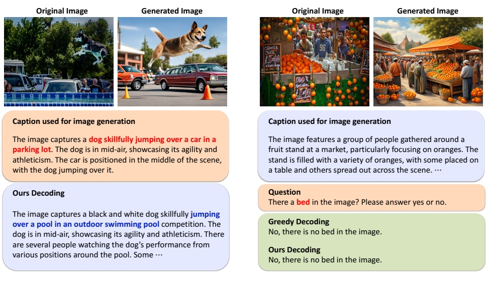

## Caption used for image generation

The image captures a dog skillfully jumping over a car in a parking lot. The dog is in mid-air, showcasing its agility and athleticism. The car is positioned in the middle of the scene, with the dog jumping over it.

## Ours Decoding

The image captures a black and white dog skillfully jumping over a pool in an outdoor swimming pool competition. The dog is in mid-air, showcasing its agility and athleticism. There are several people watching the dog's performance from various positions around the pool. Some ...

## Caption used for image generation

(a)

The image features a group of people gathered around a fruit stand at a market, particularly focusing on oranges. The stand is filled with a variety of oranges, with some placed on a table and others spread out across the scene.

Question

There a bed in the image? Please answer yes or no.

Greedy Decoding

No, there is no bed in the image.

Ours Decoding

No, there is no bed in the image.

(b)

Figure 6: Qualitative samples using LLaVA-1.5 for backbone model. (a) shows an example that T2I model faithfully generate the images that depicts the hallucination in the caption. (e.g., jumping over a car) (b) is an example of our limitation in VQA tasks, which there can be a misalignment between visualized hallucination and actual main subject of question.

inal and generated images are primarily influenced by the hallucinated tokens.

To more clearly demonstrate how our method mitigates multimodal hallucinations, we present an example in Figure 6 (a), illustrating the process from the initial hallucinated caption to the generated image, followed by the contrastive decoding result. Specifically, for an image of a dog jumping into a pool, the MLLM incorrectly describes the scene as “a dog jumping over a car in a parking lot.” Using this caption, the T2I model generates a reconstructed image that faithfully visualized the hallucinated content. By contrasting the distributions of the reconstructed and original images during decoding, our method effectively reduces hallucinations.

Limitations. One of the key limitations of our approach is its strong dependence on T2I generation models. This reliance may hinder effectiveness in tasks like VQA, where the generated captions can sometimes contain hallucinations that deviate significantly from the specific question. This limitation is particularly evident in our experiments with the POPE benchmark, where the performance gain is not as significant as expected. Regarding questions about the presence of specific objects, if the object in question is not related to the hallucinations generated by the caption, visualizing with a T2I model may not sufficiently reflect the information needed for the VQA task. In Figure 6 (b), a question about the presence of a bed in an original image where people are looking at fruits might not be well served by the reconstructed image. This indicates the effectiveness of our method may decrease for certain type of questions.

## Conclusion

Currently, our technique employs a fixed prompt for image captioning. However, we believe that adapting the prompt to respond more specifically to the given question could mitigate this issue. We plan to explore this adaptive approach in future work.

In this paper, we presented ConVis, a novel contrastive decoding method designed to mitigate hallucinations in MLLMs. By utilizing a T2I generation model, our approach effectively visualizes hallucinations and contrasts probability distributions between the original and reconstructed images. This process allows for the penalization of hallucinated content during the decoding phase, all without the need for additional data or model retraining.

Our extensive experiments across five benchmarks, including CHAIR, HallusionBench, and LLaVA-Bench, demonstrated that ConVis consistently reduces hallucinations while preserving the core language model capabilities of MLLMs. The method achieves competitive or superior performance compared to existing techniques in various categories, validating its effectiveness in enhancing the reliability of MLLM outputs.