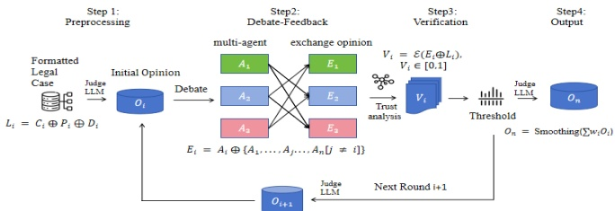

Figure 1: A brief introduction of Debate-Feedback Structure

## 2 Related Work

Legal documents are characterized by lengthy texts and complex logic, which has led prior research to focus on two key approaches to address these challenges: training legal LLM and using retrieval augmentation.

### 2.1 Legal LLM

In-context Learning(ICL) is a learning paradigm widely applied in large language models (LLMs) by using a set of context examples to guide predictions during reasoning (Dong et al., 2024; Liu et al., 2021; Gutierrez-Pachas et al., 2022; Min et al., 2022). However, due to the often extensive length of legal texts, naive ICL methods are constrained by LLM input length limits. As a result, LegalAI solutions typically combine ICL with fine-tuning or pretraining of models to overcome these limitations. For instance, LegalBERT (Chalkidis et al., 2019) fine-tunes BERT on legal datasets, achieving strong results in legal text classification and provision retrieval. Similarly, Lawformer (Xiao et al., 2021) handles lengthy Chinese legal documents, while CaseLaw-BERT (Paul et al., 2023), fine-tuned on case law datasets, enhances legal case retrieval and judgment prediction. Despite their success, these approaches rely heavily on large, domain-specific datasets, which can limit their applicability across different legal systems and languages.

### 2.2 Retrieval Augmentation

Retrieving relevant legal precedents—court judgments or legal decisions from previous cases—is a mainstream approach to assist LLMs in making predictions, especially in overcoming the challenge of lengthy texts. By providing recommended samples, this method guides the LLM's reasoning process more effectively (Zhong et al., 2020; Huang et al., 2021). Ma et al. introduced a framework that deeply integrates legal precedents into judgment prediction (Wu et al., 2023), combining the reasoning capabilities of LLMs with domain-specific models to enable more accurate and context-aware predictions. Similarly, Caseformer (Su et al., 2024) employs a pre-training strategy that emphasizes distinctions between cases, enhancing case retrieval performance. Although retrieval augmentation improves the handling of long texts, it still relies on the availability of large datasets, and its reliance on specific legal systems and languages can limit broader applicability across different jurisdictions.

## 3 Methodology

In this section, we first systematically introduce our Feedback-Debate model, followed by an analysis of the limitations of the general debate architecture in specific legal scenarios, along with proposed solutions to address these shortcomings.

Overview Algorithm[1] presents the pseudo code for the debate-feedback framework in binary classification. The input is a preprocessed legal event text, labeled as S, and the main language model (LM) plays the role of the judge, predicting the probability of a legal judgment,  $ LM : S \rightarrow [0,1] $. Two agents,  $ t_{ne} $ and  $ t_{po} $, debate from opposing perspectives, providing inputs to refine the judgment. Each debate round involves these agents exchanging and debating their positions, with n defining the number of iterations.

The assistant model  $ \mathcal{E} $ evaluates the reliability of the agents' arguments and outputs a probability. If the reliability exceeds a threshold, the main LM adjusts its prediction by weighting the latest information, otherwise it defaults to the initial prediction. The final decision is smoothed over all rounds to produce a stable outcome. (Note that notation  $ \oplus $ does not mean xor, but rather combination in a non-additive sense.)