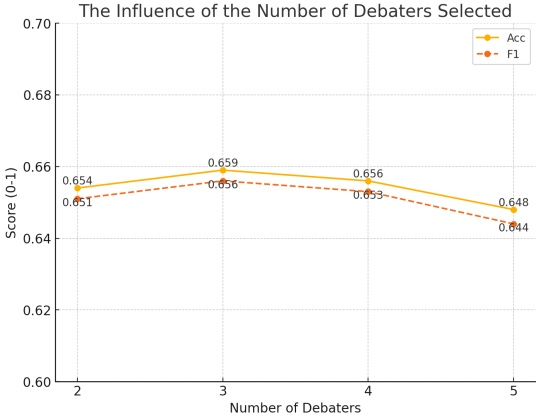
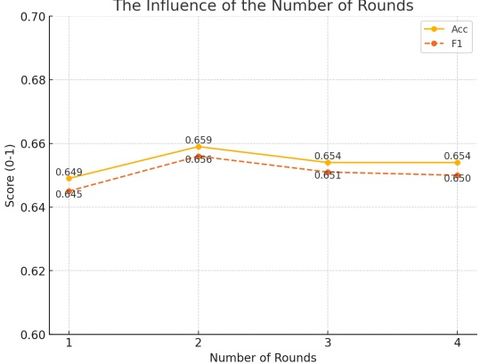

## A Appendix

1. The choices about different numbers of rounds and debaters on the debate-feedback model (without assistant model).

As illustrated in Figures[2] and Figures[3], while the number of debaters and debate rounds may vary depending on the specific task, generally, using 2-4 debaters and conducting 2-3 rounds often yields favorable results. This configuration can serve as a useful reference for readers, helping to avoid unnecessary computational overhead.

Figure 2: Influence of the number of debaters selected.

Figure 3: Influence of the number of rounds selected.

2. A sample of Debate-Feedback Structure with one round and three debaters in binary classification task, table[4].