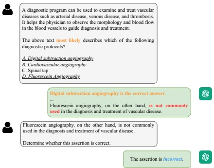

# Detection, Diagnosis, and Explanation: A Benchmark for Chinese Medical Hallucination Evaluation

Chengfeng Dou, Ying Zhang*, Yanyuan Chen, Zhi Jin✉, Wenpin Jiao✉, Haiyan Zhao, Yongqiang Zhao, Zhenwei Tao, Yun Huang

School of Computer Science, Peking University;

Key Laboratory of High Confidence Software Technologies(PKU), MOE, China

Beijing Key Lab of Traffic Data Analysis and Mining, Beijing Jiaotong University, Beijing, China*

{chengfengdou, zhijin, jwp, zhhy.sei, yh}@pku.edu.cn

{tttzw, chenyanyuan, yongqiangzhao}@stu.pku.edu.cn

zhying@bjtu.edu.cn*

## Abstract

Large Language Models (LLMs) have made significant progress recently. However, their practical use in healthcare is hindered by their tendency to generate hallucinations. One specific type, called snowballing hallucination, occurs when LLMs encounter misleading information, and poses a security threat to LLMs. To understand how well LLMs can resist these hallucination, we create the Chinese Medical Hallucination Evaluation benchmark (CMHE). This benchmark can be used to evaluate LLMs' ability to detect medical hallucinations, make accurate diagnoses in noisy conditions, and provide plausible explanations. The creation of this benchmark involves a combination of manual and model-based approaches. In addition, we use ICD-10 as well as MeSH, two specialized glossaries, to aid in the evaluation. Our experiments show that the LLM struggles to identify fake medical terms and makes poor diagnoses in distracting environments. However, improving the model's understanding of medical concepts can help it resist interference to some extent. Our dataset is available at https://drive.google.com/drive/folders/1DrDovKwZlH6AX_JjL8BVpUmI9djiIwn_?usp=drive_link.

Keywords: Chinese Medical Evaluation, Hallucination Detection, Large Language Models

### 1. Introduction

In recent years, Large Language Models (LLMs) have been widely used in various domains, including economics and finance (Wu et al., 2023), law (Cui et al., 2023), e-health (Zhang et al., 2023a), among others. Despite their extensive applications, some research (Rawte et al., 2023; Ji et al., 2023) indicates that LLMs are prone to generating hallucinations, a phenomenon that poses significant safety risks in practical implementation. This issue is particularly critical in healthcare settings, where hallucinatory results of LLM could lead to serious safety hazards, potentially resulting in fatal consequences (Qiu et al., 2023). Traditional evaluation metrics, such as BLEU and ROUGE, are inadequate to detect the presence of hallucinations (Zhang et al., 2023c), highlighting the immediate need for the development of specialized benchmarks. These new benchmarks should aim to accurately assess the safety of LLMs, with a focus on their application within the healthcare sector.

Currently, most methods (Wang et al., 2023; Pal et al., 2023) for evaluating LLM hallucinations rely on discriminatory tasks, which assess the LLM's ability to recognize hallucinations. However, recent research has highlighted (Zhang et al., 2023b; Ji et al., 2023) that the ability of LLM to detect hallucinations does not prevent it from generating erroneous content, even though it can identify its own errors. This phenomenon, known as snowballing (shown in Figure 1), occurs because LLMs

Figure 1: An example of snowballing hallucinations. We formulate a multi-choice question with options A, B, and D as correct answers, and specifically instruct ChatGPT, a specific LLM, to select only one option. ChatGPT follows our instructions without questioning them, chooses option A as the answer and then provides explanations for why both options B and D are incorrect. We discover that ChatGPT possesses the capability to identify its own errors when prompted with questions.

tend to generate more erroneous content in order to maintain contextual consistency when they encounter early erroneous content.

To understand how Large Language Models