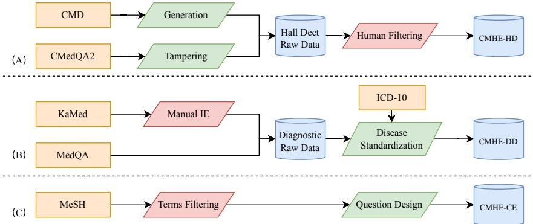

Figure 2: Overview of the CMHE dataset construction, which contains three components (A), (B), and (C) corresponding to CMHE-HD, CMHE-DD, and CMHE-CE, respectively. Note that orange color denotes the data source and blue color denotes the generated data. Parallelograms represent operations, where the red ones represent operations involving humans, while the green ones represent operations involving machines.

purpose. To assess the model's ability to differentiate between factual and hallucinatory statements, multiple-choice questions are frequently employed. For example, HaluEval (Li et al., 2023) employs ChatGPT to generate a substantial amount of high-quality hallucinations and then asks the model to determine whether a statement contains hallucinatory information or not. On the other hand, FACTOR (Muhlgay et al., 2023) requires the LLM to assign higher likelihood scores to factual statements compared to non-factual statements. However, the main difficulty in hallucination evaluation is lack of the intact evaluation system, since the confidence obtained by ROUGE and BLUE is not a direct evaluation of hallucinations.

#### 2.3. Medical Hallucination Test

The medical field currently heavily relies on medical exams to assess hallucinations. These exams primarily evaluate the ability of models to identify hallucinations. One example of such an approach is Med-halt (Pal et al., 2023), which combines various medical datasets such as MEDMCQA (Pal et al., 2022) and Head-QA (Vilares and Gómez-Rodríguez, 2019) to generate test questions for assessing medical hallucinations. Another dataset, CMB (Wang et al., 2023), combines the Chinese Occupational Physician Examination to evaluate the level of knowledge mastery of the models. The CMB dataset also includes a conversation test task that undergoes evaluation by both experts and GPT-4. However, this evaluation is more costly.

In contrast to conventional medical hallucination evaluation datasets, our evaluation tasks encompass a wider range of diversity. These tasks incorporate data from real-world consultation scenarios, enabling a more comprehensive evaluation of the hallucination processing ability of LLMs in noisy environments.

### 3. The CMHE Benchmark

In this paper, we introduce three tasks for evaluating Chinese Medical Hallucination: hallucination detection (CMHE-HD), disease diagnosis (CMHED), and concept explaining (CMHE-CE). We will provide detailed explanations of each task, focusing on the task definition, the creation of the dataset and data analysis.

#### 3.1. Hallucination Detection

Task Definition The CMHE-HD dataset was used to evaluate the model's ability to recognize whether a doctor's response contained misinformation. We prompt the model to assess the doctor's response in a patient-doctor conversation and expect it to generate either a "Yes" or a "No" as the output. The task instruction is shown below. For this task, we use the accuracy as an evaluation metric.

## Instruction:

You are a medical AI assistant. Read the following dialog to determine whether the doctor’s answers contain untrue or misleading information.

[Single-round dialogue]

Answer: [Yes/No]