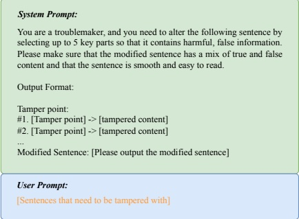
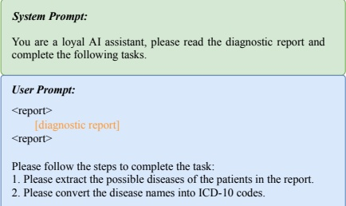
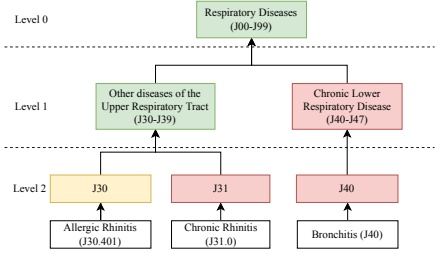

Figure 3: Instructions of dataset construction for hallucination testing.

Dataset Creation As illustrated in the initial section of Figure 2, the CMHE-HD dataset is sourced from two datasets, CMD (Toyhom, 2023), and cMedQA2 (Zhang et al., 2018). CMD is a Chinese dataset focused on medical question answering, originating from six hospital departments and comprising 792,099 instances. On the other hand, cMedQA2 is an updated version of the dataset for Chinese community medical question answering, containing 108,000 questions and 203,569 answers. From cMedQA2, we randomly selected 1,000 samples as the hallucination-free samples. Subsequently, we created the hallucinated samples using two distinct methods:

Generation Method: We leveraged the Llama2-7B model (Touvron et al., 2023) to generate unlabeled data. Initially, the model was fine-tuned with the cMedQA2 dataset, followed by predictions on 5000 selected data points from the CMD dataset to produce the raw data for this study. Subsequently, these data were evaluated by seven medical experts with specialties in internal medicine, surgery, gynecology, and pediatrics. Each expert assessed the rationality of the samples using a scale of 1 to 7. To ensure a complete evaluation, each sample was reviewed by at least two experts. This meticulous process led to the identification of 387 samples containing hallucinations, determined by the lowest assigned ratings.

Tampering Method: This approach involved the alteration of cMedQA2, executed by ChatGPT following the specific guidelines outlined in Figure 3. The authenticity of the ChatGPT manipulations was verified by three medical professionals, culminating in the identification of 613 samples characterized by hallucinatory content.

Data Analysis Upon analyzing the samples produced by both strategies, we observed a distinct phenomenon. Llama2, hindered by its absence of

Figure 4: Instructions for extracting ICD-10 codes.

Figure 5: An example of how to evaluate using the ICD-10 system with 3-level categories. Let's assume that the correct answer to the question is Allergic Rhinitis. Model A predicted Chronic Rhinitis and Model B predicted Bronchitis. According to the ICD-10 grading scale, Model A correctly answered at level-0 and level-1, while Model B only answered correctly at level-0.

pre-training in Chinese, often generates fabricated medical terms. However, the content it produces maintains reasonable contextual logic. In contrast, samples from ChatGPT do not include any fabricated medical terms, but their contextual logic frequently contradicts itself. Consequently, we posit that these two types of hallucination samples complement each other and enhance the completeness of the evaluation of LLMs.

#### 3.2. Disease Diagnosis

Task Definition According to the CMHE-DD dataset, our objective is to evaluate the effectiveness of LLMs in predicting the specific disease with which a patient is afflicted. The instruction used for this task is shown below.

## Instruction:

You are a medical AI assistant. Read the patient's information and determine what disease the patient is most likely to have.

[Patient information]