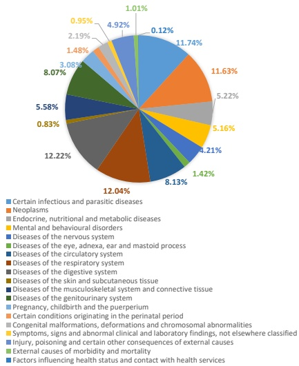

## Answer: [Diagnostic result]

Existing assessments often gauge accuracy by relying on the names of diseases, a method fraught with challenges due to the inconsistent and varied terminology employed to describe identical medical conditions. To navigate these obstacles, we have integrated the International Classification of Diseases, Tenth Revision (ICD-10) system into our evaluation framework. The ICD-10 classification catalog, developed by the World Health Organization, is a globally recognized standard for the coding and classification of diseases, symptoms, and medical procedures. It provides a detailed framework for the systematic organization and reporting of health information in different clinical environments and countries, catering to epidemiological studies, health management, and clinical applications.

Our methodology begins with the extraction of disease names from the diagnostic outputs generated by ChatGPT. Then these names are accurately matched to their respective ICD-10 codes, as outlined in Figure 4. This strategy guarantees a standardized and precise comparison with the responses provided. Furthermore, to accurately assess the similarity between diseases, we utilize the hierarchical structure of the ICD-10 system, as shown in Figure 5. This hierarchical approach enables us to examine diseases at three distinct levels of classification granularity, enriching our analysis of diagnostic accuracy. Given the possibility that patients with multiple diseases present, we use the Micro-F1 score as our evaluative metric. This choice allows for a nuanced assessment of the diagnostic precision of our model, accommodating the complexities of real-world medical scenarios.

Dataset Creation As illustrated in Figure 2 (B), the CMHE-DD dataset is synthesized by merging two Chinese medical datasets: KaMed (Li et al., 2021) and MedQA (Jin et al., 2021). KaMed was utilized to produce instances containing interference information, while MedQA-USMLE was employed for instances lacking interference information.

The KaMed dataset contains over 63k Chinese Medical dialogues covering various diseases in about 100 hospital departments. We selected 10,000 dialogues for extension annotations. Firstly, we have assigned four annotators to extract key information from each dialogue. This includes crucial details such as the patient's age, gender, clinical symptoms, physical examinations, medical history, chief complaints, and the results of the disease diagnosis. Next, we used ChatGPT to convert the extracted information into natural language descriptions that fit in a medical conversation. Simultaneously, we have sought the expertise of three doctors to assess the completeness of the conversations and the accuracy of the disease predictions. From

Figure 6: The distributions of the CMHE-DD dataset on disease categories in ICD-10 system.

this evaluation, we have identified a subset of conversations that exhibit clear and accurate diagnostic ideas. Following the application of filters and selection criteria based on both key information and the quality of the conversations, we have obtained a total of 327 dialogues that are suitable for disease diagnosis purposes.

The MedQA-USMLE dataset comprises a set of multiple-choice OpenQA information intended for tackling medical issues. It was gathered from official medical licensing exams in the United States, Mainland China, and Taiwan. Each instance in the MedQA dataset includes a query, possible choices, supporting evidence, and the correct response. To assess its performance, a subset of 1,295 instances from Mainland China was carefully chosen.

Following the screening of the appropriate samples, we utilized ChatGPT to convert the disease names of the samples into ICD-10 codes. Furthermore, we performed manual proofreading to confirm the precision of the ICD-10 codes.

Data Analysis The CMHE-DD dataset comprises 867 distinct illnesses corresponding to 452 categories in the ICD-10 classification system. Out of these, 327 instances are drawn from the KaMed dataset, where each case can encompass one or more diseases. The remaining instances originate from the MedQA dataset, which exclusively contains cases with a single disease. On average, each disease's original description in the dataset