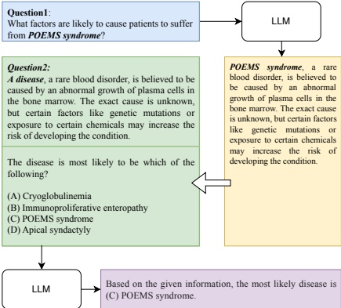

consists of 6.03 Chinese characters. Upon associating these descriptions with the ICD-10 codes, a specific category code is assigned as a label for each disease. The distribution of diseases in the CMHE-DD dataset is depicted in Figure 6.

#### 3.3. Concept Explanation

Task Definition The CMHE-CE dataset serves the purpose of evaluating the model's ability to refrain from producing misleading or fictitious information while elucidating medical concepts. To precisely measure the accuracy of the content generated by LLMs, we constructed the task form in the form of a self-familiar test (Luo et al., 2023; Dhuli-awala et al., 2023). This approach enables us to evaluate the model's proficiency in generating suitable interpretations of provided concepts, as well as its ability to generate corresponding concepts based on given explanations concurrently.

Figure 7 demonstrates the two-phase testing procedure of CMHE-CE. Initially, LLMs must respond to a provided question that centers on a single concept, like 'POEMS syndrome', and produce corresponding answers. Afterwards, the response generated needs refinement by substituting 'POEMS syndrome' with predefined mask labels $ ^{1} $. These adjusted answers are then employed as questions in the subsequent phase. In the second phase, LLMs are given the newly created questions and answer options as input. Their objective is to recognize and choose the specific concept 'POEMS syndrome' as the correct answer.

In the test described above, regardless of when the model produces text with inaccurate information, it will not pass the self-familiar test. This test is useful for assessing the model's capacity to generate accurate medical content.

Dataset Creation As illustrated in Part (C) of Figure 2, the CMHE-CE dataset is constructed using the Medical Subject Headings (MeSH) (Lipscomb, 2000). MeSH is a hierarchically organized terminology used to index biomedical information in databases such as PubMed  $ ^{2} $ and other resources from NLM  $ ^{3} $. MeSH offers two key advantages for our purposes. First, its comprehensive catalog encompasses a wide range of medical concepts, making it highly suitable for assessing the breadth of medical knowledge in LLMs. Second, MeSH organizes similar medical concepts under specific subcategories, allowing us to evaluate LLMs' ability

Figure 7: The overview of self-familiar test.

to differentiate between similar concepts based on the catalog structure.

To construct the data set, we initially used the Chinese version of MeSH and involved three medical experts to manually review and choose terms that are highly relevant to disease diagnosis. Subsequently, we implemented specific guidelines to craft queries (referred to as Question 1 in Figure 7) for each term, adapting them to the characteristics of the term. In the case of diseases, we explore aspects such as causes, symptoms, available treatments, and screening methods. For drugs, our focus was on pharmacokinetics, indications, potential side effects, and interactions with other medications. When evaluating screening protocols, we considered both the procedure itself and the specific disease under scrutiny. Finally, we proceeded to generate the appropriate choices (corresponding to the options in Question 2 of Figure 7) for each concept. To achieve this, we chose two concepts of MeSH that closely resembled the correct answer to create challenging options. In addition, we selected a third concept that diverged significantly from the correct answer category, making it an easily eliminated option. Our methodology defines the similarity between two concepts as the inverse of the shortest path length within the MeSH hierarchical tree.

Data Analysis We obtained a total of 9,909 concepts. Among these concepts, 71.6% are related to diseases, 17.7% are related to medicines, and the remaining concepts are associated with medical tests.