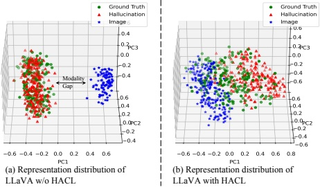
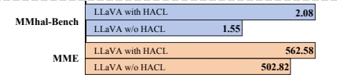

# Hallucination Augmented Contrastive Learning for Multimodal Large Language Model

Chaoya Jiang $ ^{1} $ Haiyang Xu $ ^{2*} $ Mengfan Dong $ ^{1} $ Jiaxing Chen $ ^{1} $ Wei Ye $ ^{1*} $ Ming Yan $ ^{2} $ Qinghao Ye $ ^{2} $ Ji Zhang $ ^{2} $ Fei Huang $ ^{2} $ Shikun Zhang $ ^{1} $

 $ ^{1} $National Engineering Research Center for Software Engineering, Peking University

 $ ^{2} $Alibaba Group

{jiangchaoya, wye}@pku.edu.cn, shuofeng.xhy@alibaba-inc.com

## Abstract

Multi-modal large language models (MLLMs) have been shown to efficiently integrate natural language with visual information to handle multi-modal tasks. However, MLLMs still face a fundamental limitation of hallucinations, where they tend to generate erroneous or fabricated information. In this paper, we address hallucinations in MLLMs from a novel perspective of representation learning. We first analyzed the representation distribution of textual and visual tokens in MLLM, revealing two important findings: 1) there is a significant gap between textual and visual representations, indicating unsatisfactory cross-modal representation alignment; 2) representations of texts that contain and do not contain hallucinations are entangled, making it challenging to distinguish them. These two observations inspire us with a simple yet effective method to mitigate hallucinations. Specifically, we introduce contrastive learning into MLLMs and use text with hallucination as hard negative examples, naturally bringing representations of non-hallucinative text and visual samples closer while pushing way representations of non-hallucinating and hallucinative text. We evaluate our method quantitatively and qualitatively, showing its effectiveness in reducing hallucination occurrences and improving performance across multiple benchmarks. On the MMhal-Bench benchmark, our method obtains a 34.66%/29.5% improvement over the baseline MiniGPT-4/LLaVA. Our code is available on https://github.com/XPLUG/mPLUG-HalOwl/tree/main/hacl.

### 1. Introduction

Large Language Models (LLMs) like GPT-3 [4], LLaMA [45, 46], and GPT-4 [39] have received significant attention for their remarkable text understanding and generation

(c) The blue bar represents overall score on MMhal-Bench and the orange bar represents the overall score on MME. Noted bigger numbers mean better results.

Figure 1. Subfigure (a) and subfigure (b) show the distributions of the last token's representations yielded by LLM for visual or textual token sequences. Blue icons represent images, green icons represent ground truth captions, and red ones represent hallucinative captions generated by GPT-4. HACL refers to our proposed method, Hallucination Augmented Contrastive Learning. In subfigure (a), textual and visual representations have cross-model semantic gaps, while non-hallucinating and hallucinative text representations are mixed. This phenomenon is alleviated by HACL, as shown in subfigure (b). Subfigure (c) shows the empirical results of the hallucination evaluation benchmark MMhal-Bench [44] and the model performance evaluation metric MME [12].

capabilities. Recently, GPT-4V $ ^{1} $ [38] has demonstrated impressive multi-modal abilities in tasks such as image caption and visual question answering, shedding light on the vision-language domain and attracting widespread research interests. Consequently, a new category of models, known as Multi-modal Large Language Models (MLLMs) [2, 10, 27, 33, 49–51, 55], has emerged, aiming to enhance