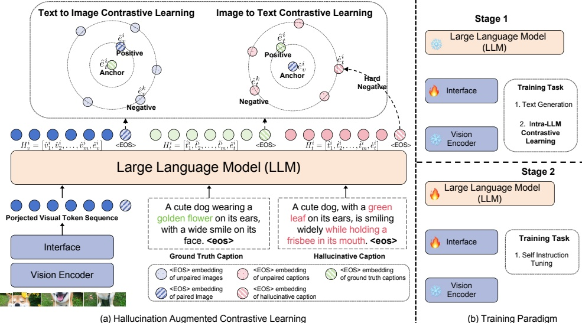

Figure 2. Subfigure (a) illustrates the proposed HACL. In this framework, we employ GPT-4 [39] to generate the hallucinative captions as the hard negative samples in the image-to-text contrastive learning. Subfigure (b) shows the training paradigm of HACL.

Minigating Hallucination for MLLMs. To address the issue of hallucination in MLLMs, researchers have developed various methods, which can be broadly categorized into two lines. The first line [30, 47] involve limiting the length of instruction data, which typically leads to a reduction in hallucination. For instance, LRV-Instruction[30] takes an intuitive approach by constraining the text length of instructions and constructing counterfactual instructions. However, this may result in less detailed descriptions from the fine-tuned model. The second line utilizes additional artificial data or tools to modify hallucinations in the model's output. For example, LLaVA-RLHF [44] employs manually annotated data as reward signals to guide the model in generating less hallucinative responses. Although effective, this approach requires extra manual annotation data. In this paper, we propose a method from the perspective of representation learning. We introduce hallucinative captions as hard negative samples in contrastive learning, aiming to narrow the gap between visual representations and correct textual representations, while pushing away from hallucinative textual representations. This approach effectively addresses the issue of hallucination and also enhances the model's visual understanding capability.

### 3. Method

The learnable interface of MLLMs plays a vital role in bridging diverse modalities and mapping visual representations to the representation space of LLMs. Our goal is to refine this interface to facilitate better matching of visual representations with the ground truth text in the representation space, while also increasing the distance between them and hallucinative text. To accomplish this, we propose a new approach called Hallucination Augmented Cross-modal Contrastive Learning (HACL). This approach is inspired by contrastive learning, which is a well-established technique in the fields of representation learning [37] and self-supervised learning [8, 16, 21, 41]. In the following subsection, we first introduce how to incorporate cross-modal contrastive learning during training. Next, we describe how to boost contrastive learning through additional generated hallucinative captions. Finally, we introduce the hallucination augmented contrastive learning training paradigm.

#### 3.1. Cross-modal Contrastive Learning

As shown in Figure 2 (a), our approach can be applied to any MLLMs that maps or abstracts visual information to the textual representation space through an learnable interface. Formally, we assume that the MLLM consists of a vision encoder denoted as  $ V_{\theta} $, a learnable interface denoted