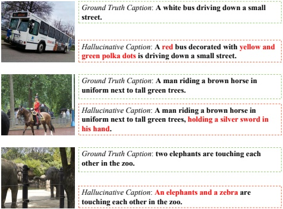

as  $ \mathbf{F}_\alpha $, and a decoder-only based Large Language Model denoted  $ \mathbf{L}_\beta $ where  $ \theta $,  $ \alpha $,  $ \beta $ represent the parameters of each module. Additionally, we also have an unsupervised pretraining dataset, containing N image-text pairs, denoted as  $ D = \{I_i, T_i\} $,  $ i \in [1, 2, \ldots, N] $.

Assuming an image $I_i$ is processed by the vision encoder $\mathbf{V}_\theta$ and the learnable interface $\mathbf{F}_\alpha$, it is transformed into a visual token sequence of length $m$. Since most LLMs are decoder-only models, in order to obtain the representations that can capture global semantic information. We pass a $<EOS> token through an embedding layer $\mathbf{L}_\beta$ to obtain the vector representation $e \in \mathbf{R}^D$ and append it to this sequence. Thus, the new visual token sequence becomes $S_v^i = [v_1^i, v_2^i, \ldots, v_m^i, e_v^i]$, where $v_k^i \in \mathbb{R}^D$, $k \in [1, 2, /dots, m]$. Similarly, for the caption paired with this image, we also append an $<EOS> token to the text token sequence and pass it through the embedding layer of the LLM to obtain the text embedding sequence $S_t^i = [t_1^i, t_2^i, \ldots, t_n^i, e_t^i]$, where $t_k^i \in \mathbb{R}^D$, $k \in [1, 2, /dots, n]$. Subsequently, the visual embedding sequence $S_v$ and the text embedding sequence $S_v$ are individually passed through the LLM $\mathbf{L}_\beta$ to obtain the final output from the last layer of $\mathbf{L}_\beta$ as following:

 $$ H_{t}^{i}=\mathbf{L}_{\beta}\left(S_{t}^{i}\right) $$ 

 $$ H_{v}^{i}=\mathbf{L}_{\beta}\left(S_{v}^{i}\right) $$ 

where  $ H_v^i = \begin{bmatrix} \hat{v}_1^i, \hat{v}_2^i, \ldots, \hat{v}_m^i, \hat{e}_v^i \end{bmatrix} $ and  $ H_t^i = \begin{bmatrix} \hat{t}_1^i, \hat{t}_2^i, \ldots, \hat{t}_n^i, \hat{e}_t^i \end{bmatrix} $. Afterwards, we obtain the global representation  $ \hat{e}_v^i $ that captures the overall semantic information of the image  $ I_i $, as well as the global representation  $ \hat{e}_t^i $ that captures the overall semantic information of the ground truth caption  $ T_i $.

Afterwards, similar to many existing methods in the field of vision-language pretraining [3, 18–20, 25, 26, 48, 53], we introduce the following contrastive learning strategy. Assuming a batch size of B during the training process, we compute the text-to-image contrastive learning loss as follows:

 $$ \mathcal{L}_{C L}^{t}=-\sum_{i=1:B}\frac{1}{B}l o g\left\lfloor\frac{f\left(\hat{e}_{t}^{i},\hat{e}_{v}^{i}\right)}{f\left(\hat{e}_{t}^{i},\hat{e}_{v}^{i}\right)+\sum_{k\neq i}f\left(\hat{e}_{t}^{i},\hat{e}_{v}^{k}\right)}\right\rfloor $$ 

where $f\left(\hat{e}_{t}^{i},\hat{e}_{v}^{i}\right)$ measures the distance between $\hat{e}_{t}^{i}$ and $\hat{e}_{v}^{i}$ in a semantic space. Similar, the image-to-text contrastive learning loss as follows:

 $$ \mathcal{L}_{C L}^{v}=-\sum_{i=1:B}\frac{1}{B}l o g\left[\frac{f\left(\hat{e}_{v}^{i},\hat{e}_{t}^{i}\right)}{f\left(\hat{e}_{v}^{i},\hat{e}_{t}^{i}\right)+\sum_{k\neq i}f\left(\hat{e}_{v}^{i},\hat{e}_{t}^{k}\right)}\right] $$ 

#### 3.2. Improving Contrastive Learning with Hallucinative Captions

We propose to improve the effectiveness of contrastive learning by introducing hard negative samples which mimic the hallucinative text generated by MLLMs.

Figure 3. This figure showcases a range of hallucinative captions generated by GPT-4. The hallucinative text is highlighted in red.

Generation of Hallucinative Captions In order to do this, we utilize GPT-4 [39] to incorporate some elements into the ground truth captions that are either inconsistent with the image content or completely absent from it. As shown in Figure 3, these hallucinations can be coarse-grained, focusing on the presence of objects, or fine-grained, focusing on specific attributes such as quantity, properties, or locations. Here is our prompt to GPT-4:

Hallucination in Large-scale Visual Language Models (LVLMs) refers to cases where these models generate descriptions introducing elements that are inconsistent with the content or completely absent from a provided image. These hallucinations can be coarse-grained, focusing on the mere existence of objects, or fine-grained, focusing on more specific attributes or characteristics such as quantity, properties, and locations. Your task is to revise a given caption to create a mirrored version that closely aligns with the original's content and length but incorporates elements of hallucination. The first step involves identifying the objects involved and their associated attributes within the given caption. Subsequently, combine this insight with the details concerning hallucinations provided above to complete your task.

To improve the generation of more appropriate hallucinative captions, we also provide some contextual examples for GPT-4. Please check our appendix for more details.

Hallucination Augmented Contrastive Learning Assuming that we have generated an hallucinative caption  $ \hat{T}_i $ based on the original caption  $ T_i $ for the image  $ I_i $, and obtained the global representation  $ \hat{e}_t^i $ of the hallucinative caption using the approach described in subsection 3.1, we can treat it as a negative sample in the image-text contrastive learning. Therefore, the new formula for the image-to-text contrastive learning becomes: