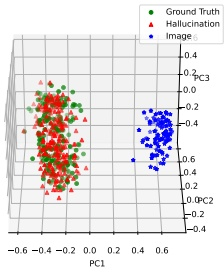
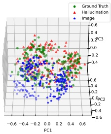
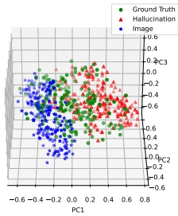

(a) w/o HACL

(b) w/ CL

(c) w/ HACL

Figure 4. This figure illustrates the visualization of various data distributions. The blue icons represent visual data extracted from images, the green icons denote ground truth caption data, and the red icons signify hallucinative caption data. The label "w/o HACL" represents the data distribution obtained from the original model output without employing our proposed method. On the other hand, "w/ CL" indicates the data distribution resulting from the model output utilizing contrastive learning. Lastly, "w/ HACL" indicates the data distribution generated by the model output using our proposed method.

lucinative captions, and the contrastive learning loss was calculated solely based on the equations 3 and 9 discussed in subsection 3.1 of our paper. We conducted experiments on MLLMs including LLaVA [33], MiniGPT-4 [55], and LLaVA1.5 [32], and reported the results on benchmarks such as POPE and MMHal-Bench. Additionally, we also reported results on the MME and VQA benchmarks. As illustrated in the Table 5, absent the facilitation from hallucinative captions, the models displayed moderate improvements on hallucination benchmarks such as MMhal-Bench, yet these improvements were somewhat constrained. However, the subsequent inclusion of hallucinative captions resulted in a marked enhancement on the same hallucination benchmark, thus affirming the potency of the hallucinative captions. Furthermore, we observed analogous improvements in the model's performance on both MME and VQA. Our hypothesis asserts that hallucinative captions aid MLLMs in diverting the visual representation from hallucinations and other textual inaccuracies. This action helps avoid instances of hallucination. Furthermore, contrastive learning supports the model by aligning the semantics of image-text, which ultimately enhances the model's effectiveness.

Discussion on Training Paradigm We have observed that certain Multimodal Language-and-Vision Models (MLLMs) may not freeze the activity of either the visual encoder or the Language-and-Vision Models (LLMs) during the initial stage of pretraining. To assess the impact of our methodology under such distinct training paradigms, we independently tested models where either the Visual Encoder or the LLMs were active during the first pretraining phase. These tests were conducted on two platforms: LLaVA and LLaVA1.5 and subsequently evaluated against multiple benchmark standards. As illustrated in Table 6, the models experienced a significant performance decline when LLMs are activated. We hypothesize that this downturn could be linked to low-quality data in the first pretraining stage and the introduction of additional contrast learning tasks, both of which affect the LLMs' representation distribution. This culminates in the catastrophic forgetting of the LLMs. Conversely, initiating the Visual Encoder led to a modest performance boost. This might be attributed to the fact that the target parameters our model can optimize extend beyond the learnable interface and incorporate the visual encoder as well. This expanded scope paves the way for a more successful alignment of visual and text representations within the MLLMs.

#### 4.5. Visualization

The objective of our research is the introduction of HACL, to further enhance the visual representation output of our interface. The aim is to closely align the output to the correct textual representation within the representation space of Language Models (LLMs) and, at the same time, distance it from hallucinative and other incorrect textual representations. To substantiate our objective, we randomly selected 200 image-text pairs from the COCO [29] val2017 dataset. Using GPT-4, we generated hallucination samples and subsequently reduced these samples using the hidden state representation of the last token through LLMs for visualization purposes. The data distribution under three conditions: without employing HACL, instigating cross-modal contrastive learning but without the use of hallucination-enhanced samples, and usage of hallucination-enhanced sample contrast learning was visualized respectively. The MLLM utilized in our study was LLaVA. As illustrated in Figure 4 (a), a substantial modality gap is observable in the data distribution without contrast learning. In Figure 4 (b), after applying contrast