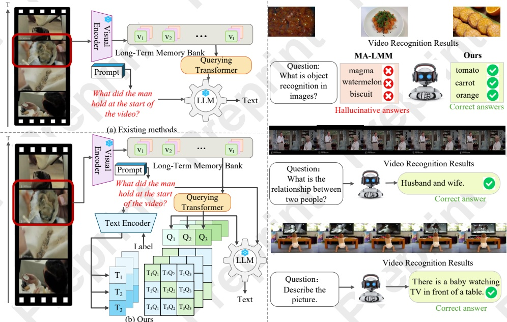

#### Preprint – IJCAI 2025: This is the accepted version made available for conference attendees. Do not cite. The final version will appear in the IJCAI 2025 proceedings

Figure 1: (Top-left) Existing methods utilize visual features that are not semantically aligned for text decoding. (Bottom-left) Our MMA employs a multi-level multimodal semantic alignment strategy to mitigate the hallucinations. (Right) Our method effectively identifies confusable objects, showcasing its capability to grasp complex semantics. It significantly outperforms MA-LMM in reducing hallucinations and enhancing answer accuracy.

timodal alignment (MMA) strategy to enhance intermediate visual features, combined with final language supervision, guiding the model to generate more accurate and contextually aligned outputs. Specifically, we employ a text encoder to convert text inputs into semantic features, facilitating alignment between visual and textual modalities through a semantic discriminative loss. Our approach goes beyond simple global representations by performing multi-level alignment, aligning semantic features at various levels of the visual and textual modalities. This strategy enables the model to capture both high-level and low-level semantic relationships, reducing hallucinations by establishing precise correspondences between video content and generated language.

To further enhance semantic alignment, we introduce a two-stage progressive training strategy. We leverage larger and more diverse datasets to expand the variety of semantic features and better capture general semantic relationships between visual and textual modalities. By integrating richer semantic information into the model and refining the alignment process, we significantly reduce ambiguity and improve performance across various video-language tasks.

Extensive experimentation demonstrates that our method consistently outperforms existing models in reducing hallucinations, improving multimodal alignment, and achieving superior overall performance across multiple video-language tasks. Our results suggest that the proposed approach effectively mitigates hallucinations in large video-language models, laying a foundation for more reliable and accurate multimodal systems.

We summarize our main contributions as follows:

• We propose a novel multi-level multimodal alignment strategy that incorporates textual semantic supervision during visual encoding. This approach aligns semantic features from both text and vision at multiple levels to address hallucinations in large video-language models.

• We propose a two-stage training strategy that facilitates progressive co-learning from general vision-text semantics to task-specific semantics, utilizing a larger and more diverse dataset.

• We conducted extensive experiments on the LVU and MSVD datasets to compare our methods with other VLMs. Our results show that our approach achieves state-of-the-art performance across various downstream video tasks, significantly improving the quality and reliability of video language models while effectively reducing hallucinations.