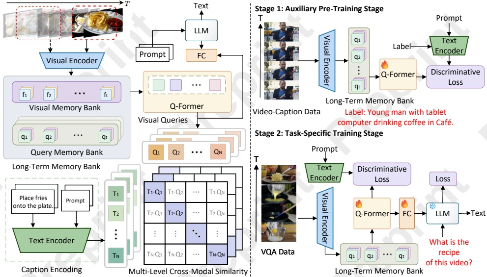

#### Preprint – IJCAI 2025: This is the accepted version made available for conference attendees. Do not cite. The final version will appear in the IJCAI 2025 proceedings

Figure 2: (Left) Framework overview. Framework overview. Long-Term Memory Bank and Q-Former are employed to encode visual features. Text encoder extracts joint semantic features from the prompt and text label, achieving multi-level semantic alignment with visual features through contrastive learning. The LLM then generates text outputs for various downstream tasks in video understanding. (Right) Two-stage training strategy. In the auxiliary pre-training stage, semantic discriminant loss is utilized on a larger and more diverse video-language dataset. In the task-specific training stage, both semantic discriminant loss and text decoding loss are applied to train on downstream task datasets.

## 2 Related Work

### 2.1 Advancements in Long-Term Video Understanding

Recent advancements in long-term video understanding have been driven by multimodal LLMs (MLLMs), memory-augmented architectures, and task-specific methods. Nevertheless, handling long-duration videos remains challenging due to computational inefficiency, temporal dependencies, and redundant information.

The integration of vision and language models has played a key role in this progress. Early models like BLIP-2 [Li et al., 2023a] combined pre-trained vision and language encoders, enabling rich cross-modal reasoning for tasks such as video captioning and visual question answering. Building on this foundation, models like Video-ChatGPT [Maaz et al., 2023] and Video-LLaMA [Zhang et al., 2023] incorporate video transformers to better capture temporal dynamics. However, they still face limitations with extended video sequences due to fixed-size token compression, which leads to loss of critical semantics. TimeChat [Ren et al., 2024] addresses this issue by introducing dynamic token compression, adjusting the compression rate according to video length. This improves temporal event localization and enhances modeling of complex temporal relationships, advancing the capabilities of multimodal video models.

### 2.2 Memory-Augmented Architectures and Scalability Challenges

Memory-augmented architectures have become a key strategy for long-term video understanding by retaining and referencing past frames to maintain temporal coherence. Models like LongVLM [Weng et al., 2025] balance short- and long-term memory to reduce redundancy in extended videos, though they often struggle to preserve fine-grained visual details under limited computational budgets. Hierarchical models such as MeMViT [Wu et al., 2022] improve attention mechanisms for long-form tasks but often underutilize token-level representation, which remains essential for effective encoding.

Meanwhile, task-specific methods have advanced computational efficiency across various video understanding tasks [Dang et al., 2023b; Dang and Yang, 2022; Dang and Yang, 2021]. Retrieval-augmented generation (RAG) integrates external knowledge with generative models to reduce cost, while approaches like STTS [Bertasius et al., 2021] improve efficiency through early selection and merging of informative tokens. Despite these gains, capturing both local and global temporal dependencies remains a central challenge for