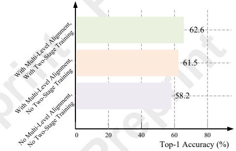

Preprint – IJCAI 2025: This is the accepted version made available for conference attendees. Do not cite. The final version will appear in the IJCAI 2025 proceedings.

<table border=1 style='margin: auto; word-wrap: break-word;'><tr><td rowspan="2">Model</td><td colspan="3">Content</td><td colspan="4">Metadata</td><td rowspan="2">Avg</td></tr><tr><td style='text-align: center; word-wrap: break-word;'>Relation</td><td style='text-align: center; word-wrap: break-word;'>Speak</td><td style='text-align: center; word-wrap: break-word;'>Scene</td><td style='text-align: center; word-wrap: break-word;'>Director</td><td style='text-align: center; word-wrap: break-word;'>Genre</td><td style='text-align: center; word-wrap: break-word;'>Writer</td><td style='text-align: center; word-wrap: break-word;'>Year</td></tr><tr><td style='text-align: center; word-wrap: break-word;'>Obj_T4mer [Wu and Krahenbuhl, 2021]</td><td style='text-align: center; word-wrap: break-word;'>54.8</td><td style='text-align: center; word-wrap: break-word;'>33.2</td><td style='text-align: center; word-wrap: break-word;'>52.9</td><td style='text-align: center; word-wrap: break-word;'>47.7</td><td style='text-align: center; word-wrap: break-word;'>52.7</td><td style='text-align: center; word-wrap: break-word;'>36.3</td><td style='text-align: center; word-wrap: break-word;'>37.8</td><td style='text-align: center; word-wrap: break-word;'>45.0</td></tr><tr><td style='text-align: center; word-wrap: break-word;'>Performer [Choromanski et al., 2020]</td><td style='text-align: center; word-wrap: break-word;'>50.0</td><td style='text-align: center; word-wrap: break-word;'>38.8</td><td style='text-align: center; word-wrap: break-word;'>60.5</td><td style='text-align: center; word-wrap: break-word;'>58.9</td><td style='text-align: center; word-wrap: break-word;'>49.5</td><td style='text-align: center; word-wrap: break-word;'>48.2</td><td style='text-align: center; word-wrap: break-word;'>41.3</td><td style='text-align: center; word-wrap: break-word;'>49.6</td></tr><tr><td style='text-align: center; word-wrap: break-word;'>Orthformer [Patrick et al., 2021]</td><td style='text-align: center; word-wrap: break-word;'>50.0</td><td style='text-align: center; word-wrap: break-word;'>38.3</td><td style='text-align: center; word-wrap: break-word;'>66.3</td><td style='text-align: center; word-wrap: break-word;'>55.1</td><td style='text-align: center; word-wrap: break-word;'>55.8</td><td style='text-align: center; word-wrap: break-word;'>47.0</td><td style='text-align: center; word-wrap: break-word;'>43.4</td><td style='text-align: center; word-wrap: break-word;'>50.8</td></tr><tr><td style='text-align: center; word-wrap: break-word;'>VideoBERT [Sun et al., 2019]</td><td style='text-align: center; word-wrap: break-word;'>52.8</td><td style='text-align: center; word-wrap: break-word;'>37.9</td><td style='text-align: center; word-wrap: break-word;'>54.9</td><td style='text-align: center; word-wrap: break-word;'>47.3</td><td style='text-align: center; word-wrap: break-word;'>51.9</td><td style='text-align: center; word-wrap: break-word;'>38.5</td><td style='text-align: center; word-wrap: break-word;'>36.1</td><td style='text-align: center; word-wrap: break-word;'>45.6</td></tr><tr><td style='text-align: center; word-wrap: break-word;'>LST [Islam and Bertasius, 2022]</td><td style='text-align: center; word-wrap: break-word;'>52.5</td><td style='text-align: center; word-wrap: break-word;'>37.3</td><td style='text-align: center; word-wrap: break-word;'>62.8</td><td style='text-align: center; word-wrap: break-word;'>56.1</td><td style='text-align: center; word-wrap: break-word;'>52.7</td><td style='text-align: center; word-wrap: break-word;'>42.3</td><td style='text-align: center; word-wrap: break-word;'>39.2</td><td style='text-align: center; word-wrap: break-word;'>49.0</td></tr><tr><td style='text-align: center; word-wrap: break-word;'>VIS4mer [Islam and Bertasius, 2022]</td><td style='text-align: center; word-wrap: break-word;'>57.1</td><td style='text-align: center; word-wrap: break-word;'>40.8</td><td style='text-align: center; word-wrap: break-word;'>67.4</td><td style='text-align: center; word-wrap: break-word;'>62.6</td><td style='text-align: center; word-wrap: break-word;'>54.7</td><td style='text-align: center; word-wrap: break-word;'>48.8</td><td style='text-align: center; word-wrap: break-word;'>44.8</td><td style='text-align: center; word-wrap: break-word;'>53.7</td></tr><tr><td style='text-align: center; word-wrap: break-word;'>MA-LMM [He et al., 2024]</td><td style='text-align: center; word-wrap: break-word;'>58.2</td><td style='text-align: center; word-wrap: break-word;'>44.8</td><td style='text-align: center; word-wrap: break-word;'>80.3</td><td style='text-align: center; word-wrap: break-word;'>74.6</td><td style='text-align: center; word-wrap: break-word;'>61.0</td><td style='text-align: center; word-wrap: break-word;'>70.4</td><td style='text-align: center; word-wrap: break-word;'>51.9</td><td style='text-align: center; word-wrap: break-word;'>63.0</td></tr><tr><td style='text-align: center; word-wrap: break-word;'>MMA (Ours)</td><td style='text-align: center; word-wrap: break-word;'>62.6</td><td style='text-align: center; word-wrap: break-word;'>41.9</td><td style='text-align: center; word-wrap: break-word;'>83.0</td><td style='text-align: center; word-wrap: break-word;'>79.9</td><td style='text-align: center; word-wrap: break-word;'>62.1</td><td style='text-align: center; word-wrap: break-word;'>70.6</td><td style='text-align: center; word-wrap: break-word;'>54.9</td><td style='text-align: center; word-wrap: break-word;'>65.0</td></tr></table>

Table 1: Comparison with state-of-the-art methods on long-term video understanding task using the LVU dataset.

Dolan, 2011] contains approximately 120K sentences summarizing more than 2,000 video snippets, collected via Mechanical Turk in the summer of 2010.

### 4.2 Implementation Details

For the visual encoder, we adopt the pre-trained image encoder ViT-G/14 [Alexey, 2020] from EVA-CLIP [Fang et al., 2023], which can also be replaced with other CLIP-based video encoders. We utilize the pre-trained Q-Former weights provided by InstructBLIP [Dai et al., 2023] and use the collected WebVid-5k [Bain et al., 2021] dataset for the first stage of training. Additionally, we employ Vicuna-7B [Chiang et al., 2023] as the large language model (LLM). The hyperparameters of the loss function in our method are set as:  $ \lambda_{multi} = 0.5 $ and  $ \lambda_{text} = 1 $. All experiments are conducted on 4 V100 GPUs.

### 4.3 Quantitative Results

Long-Term Video Understanding. We compared our method with the state-of-the-art approaches previously reported on the LVU benchmark, and the results are shown in Table 1. It is noteworthy that our method outperforms existing long-term video models (MA-LMM [He et al., 2024], ViS4mer [Islam and Bertasius, 2022], VideoBERT [Sun et al., 2019], and Object Transformer [Wu and Krahenbuhl, 2021]) in both content understanding and metadata prediction tasks. This result in significant improvements in most tasks, with an increase in the average top-1 accuracy by 2.0% compared to the MA-LMM model. The result demonstrates the superior long-term video understanding capability of our method. Unlike previous models, our method performs semantic alignment of video content at multiple levels, enabling the model to achieve a more precise understanding of the questions posed in the video.

Video Question Answering. To compare with existing multimodal video understanding methods, we conducted experiments on the MSVD [Chen and Dolan, 2011] video question answering (VQA) datasets included in Table 2, to validate that using prompts for multi-level alignment enables the model to better understand its task and describe objects in videos. We observed that the introduction of multi-level alignment brings about an enhancement in performance, confirming its role in strengthening the model's ability to align semantics. Conducting two-stage training based on multi-level

<table border=1 style='margin: auto; word-wrap: break-word;'><tr><td style='text-align: center; word-wrap: break-word;'>Model</td><td style='text-align: center; word-wrap: break-word;'>MSVD</td></tr><tr><td style='text-align: center; word-wrap: break-word;'>FrozenBiLM [Yang et al., 2022]</td><td style='text-align: center; word-wrap: break-word;'>54.8</td></tr><tr><td style='text-align: center; word-wrap: break-word;'>GiT [Wang et al., 2022]</td><td style='text-align: center; word-wrap: break-word;'>56.8</td></tr><tr><td style='text-align: center; word-wrap: break-word;'>mPLUG-2 [Xu et al., 2023]</td><td style='text-align: center; word-wrap: break-word;'>58.1</td></tr><tr><td style='text-align: center; word-wrap: break-word;'>UMT-L [Li et al., 2023b]</td><td style='text-align: center; word-wrap: break-word;'>55.2</td></tr><tr><td style='text-align: center; word-wrap: break-word;'>VideoCoCa [Yan et al., 2022]</td><td style='text-align: center; word-wrap: break-word;'>56.9</td></tr><tr><td style='text-align: center; word-wrap: break-word;'>Video-LLaMA [Zhang et al., 2023]</td><td style='text-align: center; word-wrap: break-word;'>58.3</td></tr><tr><td style='text-align: center; word-wrap: break-word;'>MA-LMM [He et al., 2024]</td><td style='text-align: center; word-wrap: break-word;'>60.6</td></tr><tr><td style='text-align: center; word-wrap: break-word;'>MMA (Ours)</td><td style='text-align: center; word-wrap: break-word;'>60.9</td></tr></table>

Table 2: Comparison with state-of-the-art methods on the video question answering task using MSVD dataset.

alignment enables the model to learn more concrete semantic information, reducing model hallucination issues. It is worth noting that our results also surpass the recent MA-LMM on these datasets, highlighting the significant improvement our model provides in video question answering.

Ablation Study. To evaluate the effectiveness of the multilevel multimodal alignment strategy and the two-stage training strategy, we conduct comprehensive ablation experiments on the LVU relation dataset. The experimental results are shown in Figure 3.

Figure 3: Ablation results of effect of multi-level multimodal alignment and two-stage training on the LVU Relation.

