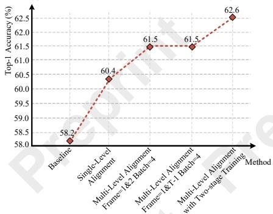
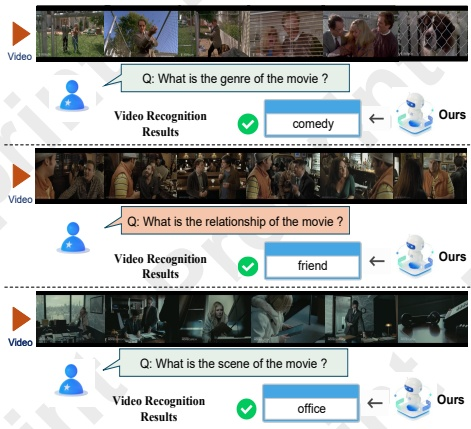

Figure 4: Ablation experiment of multi-level alignment module.

The results show that employing a multi-level alignment strategy based on the baseline yields performance improvements of 3.3%. This indicates that multi-level multimodal alignment effectively integrates textual semantics into the training of the video language model, enhancing the training process of Q-Former and significantly improving recognition accuracy in long video understanding tasks.

The results in Figure 3 also show that applying the combination of the multi-level multimodal alignment strategy and the two-stage training approach, applied on top of the baseline, results in performance improvements of 4.4% on the LVU relation dataset. Furthermore, the experimental accuracy achieved with this combined approach surpasses that of using only the multi-level multimodal alignment strategy. This demonstrates the effectiveness of the two-stage training approach, which enables VLMs to learn richer semantics.

Figure 4 shows the results regarding the effects of various alignment strategies and sampling frames. When performing single-level alignment on only using the first three frames, the performance improved compared to the baseline. We use multi-level alignment, achieving a score of 61.5%, which further validates the effectiveness of the alignment strategy. We attempted to modify the frame sampling method by testing on the first two frames and the first and last frames, respectively, and the results showed no change in top-1 performance. Additionally, using more frames in multi-level alignment does not bring any performance gains. Multi-level alignment improved model performance compared to single-level alignment, demonstrating the superiority of the multi-level alignment method. Finally, with the addition of two-stage training, the performance improved again, indicating that the alignment of additional data enables the model to better mitigate hallucination phenomena.

### 4.4 Visualization

Figure 1 (right) shows the comparison results between our method and the baseline method MA-LMM on the long-term video understanding task.

Figure 5: Visualization results of our method on long-term video recognition task on LVU dataset.

Figure 5 shows the qualitative results of our method on the long-term video understanding task of the LVU dataset. In the "comedy" genre judgment (top), the model accurately determined the movie genre based on the video content, demonstrating its understanding of visual elements such as the plot and its capacity to align with semantic concepts. In the "friend" relationship recognition (middle), the model successfully inferred the relationship between characters, showcasing its ability to effectively capture and analyze visual information, including character interactions. In the "office" scene recognition (bottom), the model correctly identified the scene, illustrating its proficiency in analyzing and classifying visual elements like the video background and accurately outputting semantic information. These three examples collectively demonstrate that our model effectively captures complex semantic information while minimizing the occurrence of hallucinations.

## 5 Conclusions

In this work, we present a novel framework that directly addresses the challenge of mitigating hallucinations in large video-language models. By incorporating language-level supervision and alignment during training, our approach enhances semantic consistency between video and text modalities, effectively reducing the impact of noisy or misaligned data. The use of an expanded dataset and improved semantic discrimination loss further strengthens cross-modal alignment by introducing more diverse and semantically rich representations. Experimental results across various video-language tasks show that our method not only significantly reduces hallucinations but also achieves state-of-the-art performance, setting a new benchmark for future research. This work paves the way for more accurate and robust video-language understanding, with broad applications in video analysis, multimodal learning, and beyond.