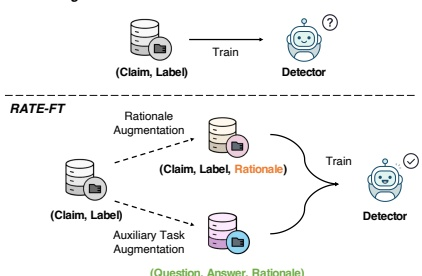

# Learning Auxiliary Tasks Improves Reference-Free Hallucination Detection in Open-Domain Long-Form Generation

Chengwei Qin $ ^{\dagger,*} $, Wenxuan Zhou $ ^{\dagger} $, Karthik Abinav Sankararaman $ ^{\dagger} $, Nanshu Wang $ ^{\dagger} $, Tengyu Xu $ ^{\dagger} $, Alexander Radovic $ ^{\dagger} $, Eryk Helenowski $ ^{\dagger} $, Arya Talebzadeh $ ^{\dagger} $, Aditya Tayade $ ^{\dagger} $, Sinong Wang $ ^{\dagger} $, Shafiq Joty $ ^{\dagger} $, Han Fang $ ^{\dagger} $, Hao Ma $ ^{\dagger} $

 $ ^{\dagger} $The Hong Kong University of Science and Technology (Guangzhou)

 $ ^{\dagger} $Nanyang Technological University  $ ^{\dagger} $GenAI, Meta

## Abstract

Hallucination, the generation of factually incorrect information, remains a significant challenge for large language models (LLMs), especially in open-domain long-form generation. Existing approaches for detecting hallucination in long-form tasks either focus on limited domains or rely heavily on external fact-checking tools, which may not always be available.

In this work, we systematically investigate reference-free hallucination detection in open-domain long-form responses. Our findings reveal that internal states (e.g., model's output probability and entropy) alone are insufficient for reliably (i.e., better than random guessing) distinguishing between factual and hallucinated content. To enhance detection, we explore various existing approaches, including prompting-based methods, probing, and fine-tuning, with fine-tuning proving the most effective. To further improve the accuracy, we introduce a new paradigm, named RATE-FT, that augments fine-tuning with an auxiliary task for the model to jointly learn with the main task of hallucination detection. With extensive experiments and analysis using a variety of model families & datasets, we demonstrate the effectiveness and generalizability of our method, e.g., +3% over general fine-tuning methods on LongFact.

## 1 Introduction

With the recent advancements in model scale and pretraining data, large language models (LLMs) have demonstrated remarkable capabilities in various natural language processing (NLP) tasks (Brown et al., 2020). Despite these successes, hallucination, where models tend to produce content that conflicts with real-world facts, remains a significant challenge (Zhang et al., 2023). Most existing research on hallucination detection has

Figure 1: Comparison between Fine-Tuning and RATE-FT for hallucination detection. RATE-FT improves Fine-Tuning by incorporating rationales and an auxiliary task (question answering) into the training process.

cused on short-form tasks, where the output consists of one or a few tokens. While these methods are effective for short-form content (Manakul et al., 2023; Mahaut et al., 2024; Yehuda et al., 2024; Zhang et al., 2024a), extending them to open-domain long-form generation presents additional complexities and new challenges. Unlike short-form tasks, long-form responses can span hundreds or even thousands of tokens, requiring models to generate detailed and nuanced answers to broad fact-seeking prompts (Wei et al., 2024). This necessitates that LLMs synthesize information across multiple knowledge domains, increasing the risk of generating content that sounds plausible yet is factually incorrect. For example, when answering 'What is the significance of Amber Room?', LLMs may generate responses that mix accurate historical information with fabricated details, complicating the task of distinguishing fact from hallucination.

Recent efforts have sought to address hallucination detection in long-form tasks. However, they either focus on limited domains, e.g., biography generation (Min et al., 2023; Fadeeva et al., 2024) or rely heavily on external fact-checking tools or