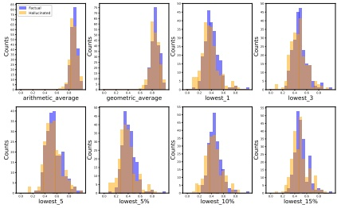

Figure 2: Detection results based on token probability.

of internal states to estimate factual confidence following SelfCheckGPT (Manakul et al., 2023): the probability or the entropy (uncertainty) of output tokens. Specifically, we examine the arithmetic and geometric  $ {}^{1} $ averages of all tokens, the average of tokens with the top-K lowest probability or highest entropy ( $ K = 1, 3, 5 $), and the average of tokens with the top-P% lowest probability or highest entropy ( $ P = 5, 10, 15 $). The results in Figure 2 and Appendix A.2 suggest that neither internal state reliably, i.e., better than random guessing, predicts the correctness of a given claim, which may be due to the presence of numerous insignificant tokens within the claim, such as stop words. To address this, we consider variants that focus only on output tokens related to entities. The results, shown in Appendix A.2, reveal similar patterns (see Appendix A.3 for a detailed comparison with the findings in Manakul et al. (2023)). We analyze the underlying reasons as follows. In open-domain long-form generation, claims are not limited to a few tokens, which introduces multiple sources of uncertainty. Specifically, the probability or entropy reflects the model's confidence in how a claim is expressed, i.e., its confidence in the claim as a sequence of output tokens, rather than in the correctness of the claim. Different surface forms of the claim yield different confidence levels, leading to unreliable estimates.

Considering the unreliability of LLMs' internal states in hallucination detection, there are several promising alternative approaches, including prompting, probing and fine-tuning LLMs, which we explore in the next section.

## 4 Prompting, Probing and Fine-Tuning

Based on a review of the research area, we identify three groups of existing hallucination detection methods, which we discuss below.

Prompting Prompting-based approaches involve directly prompting LLMs to assess the correctness of a given claim without additional training. We investigate the following three different methods: (i) Prompting the model to output 'True' or 'False' for a given claim, referred to as Prompt $ _{TF} $. The probability assigned to the token 'True' represents  $ P_{factual} $, while the probability assigned to 'False' represents  $ P_{hallucinated} $. (ii) Prompting the model to output the probability that it considers the given claim to be correct, referred to as Prompt $ _{Prob} $. This number directly represents  $ P_{factual} $. (iii) SelfCheckGPT, which detects hallucinations by sampling additional responses from the model and assessing inconsistencies between each response and the target claim. The proportion of responses that support the claim is taken as  $ P_{factual} $. Following Manakul et al. (2023), we sample 20 responses for detection.

Probing Following Su et al. (2024a), we train a multilayer perceptron (MLP) on the contextualized embeddings of LLMs to perform binary classification for hallucination detection, while keeping the base LLM frozen. The trained MLP outputs  $ P_{factual} $ as an indicator for classification.

Fine-Tuning We fine-tune the base LLM with LoRA to enhance its ability to output 'True' or 'False' for a given claim (Kapoor et al., 2024). Similar to Prompt $ _{TF} $, the probabilities assigned to the tokens 'True' and 'False' correspond to  $ P_{factual} $ and  $ P_{hallucinated} $, respectively. Note that LoRA fine-tuning allows us to easily use the original model for general tasks while applying the trained LoRA specifically for hallucination detection.

Following the data construction process outlined in Appendix A.1, we conduct experiments on the full set of LongFact using Llama-3-8B-Instruct. This process yields 2,711 factual and hallucinated claims, which are subsequently split into training (70%), validation (20%), and test (10%) sets. For all three types of methods, we use  $ P_{\text{factual}} $ as the classification indicator. Specifically, a claim is classified as ‘factual’ if  $ P_{\text{factual}} $ exceeds a predefined threshold; otherwise, it is classified as ‘hallucinated’. The optimal threshold is determined through a search on the validation set. Consistent with Tang et al. (2024); Chen et al. (2024b), we employ balanced accuracy (BAcc) as the evaluation metric:  $ \text{BAcc} = \frac{1}{2} \left( \frac{\text{TP}}{\text{TP} + \text{FN}} + \frac{\text{TN}}{\text{TN} + \text{FP}} \right) $, where TP, TN, FP, and FN stand for true/false positives/negatives.

The results of different methods on the test set, as