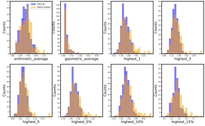

guessing, predicts the correctness of a given claim. One possible explanation for this is the presence of many insignificant tokens, such as stop words, within the claim. To address this, we further investigate variants that focus only on output tokens related to entities (Appendix A.2), and the results exhibit similar patterns. Importantly, our findings are consistent with those in Kapoor et al. (2024).

### A.4 Out-of-Distribution Results

We verify the effectiveness of fine-tuning in Out-of-Distribution (OOD) scenarios by training the model on LongFact and evaluating its performance on Biography. The results reported in Table 5 demonstrate that fine-tuning effectively generalizes to OOD scenarios.

### A.5 More Analysis on Auxiliary Task

Further Clarification on Motivation The underlying motivation for introducing the auxiliary question answering (QA) task into fine-tuning is that hallucination detection and mitigation are complementary and closely related tasks. This auxiliary QA task—where a question about the key information in the claim is posed, and the model is trained to provide the correct answer—helps improve the factuality of the model's responses through supervised fine-tuning. It acts as a complementary component to the primary hallucination detection task, offering the model an alternative yet closely related perspective, thereby enhancing its generalization capabilities.

Comparison with F2 F2 (Hu et al., 2024) also integrates rationales and auxiliary tasks into the training process. However, its main goal is to enhance the faithfulness of model responses while we focus on improving the accuracy of hallucination detection.

### A.6 Additional Data Augmentation versus Auxiliary QA Task

To isolate the effect of additional data augmentation versus the auxiliary QA task, we design two variants: (i) we paraphrase the original claim using GPT-4 for data augmentation and fine-tune the model on the combined data, referred to as Fine-Tuning $ _{para} $, which has roughly the same amount of training data as RATE-FT; and (ii) we reduce the training data for RATE-FT by half (approximately the same amount as Fine-Tuning), referred to as RATE-FT $ _{half} $. We conduct experi-

Figure 3: Hallucination detection results based on token entropy (uncertainty).

<table border=1 style='margin: auto; word-wrap: break-word;'><tr><td style='text-align: center; word-wrap: break-word;'>$ Prompt_{TF} $</td><td style='text-align: center; word-wrap: break-word;'>$ Prompt_{Prob} $</td><td style='text-align: center; word-wrap: break-word;'>SelfCheckGPT</td><td style='text-align: center; word-wrap: break-word;'>Probing</td><td style='text-align: center; word-wrap: break-word;'>Fine-Tuning</td></tr><tr><td style='text-align: center; word-wrap: break-word;'>72.3</td><td style='text-align: center; word-wrap: break-word;'>56.3</td><td style='text-align: center; word-wrap: break-word;'>71.9</td><td style='text-align: center; word-wrap: break-word;'>71.1</td><td style='text-align: center; word-wrap: break-word;'>74.7</td></tr></table>

Table 5: Results of different methods in OOD scenarios.

ments on LongFact using Llama-3-8B-Instruct and present the results in Table 6 and 7, which demonstrate that the performance improvement primarily comes from our designed auxiliary task, rather than from additional data augmentation.

### A.7 Data Collection Process for Other Models

When conducting experiments using other models, we follow the exact same settings as those used for Llama-3-8B-Instruct. Specifically, for each prompt, we obtain a long-form response from the model under investigation with greedy decoding. Following Wei et al. (2024), we employ the model to decompose long-form responses into atomized claims and assess whether each claim is relevant to answering the corresponding prompt. For each relevant claim, we use the model to generate multi-step Google Search queries and reason about whether the search results support the claim. Claims supported by the search results are labeled as “factual”, while those contradicted by the results are categorized as “hallucinated”.

Our constructed benchmarks align well with Su et al. (2024b), as both include responses and internal states from various LLMs. The key difference is that the LLMs we investigate are all modern models (Llama-3-8B-Instruct, Llama-3.1-70B-Instruct, Mistral-7B-Instruct, and Qwen2.5-7B-Instruct), whereas the models used in Su et al. (2024b) are relatively outdated (such as LLaMA-2 and GPT-J).