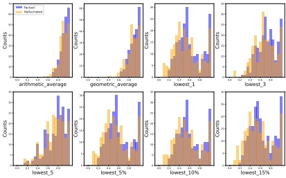
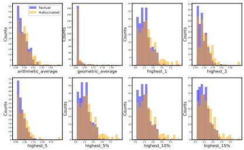

Figure 4: Hallucination detection results based on the probability of entity-related tokens.

<table border=1 style='margin: auto; word-wrap: break-word;'><tr><td style='text-align: center; word-wrap: break-word;'>Fine-Tuning $ _{para} $</td><td style='text-align: center; word-wrap: break-word;'>RATE-FT</td></tr><tr><td style='text-align: center; word-wrap: break-word;'>76.8</td><td style='text-align: center; word-wrap: break-word;'>79.6</td></tr></table>

Table 6: Comparison between Fine-Tuning $ _{para} $ and RATE-FT.

<table border=1 style='margin: auto; word-wrap: break-word;'><tr><td style='text-align: center; word-wrap: break-word;'>Fine-Tuning</td><td style='text-align: center; word-wrap: break-word;'>RATE-FT $ _{\text{half}} $</td></tr><tr><td style='text-align: center; word-wrap: break-word;'>76.1</td><td style='text-align: center; word-wrap: break-word;'>78.5</td></tr></table>

Table 7: Comparison between Fine-Tuning and RATE-FT $ _{half} $.

### A.8 Incorporating Uncertainty for Hallucination Detection

To enhance hallucination detection, we propose incorporating model uncertainty into the detection process, enabling a hybrid pipeline that combines the strengths of the model and external tools. Specifically, when the model is uncertain about whether a claim is factual or hallucinated, we leverage external tools to handle ambiguous cases, improving overall performance. The process involves setting two thresholds,  $ \alpha_{low} $ and  $ \alpha_{high} $, for classification. A claim is classified as ‘factual’ if  $ P_{\text{factual}} > \alpha_{high} $ and ‘hallucinated’ if  $ P_{\text{factual}} < \alpha_{low} $. Claims falling between these thresholds are classified as ‘unknown’ and delegated to external tools for further evaluation. Assuming the external tools’ output is the ground truth, predictions classified as ‘unknown’ are treated as correct. To evaluate the hybrid pipeline, we define the BAcc-unknown metric as follows:

 $$ \begin{aligned}BAcc-unknown&=\frac{1}{2}\big(\frac{\#Correct Factual Predictions}{\#Total Factual Claims}\\&+\frac{\#Correct Hallucinated Predictions}{\#Total Hallucinated Claims}\big)\end{aligned} $$ 

The optimal thresholds,  $ \alpha_{low} $ and  $ \alpha_{high} $, are determined through a search on the validation set. This

Figure 5: Hallucination detection results based on the entropy of entity-related tokens.

<table border=1 style='margin: auto; word-wrap: break-word;'><tr><td style='text-align: center; word-wrap: break-word;'>$ \text{Prompt}_{CoT-TF} $</td><td style='text-align: center; word-wrap: break-word;'>Probing</td><td style='text-align: center; word-wrap: break-word;'>Fine-Tuning</td><td style='text-align: center; word-wrap: break-word;'>RATE-FT</td></tr><tr><td style='text-align: center; word-wrap: break-word;'>80.4</td><td style='text-align: center; word-wrap: break-word;'>81.1</td><td style='text-align: center; word-wrap: break-word;'>82.4</td><td style='text-align: center; word-wrap: break-word;'>85.0</td></tr></table>

Table 8: BAcc-unknown (%) of different methods on Longfact with Llama-3-8B-Instruct.

Figure 6: Prompt for extracting the original output given an atomized claim.

process ensures that BAcc on the validation set exceeds 70%, while also maximizing BAcc-unknown. The goal is to strike a balance between performance and efficiency by achieving high BAcc-unknown without generating an excessive number of 'unknown' predictions, which could substantially increase detection costs. We conduct experiments on LongFact using Llama-3-8B-Instruct and report the results in Table 8, which demonstrate that incorporating model uncertainty greatly enhances hallucination detection, as evidenced by the BAcc-unknown metric's superior performance compared to standard BAcc in resolving ambiguous cases. Moreover, RATE-FT continues to outperform all other methods with respect to the BAcc-unknown metric, highlighting its robustness and effectiveness.

### A.9 Prompt for Output Extraction

After decomposition, the atomized claims may differ from the original expression in the response. To address this, we use the prompt shown in Figure 6 to retrieve the original output corresponding to a given atomized claim.