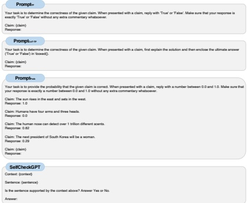
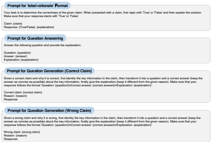

Figure 7: Prompts for different prompting methods.

Figure 8: Prompts for different components of RATE-FT.

### A.10 Prompts for Baseline Approaches

Figure 7 illustrates the prompts used for different prompting methods. The prompt used for constructing training data in Probing and Fine-Tuning is the same as the prompt employed by the Prompt $ _{TF} $ method.

### A.11 Prompts Used in RATE-FT

Figure 8 presents all the prompts used in RATE-FT.

### A.12 Implementation Details

For Prompt $ _{TF} $ and Prompt $ _{Prob} $, we obtain the response from the model with greedy decoding. Following Manakul et al. (2023), we set the temperature to 1.0 and generate 20 additional responses for SelfCheckGPT.

We evaluate 4 different types of contextualized embeddings for Probing: (1) the final token from the last layer (type₁), (2) the average of all tokens in the last layer (type₂), (3) the average of the final token across all layers (type₃), and (4) the average of type₁ and type₂ (type₄). The optimal embedding type, along with other hyperparameters, e.g., learning rate, is selected through a search on the validation set. For Fine-Tuning and RATE-FT, we leverage the LLaMA-Factory library (Zheng et al., 2024) and perform a search on the validation set for important hyperparameters.

