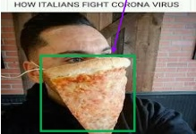
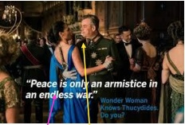

# Multi-Granular Multimodal Clue Fusion for Meme Understanding

Li Zheng $ ^{1} $, Hao Fei $ ^{2} $, Ting Dai $ ^{1} $, Zuquan Peng $ ^{1} $, Fei Li $ ^{1,3*} $, Huisheng Ma $ ^{4} $, Chong Teng $ ^{1} $, Donghong Ji $ ^{1} $

 $ ^{1} $Key Laboratory of Aerospace Information Security and Trusted Computing, Ministry of E

School of Cyber Science and Engineering, Wuhan University, Wuhan, China

 $ ^{2} $National University of Singapore, Singapore, Singapore

 $ ^{3} $Laboratory for Advanced Computing and Intelligence Engineering, Wuxi, China

 $ ^{4} $North China Institute of Computing Technology, beijing, China

{zhengli,daiting_cs,pzq_cse,lifei_csnlp,tengchong,dhji}@whu.edu.cn

haofei37@nus.edu.sg, mhs@bupt.cn

## Abstract

With the continuous emergence of various social media platforms frequently used in daily life, the multimodal meme understanding (MMU) task has been garnering increasing attention. MMU aims to explore and comprehend the meanings of memes from various perspectives by performing tasks such as metaphor recognition, sentiment analysis, intention detection, and offensiveness detection. Despite making progress, limitations persist due to the loss of fine-grained metaphorical visual clue and the neglect of multimodal text-image weak correlation. To overcome these limitations, we propose a multigranular multimodal clue fusion model (MGMCF) to advance MMU. Firstly, we design an object-level semantic mining module to extract object-level image feature clues, achieving fine-grained feature clue extraction and enhancing the model's ability to capture metaphorical details and semantics. Secondly, we propose a brand-new global-local cross-modal interaction model to address the weak correlation between text and images. This model facilitates effective interaction between global multimodal contextual clues and local unimodal feature clues, strengthening their representations through a bidirectional cross-modal attention mechanism. Finally, we devise a dual-semantic guided training strategy to enhance the model's understanding and alignment of multimodal representations in the semantic space. Experiments conducted on the widely-used MET-MEME bilingual dataset demonstrate significant improvements over state-of-the-art baselines. Specifically, there is an 8.14% increase in precision for offensiveness detection task, and respective accuracy enhancements of 3.53%, 3.89%, and 3.52% for metaphor recognition, sentiment analysis, and intention detection tasks. These results, underpinned by in-depth analyses, underscore the effectiveness and potential of our approach for advancing MMU.

## Introduction

Memes, as a popular form of online communication, express viewpoints, sentiments, and intentions in a concise and humorous manner. With the development of social networks, Multimodal Meme Understanding (MMU) (Wang et al. 2024; Xu et al. 2022), as an emerging research area in Natural Language Processing (NLP), plays a crucial role in many downstream applications, such as question answering (Zheng et al.

The fine-grained metaphorical visual information

(a) How Italians fight corona virus?

The weak correlation between the text and image modalities

(b) Peace is only an armistice in an endless war.

Figure 1: Examples of Metaphorical Memes.

(2024b) and sentiment analysis (Zheng et al. 2023a,b). The definition of the MMU task involves predicting understanding from four dimensions: metaphor, sentiment, intention, and offensiveness. However, memes are nuanced, and accurately grasping the underlying meaning embedded within the combination of text and images poses a crucial challenge.

Several studies have made commendable efforts in MMU. Kiela et al. (2020); Kirk et al. (2021) introduced multimodal hate meme datasets specifically designed for hate detection. However, these studies overlooked the crucial aspect of metaphorical features in memes. Therefore, Xu et al. (2022) considered the richer metaphorical features in memes and constructed a baseline model and a bilingual dataset called MET-MEME for this purpose. Furthermore, Wang et al. (2024) proposed a metaphor-aware multimodal multitask framework on this dataset to capture the interactions between text and images. Despite achieving notable success, current researches in this field face two significant limitations: 1) the loss of fine-grained metaphorical visual clues and 2) the neglect of multimodal text-image weak correlation. These limitations hinder its further flourishing and widespread adoption.

On the one hand, existing works (Qu et al. 2023; Ji, Ren, and Naseem 2023) exhibit a lack of emphasis on images and simply encode broad visual representations at the image-level, ignoring metaphorical clues at the fine-grained object-level of images. This neglect leads to a critical absence of key visual metaphorical details, resulting in semantic ambiguity and omissions, ultimately failing to comprehensively capture