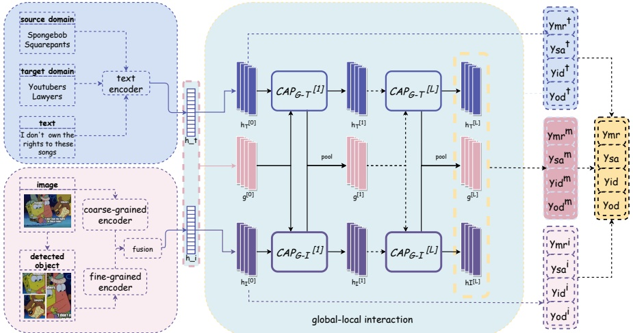

Figure 2: The overall architecture of our model. “mr” means metaphor recognition, “sa” means sentiment analysis, “id” means intention detection, “od” means offensiveness detection.

recognition program, a set of linguistic rules. Li et al. (2023b) performed metaphor detection by explicitly modeling the basic meanings of concepts. Tian et al. (2023) designed a domain contrastive learning strategy to capture the semantic inconsistencies. While these unimodal metaphor detection methods have achieved promising results, there has been relatively less exploration in the area of multimodal metaphor detection. Alnajjar, Hämäläinen, and Zhang (2022) introduced a multimodal metaphor annotated corpus and designed a video-text content-based method for metaphor detection. He et al. (2024) developed a multi-interactive cross-modal residual network for multimodal metaphor recognition.

## Methodology

## Task Definition

This paper addresses the task of multimodal meme understanding, encompassing metaphor recognition, sentiment analysis, intention detection, and offensiveness detection. Specifically, given an example consisting of an image I, its corresponding text T, a source domain  $ T_s $, and a target domain  $ T_a $, the objective of multimodal meme analysis is to predict the categories of metaphor  $ y_{mr} $, sentiment  $ y_{sa} $, intention  $ y_{id} $, and offensiveness  $ y_{od} $. As shown in Figure 2, the source domain serves as the basis for the metaphor, while the target domain embodies the concept or idea metaphorically conveyed, typically in textual form.

## Feature Extraction

Text Encoder. In accordance with the approach described in Wang et al. (2024), we utilize Multilingual BERT (Wang et al. 2019) to extract textual features from the corresponding text  $ x^{t} $, source domain  $ x^{s} $, and target domain  $ x^{a} $. The encoding process can be formulated briefly as:

 $$ \begin{aligned}\{\boldsymbol{h}_{1}^{t},...,\boldsymbol{h}_{n}^{t}\}&=M-B E R T(\{\boldsymbol{x}_{1}^{t},...,\boldsymbol{x}_{n}^{t}\})\\\{\boldsymbol{h}_{1}^{s},...,\boldsymbol{h}_{p}^{s}\}&=M-B E R T(\{\boldsymbol{x}_{1}^{s},...,\boldsymbol{x}_{p}^{s}\})\\\{\boldsymbol{h}_{1}^{a},...,\boldsymbol{h}_{q}^{a}\}&=M-B E R T(\{\boldsymbol{x}_{1}^{a},...,\boldsymbol{x}_{q}^{a}\})\end{aligned} $$ 

where n, p, and q represent the word counts of the corresponding text, source domain, and target domain, respectively.

## Image Encoder

Multimodal meme images contain rich metaphorical details that are crucial clues for understanding memes. Therefore, when extracting visual features from memes, we cannot solely focus on image-level visual semantic clues as with other multimodal tasks. It is imperative to capture object-level fine-grained clue features that encompass these metaphorical details. To achieve this goal, we devise a visual information enhancement strategy for extracting feature clues of different granularities.

For image I, following (Wang et al. 2024), we first employ a pretrained convolutional neural network classifier, VGG16 (Simonyan and Zisserman 2014), to extract image-level features  $ \boldsymbol{h}^{c} = \boldsymbol{V} \boldsymbol{G} \boldsymbol{G} \boldsymbol{1} \boldsymbol{G} \boldsymbol{1} \boldsymbol{G} $. Then, we transform the input image I into a series of embedded blocks to capture fine-grained image features. By integrating object detection, attribute recognition, and positional information, we enrich the representation of image features and enhance enhance image metaphor comprehension. Specifically, we design an object-level semantic mining module (Anderson et al. 2018) to identify and localize objects in an image. For each visual region  $ I_{i} $ represented by a bounding box, we resize the region to a standard size of  $ 224 \times 224 $ pixels. Following Xu, Zeng, and Mao (2020), we reshape the resized region  $ I_{i} $ into a sequence  $ I_{i} = \{r_{1}, \ldots, r_{m}\} $, where each region is represented by a