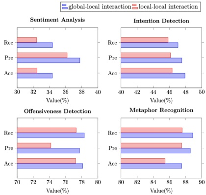

<table border=1 style='margin: auto; word-wrap: break-word;'><tr><td rowspan="2">Method</td><td colspan="3">Sentiment Analysis</td><td colspan="3">Intention Detection</td></tr><tr><td style='text-align: center; word-wrap: break-word;'>Acc</td><td style='text-align: center; word-wrap: break-word;'>Pre</td><td style='text-align: center; word-wrap: break-word;'>Rec</td><td style='text-align: center; word-wrap: break-word;'>Acc</td><td style='text-align: center; word-wrap: break-word;'>Pre</td><td style='text-align: center; word-wrap: break-word;'>Rec</td></tr><tr><td style='text-align: center; word-wrap: break-word;'>Ours</td><td style='text-align: center; word-wrap: break-word;'>34.36</td><td style='text-align: center; word-wrap: break-word;'>37.77</td><td style='text-align: center; word-wrap: break-word;'>34.38</td><td style='text-align: center; word-wrap: break-word;'>47.92</td><td style='text-align: center; word-wrap: break-word;'>47.53</td><td style='text-align: center; word-wrap: break-word;'>47.06</td></tr><tr><td style='text-align: center; word-wrap: break-word;'>w/o OM</td><td style='text-align: center; word-wrap: break-word;'>32.47</td><td style='text-align: center; word-wrap: break-word;'>36.16</td><td style='text-align: center; word-wrap: break-word;'>32.39</td><td style='text-align: center; word-wrap: break-word;'>46.27</td><td style='text-align: center; word-wrap: break-word;'>46.17</td><td style='text-align: center; word-wrap: break-word;'>45.89</td></tr><tr><td style='text-align: center; word-wrap: break-word;'>w/o UP</td><td style='text-align: center; word-wrap: break-word;'>32.85</td><td style='text-align: center; word-wrap: break-word;'>36.53</td><td style='text-align: center; word-wrap: break-word;'>32.76</td><td style='text-align: center; word-wrap: break-word;'>46.73</td><td style='text-align: center; word-wrap: break-word;'>46.59</td><td style='text-align: center; word-wrap: break-word;'>46.11</td></tr><tr><td style='text-align: center; word-wrap: break-word;'>w/o GL</td><td style='text-align: center; word-wrap: break-word;'>31.76</td><td style='text-align: center; word-wrap: break-word;'>35.49</td><td style='text-align: center; word-wrap: break-word;'>31.83</td><td style='text-align: center; word-wrap: break-word;'>45.82</td><td style='text-align: center; word-wrap: break-word;'>45.41</td><td style='text-align: center; word-wrap: break-word;'>45.47</td></tr><tr><td style='text-align: center; word-wrap: break-word;'>w/o DG</td><td style='text-align: center; word-wrap: break-word;'>33.59</td><td style='text-align: center; word-wrap: break-word;'>36.94</td><td style='text-align: center; word-wrap: break-word;'>33.52</td><td style='text-align: center; word-wrap: break-word;'>47.05</td><td style='text-align: center; word-wrap: break-word;'>46.94</td><td style='text-align: center; word-wrap: break-word;'>46.63</td></tr><tr><td rowspan="2"></td><td colspan="3">Offensiveness Detection</td><td colspan="3">Metaphor Recognition</td></tr><tr><td style='text-align: center; word-wrap: break-word;'>Acc</td><td style='text-align: center; word-wrap: break-word;'>Pre</td><td style='text-align: center; word-wrap: break-word;'>Rec</td><td style='text-align: center; word-wrap: break-word;'>Acc</td><td style='text-align: center; word-wrap: break-word;'>Pre</td><td style='text-align: center; word-wrap: break-word;'>Rec</td></tr><tr><td style='text-align: center; word-wrap: break-word;'>Ours</td><td style='text-align: center; word-wrap: break-word;'>78.11</td><td style='text-align: center; word-wrap: break-word;'>77.73</td><td style='text-align: center; word-wrap: break-word;'>78.32</td><td style='text-align: center; word-wrap: break-word;'>87.51</td><td style='text-align: center; word-wrap: break-word;'>88.58</td><td style='text-align: center; word-wrap: break-word;'>88.89</td></tr><tr><td style='text-align: center; word-wrap: break-word;'>w/o OM</td><td style='text-align: center; word-wrap: break-word;'>77.28</td><td style='text-align: center; word-wrap: break-word;'>73.41</td><td style='text-align: center; word-wrap: break-word;'>77.22</td><td style='text-align: center; word-wrap: break-word;'>85.42</td><td style='text-align: center; word-wrap: break-word;'>87.45</td><td style='text-align: center; word-wrap: break-word;'>87.46</td></tr><tr><td style='text-align: center; word-wrap: break-word;'>w/o UP</td><td style='text-align: center; word-wrap: break-word;'>77.53</td><td style='text-align: center; word-wrap: break-word;'>74.66</td><td style='text-align: center; word-wrap: break-word;'>77.68</td><td style='text-align: center; word-wrap: break-word;'>85.81</td><td style='text-align: center; word-wrap: break-word;'>87.64</td><td style='text-align: center; word-wrap: break-word;'>87.74</td></tr><tr><td style='text-align: center; word-wrap: break-word;'>w/o GL</td><td style='text-align: center; word-wrap: break-word;'>76.89</td><td style='text-align: center; word-wrap: break-word;'>72.57</td><td style='text-align: center; word-wrap: break-word;'>76.94</td><td style='text-align: center; word-wrap: break-word;'>84.98</td><td style='text-align: center; word-wrap: break-word;'>86.77</td><td style='text-align: center; word-wrap: break-word;'>86.79</td></tr><tr><td style='text-align: center; word-wrap: break-word;'>w/o DG</td><td style='text-align: center; word-wrap: break-word;'>77.74</td><td style='text-align: center; word-wrap: break-word;'>75.39</td><td style='text-align: center; word-wrap: break-word;'>77.93</td><td style='text-align: center; word-wrap: break-word;'>86.43</td><td style='text-align: center; word-wrap: break-word;'>87.93</td><td style='text-align: center; word-wrap: break-word;'>88.02</td></tr></table>

Table 2: Ablation results on the MET-MEME English dataset of four tasks. “OM” means object-level semantic mining, “UP” means unimodal prediction, “GL” means global-local interaction, “DG” means dual-semantic guided strategy.

merge feature vectors for meme understanding, and M3F (Wang et al. 2024) devise attention mechanisms to capture the interaction between text and images.

## Main Results

We conduct a comprehensive comparison of our MGmCF with SoTA unimodal and multimodal models on the METMEME dataset. Table 1 presents the results for four tasks: sentiment analysis (SA), intention detection (ID), offensive-ness detection (OD), and metaphor recognition (MR). The results highlight that our approach outperforms SoTA baselines across all evaluation metrics for the four tasks, revealing several key findings. Firstly, compared to unimodal models, multimodal models demonstrate superior performance by leveraging additional visual-textual features. However, it is crucial to thoroughly exploit visual information and deeply fuse multimodal features. Otherwise, they only yield marginal improvements over unimodal models or even underperform them (e.g., in the OD task, the MET method performs worse than DenseNet-161 and ResNet-50). By creating cross-modal attention, M3F achieves the current SoTA results. Notably, our model significantly surpasses the SoTA techniques. On the English meme dataset, our precision improves by 8.14% in the OD task, and accuracy improves by 3.53%, 3.89%, and 3.52% in MR, SA, and ID, respectively. On the Chinese dataset, our precision improves by 3.65%, 5.79%, 3.27%, and 5.6% in MR, SA, ID, and OD, respectively. Furthermore, our approach exhibits significant enhancements compared to MET. On the English MEME dataset, improvements range from 6.18% to 13.25%, and on the Chinese MEME dataset, enhancements range from 3.86% to 14.97%. These findings indicate that by focusing on object-level fine-grained image details and the intrinsic unimodal clues, and integrating multi-granular clues, we achieve significant performance improvements in the MMU.

## Ablation Study

We perform ablation experiments to evaluate the contribution of each component in our model. As depicted in Table 2, no variant matches the full model's performance, highlighting the indispensability of each component. Specifically, when

Figure 3: Comparative results between global-local and local-local interaction on the MET-MEME English dataset.

the global-local interaction is not utilized, three evaluation metric scores for all four tasks suffer the most significant decline. In particular, the precision score for the OD task drops by 5.16%, and for the SA task drops by 2.28%. This indicates that the global-local interaction successfully integrates information from different modalities, providing a more comprehensive multimodal feature representation. To validate the necessity of object-level semantic mining module, we remove this module, and the decline in results signifies its indispensable impact on MMU. This finding suggests that mining fine-grained information from images can offer more detailed insights into image content. Furthermore, removing unimodal predictions leads to a performance drop, indicating that unimodal predictions contribute to the final predictions and effectively address the issue of weak correlation between image and text. Additionally, performance declines when dual-semantic guided strategy is removed, demonstrating its crucial role in enhancing semantic alignment and reducing modalities' inconsistencies.

## Deep Analyses on The Proposed Methods

To further investigate the effectiveness of our method, we conduct in-depth analyses to answer the following questions, aiming to mine the intuition and analyze implicit phenomena. Q1: What are the advantages of the global-local interaction? To further validate the effectiveness of our proposed global-local interaction model, we conduct a comparative analysis between our global-local interaction method and the local-local interaction method. The local-local interaction method refers to performing pairwise local interactions within each modality. As shown in Figure 3, the results consistently demonstrate the superiority of the global-local interaction across all evaluation metrics for the four tasks. This finding indicates that by incorporating a higher-level global context that encompasses the entire modality, the global-local interaction method achieves more comprehensive and effective interactions between modalities. In contrast, the local-