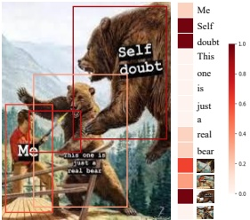
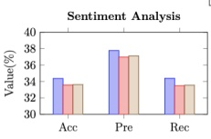
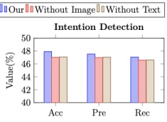
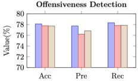
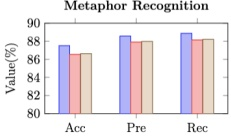
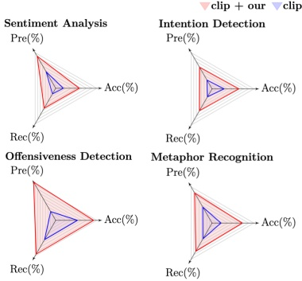

Figure 4: Visualization of a typical example.

Figure 5: Influence of unimodal prediction on the MET-MEME English dataset.

local interaction method solely focuses on intra-modality local feature interactions and fails to fully leverage the holistic information across modalities. By leveraging the global context, we capture a broader range of semantic information, enabling a deeper understanding of the interdependence between modalities and effectively addressing inconsistencies and differences between modalities, thereby enhancing the performance of the MMU task.

Q2: How can fine-grained visual features help improve model performance? We conduct a visualization in Figure 4 to better illustrate the outstanding performance of the fine-grained visual enhancement module. By visualizing the attention distribution of the model, we observe that the module exhibits higher attention towards specific object parts in the image when the fine-grained visual enhancement module is utilized. Focusing on specific objects rather than the entire image allows for more accurate capture of crucial visual details. This confirms the effectiveness of the fine-grained visual enhancement module in improving the model's attention and understanding of key visual information.

Q3: What are the advantages of unimodal prediction in multimodal meme understanding? In order to validate the effectiveness of incorporating unimodal prediction in multimodal meme understanding, we conduct a comparative analysis of the performance of combining unimodal prediction with separately removing text modal prediction and image modal prediction. As illustrated in Figure 5, the results

Figure 6: Influence of CLIP in MMU on the MET-MEME English dataset.

consistently show that the combined unimodal prediction outperform the scenarios where any unimodal prediction is removed across all evaluation metrics in the four tasks. This indicates that by focusing on the crucial information within each modality, we can achieve a more comprehensive and accurate understanding of the visual and textual elements within memes. Furthermore, we observe that removing the image modality prediction has a larger impact on the performance compared to removing the text modality prediction. This finding emphasizes the importance of enhancing visual information. By capturing fine-grained visual details, the model can better leverage the rich visual cues and context present in memes. These findings highlight the value of unimodal prediction and underscore the significance of considering the specific characteristics of each modality in MMU.

Q4: What impact does a large language model have on MMU? Considering the extensive usage of large language models (Wu et al. 2024a,b; Fei et al. 2024c,b), we investigate their influence on MMU. Figure 6 displays the results achieved by employing the standalone CLIP model and by integrating the CLIP model with our proposed method. Notably, employing the CLIP model alone yields impressive performance, attesting to its adeptness in comprehending multimodal memes. Moreover, the integration of the CLIP model with our method results in additional performance improvements, underscoring the efficacy of our approach.

## Conclusion

In this paper, we explore two major challenges in the MMU task: the loss of fine-grained metaphorical visual clues and the neglect of weak correlation between multimodal text and images, proposing a solution named MGMCF. MGMCF enhances the complexity and diversity of images by capturing object-level fine-grained visual clues, and resolves the weak correlation between text and images through a novel global-local cross-modal interaction for multi-granular clue fusion. Extensive experiments on the MET-MEME bilingual dataset demonstrate the effectiveness of all our proposed innovative methods and hypotheses, achieving SoTA performance.