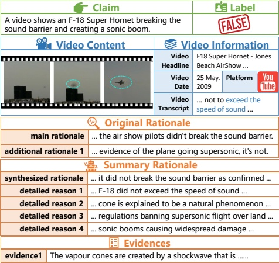

# Pioneering Explainable Video Fact-Checking with a New Dataset and Multi-role Multimodal Model Approach

Kaipeng Niu $ ^{1*} $, Danni Xu $ ^{2*} $, Bingjian Yang $ ^{1} $, Wenxuan Liu $ ^{3} $, Zheng Wang $ ^{1\dagger} $

 $ ^{1} $National Engineering Research Center for Multimedia Software, School of Computer Science, Wuhan University, China  

 $ ^{2} $National University of Singapore, Singapore

 $ ^{3} $Peking University, China

{kaipengniu, yangbingjian, wangzwhu}@whu.edu.cn, dannixu@u.nus.edu, liuwx66@pku.edu.cn

## Abstract

Existing video fact-checking datasets often lack detailed evidence and explanations, compromising the reliability and interpretability of fact-checking methods. To address these gaps, we developed a novel dataset featuring comprehensive annotations for each news item, including veracity labels, the rationales behind these labels, and supporting evidence. This dataset significantly enhances models' ability to accurately identify and explain video content. We also present an explainable automatic framework 3MFact, utilizing Multi-role Multimodal Models for video Fact-checking. Our framework iteratively gathers and synthesizes online evidence to progressively determine the veracity label, generating three key outputs: veracity label, rationale, and supported evidence. We aim for this work to be a pioneering effort, providing robust support for the field of video fact-checking.

Code — https://github.com/MeiTaylor/TRUE-3MFact

## 1 Introduction

Misinformation has been a persistent issue since the rise of digital media, with large models exacerbating the problem through their advanced text generation capabilities, enabling the creation of highly persuasive, multimodal misinformation (Kasneci et al. 2023; Xu, Fan, and Kankanhalli 2023). Despite numerous detection techniques and various fact-checking tools, these measures often fall short. The impressive AI-generated content (AIGC) can make simplistic classification results seem trivial, and studies show that merely labeling content as misinformation has limited persuasive power on affected users (Sanderson, Farrell, and Ecker 2022). In contrast, providing correct answers alongside errors can significantly enhance the corrective impact (Mera, Rodríguez, and Marin-García 2022; Mullet and Marsh 2016). To increase persuasiveness and retention, it is crucial to offer convincing rationale and robust evidence.

Early feature-based supervised models often struggle to fully capture the context of specific claims, rendering them less effective against unseen or complex misinformation. While fact-checking websites like Snopes and PolitiFact can

Figure 1: A sample in the proposed TRUE Dataset. It includes the claim, video, and video background information. Besides, three types of annotations are provided: 1) label, 2) evidences, and 3) original and summary rationales.

verify suspicious claims using external evidence, they heavily depend on human labor, making them impractical for addressing the vast volume of AI-generated misinformation. Although zero-shot methods using large language models (LLMs) have been applied to fact-checking, they often focus on isolated text (Pan et al. 2023; Zhang and Gao 2023), limiting their effectiveness in multimodal scenarios. While recent multimodal models address text-image tasks (Tahmasebi, Müller-Budack, and Ewerth 2024; Liu et al. 2024a), fact-checking for video-based content remains largely unexplored. Moreover, many early approaches lack comprehensive methodological rigor and robust experimental validation, leading to unstable and uncertain performance.

Furthermore, existing fact-checking datasets that include evidence or rationales are limited and suffer from several drawbacks: 1) Most explainable fact-checking datasets focus primarily on text modality, with limited attention to the