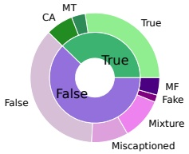
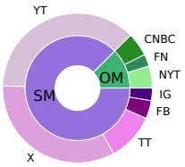

content and exhibit unstable performance. Our 3MFact framework addresses these issues by integrating LMMs and LLMs for multi-modal analysis, incorporating credible online retrieval and multi-role analysis to enhance the robustness and effectiveness of video fact-checking.

## 3 Our TRUE Dataset

### 3.1 Dataset Construction

Data Collection. The dataset was sourced from Snopes $ ^{1} $, focusing on fact-checking articles containing videos, while excluding those with ambiguous labels like “unproven”. We extracted the relevant video information for the videos in the articles from platforms like YouTube and TikTok. Following specific guidelines, we manually selected the claim-sourced video posts (target videos). Transcripts for these target videos were generated using the Deepgram API $ ^{2} $. The raw dataset contains Snopes article texts, claim-related information, associated videos and video-related information, including dates, headlines, platforms, and transcripts (See the complete dataset fields on our Github).

Data Annotation. Our dataset takes a pioneering approach to enhancing the explainability and credibility of video fact-checking by being the first to specifically annotate rationales and corresponding evidence  $ ^{3} $. We introduce two types of rationales: Expert-Crafted Rationale (ECR, also referred to as Original rationales) and LLM-Summary Rationale (LSR, also referred to as Summary rationales). ECR are extracted directly from Snopes articles by LLMs, preserving the original reasoning presented in the articles. Specifically, we extract both the main rationales for direct rating justification and additional supporting rationales. In contrast, LSR are generated by LLMs through synthesization of the article. Specifically, we transform the article into both concise yet comprehensive summaries and detailed reasons by decomposing the verification process and forming structured and traceable reasoning chains. We also collect Evidence that supports these rationales from the articles. Drawing from the Mocheq dataset's methodology (Yao et al. 2023), we extract textual evidence and external links from the <blockquote> tags in the source HTML of Snopes articles. Then, we employ LLMs to interpret the evidence and link it to the rationales. These annotations ensure that each claim is supported by well-defined rationales and evidence. The resulting dataset, as shown in Figure 1, showcases our detailed annotations.

Quality Assessment. To evaluate our dataset quality, we randomly selected 27 representative samples across different time periods and sub-labels. Each sample underwent evaluation by three independent annotators from a pool of seven experts, following a systematic framework with standardized scoring criteria across three critical dimensions (Originality, Accuracy, and Comprehensiveness), as detailed in Table 2. The evaluation results show that LSR achieves significantly higher accuracy (92.3%) and comprehensiveness (98.4%) compared to ECR (70.9% and 33.7% respectively). This performance gap stems from their different construction approaches: ECR captures the natural progression of human reasoning by extracting representative segments where reasoning points are progressively developed, while LSR excels in providing structured, comprehensive summaries through systematic synthesis of the entire content.

<table border=1 style='margin: auto; word-wrap: break-word;'><tr><td style='text-align: center; word-wrap: break-word;'></td><td style='text-align: center; word-wrap: break-word;'>Originality $ ^{1} $</td><td style='text-align: center; word-wrap: break-word;'>Accuracy $ ^{2} $</td><td style='text-align: center; word-wrap: break-word;'>Comprehensiveness $ ^{3} $</td></tr><tr><td style='text-align: center; word-wrap: break-word;'>ECR</td><td style='text-align: center; word-wrap: break-word;'>100%</td><td style='text-align: center; word-wrap: break-word;'>70.90%</td><td style='text-align: center; word-wrap: break-word;'>33.70%</td></tr><tr><td style='text-align: center; word-wrap: break-word;'>LSR</td><td style='text-align: center; word-wrap: break-word;'>-</td><td style='text-align: center; word-wrap: break-word;'>92.30%</td><td style='text-align: center; word-wrap: break-word;'>98.40%</td></tr></table>

 $ ^{1} $ Originality: Unchanged from the original texts in the article.

 $ ^{2} $ Accuracy: Consistent with the rationale’s definition and semantically accurate relative to the article content.

 $ ^{3} $ Comprehensiveness: Covering all aspects of the reasons in the article content.

Table 2: Dataset Assessment Results

Benefits of Dual Rationales. This dual annotation approach—comprising both ECR and LSR—leverages the strengths of each (reliability vs. systematicity) and provides diverse perspectives for evaluating explainable fact-checking results. It also facilitates comparisons between human and AI-generated fact-checking, making the dataset valuable for a wide range of research and applications.

(a)

(b)

Figure 2: (a) Label Composition: False labels include False (1062), Miscaptioned (268), Mixture (305), Fake (52), and Mostly False (MF, 126). True labels include True (798), Mostly True (MT, 100), and Correct Attribution (CA, 199). (b) Social Media (SM): Platforms include Instagram (IG), TikTok (TT), Facebook (FB), X (formerly Twitter), and YouTube (YT). Official Media (OM): Sources include the New York Times (NYT), CNBC, and Fox News (FN).

### 3.2 Dataset Statistics

Claims in the TRUE dataset are from 2016 to 2024, with associated videos under 5 minutes in length. To preserve data authenticity, we have avoided any balancing operations, keeping the original distribution of true and false cases from controversial events. As shown in Figure 2(a), our dataset includes 1,097 true videos and 1,828 false videos, encompassing various types of misinformation. While some sub-labels appear less frequently, this distribution reflects the natural occurrence in real-world fact-checking sources (Snopes) and maintains ecological validity. The claim sources, as illustrated in Figure 2(b), include diverse official and social media platforms, enhancing the dataset's generalizability.