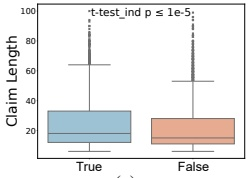
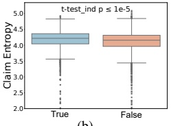
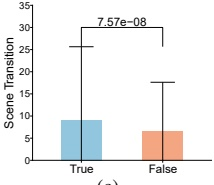
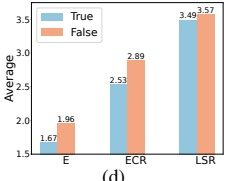

(a)

(b)

(c)

Figure 3: (a) Average Claim Length: false claims are shorter in length. (b) Average Claim Entropy: false claims have lower information richness. (c) Scene Transition Counts: Videos associated with false claims tend to have more uniform scenes. (d) Average Count of Fact-Checking Materials (E: Evidence, ECR: the Expert-Crafted Rationale, LSR: LLM-Summary-Rationale.) per Claim: False claims require more evidence and rationales for accurate judgment.

(d)

### 3.3 Characteristics and Research Insights

Low Information Richness in Claims. To highlight the importance of incorporating new modalities and claim-related information, we conducted a preliminary analysis of the fact-checking dataset's conventional modalities—claims. Claims are typically considered key in fact-checking (Shu et al. 2017). We used entropy (Shannon 1948) to measure the information richness in claims, with lower entropy indicating higher redundancy. As shown in Figure 3(a) and Figure 3(b), false claims typically exhibit lower information richness and shorter lengths, encouraging the search for additional context or evidence for more accurate judgments.

Incomplete Video Context. With the rise of short video platforms, individual users can freely manipulate and upload videos, often resulting in incomplete footage, such as the removal of hypothetical earlier scenes. Previous work has highlighted the significant impact of editing traces in video-based fact-checking (Bu et al. 2023). On this dataset, we use PySceneDetect to identify scene transitions. As shown in Figure 3(c), false videos tend to have fewer scene transitions, suggesting a partial lack of temporal context.

These findings suggest that misinformation often lacks complete information, undermining the reliability of human and machine judgments. This underscores the importance of external information and emphasizes the role of rationales and evidence in clarifying misinformation for online consumers. We also count the average number of rationales and evidence in our dataset. As shown in Figure 3(d), both human and LLM-generated language require more information to clarify false claims compared to true ones.

## 4 Framework

We propose a multi-role collaboration framework, 3MFact, which systematically transfers data between roles to verify claims related to video posts. Inspired by the success of the Question-guided Multi-hop Structure in a text fact-checking system (Pan et al. 2023), our framework also incorporates a Question-guided process. Initially, the Video Descriptor converts the video into a textual description, which, along with the input claim and video information, is passed to the Claim Verifier. The Claim Verifier assesses the sufficiency of the existing available information. If sufficient, the data proceeds to the Reasoner to generate the final truthfulness, reasons, and evidence. If not, the Claim Verifier redirects the data to the Question Manager, initiating another cycle of inquiry and evidence gathering until adequate information is accumulated or a maximum number of cycles is reached.

### 4.1 Problem Definition

The problem of video fact-checking involves verifying a video-related claim c. The model takes as input the claim c, the video content v, and the video background information  $ \mathcal{B} $ (such as the video title, release time, etc.). The primary output is a veracity rating y. Additionally, explainable fact-checking generates rationale r supported by evidence  $ \mathcal{E}_r $.

### 4.2 Video Descriptor

The Video Descriptor converts video content v into a textual description t for analysis by LLM and LMM following the following steps: 1) VideoLMM generates a video-based textual description  $ t_{video} $ from v. 2) ImageLMM produces a set of image descriptions  $ \mathcal{T}_{image} = \{t_1, t_2, \ldots, t_n\} $ for the keyframes  $ \mathcal{F} = \{f_1, f_2, \ldots, f_n\} $ of the video. Each  $ t_i $ represents the textual description of keyframe  $ f_i $. The keyframes are extracted by the Katna method. 3) The overall video content is synthesized by llm to produce the final textual description  $ t $:

 $$ \boldsymbol{t}=\mathrm{l l m}(\boldsymbol{t}_{v i d e o},\mathcal{T}_{i m a g e}). $$ 

This process ensures that the textual descriptions  $ t $ are detailed and accurate, taking into account both visual details and the overall semantics of the video.

### 4.3 Claim Verifier

The Claim Verifier assesses the sufficiency of existing available information for verifying the claim c. This information includes the claim c, the textual video description t, the video background information B, and question-answer pairs with evidence P. This module helps the system establish a reliable judgment with high certainty, avoiding unnecessary reasoning. We use a Chain-of-Thought (CoT) strategy prompt to systematically guide the LLM in inference.

As the module’s output,  $ \alpha \in \{0,1\} $ represents the judgment of information sufficiency,  $ \delta \in [0,1] $ indicates the confidence level, and  $ r_{cv} $ provides reasoning for the judgment. The process continues with the Question Generator in two cases: 1) when  $ \alpha = 0 $, indicating insufficient information, or 2) when  $ \alpha = 1 $ but  $ \delta $ is below a certain threshold (default 0.93 for higher accuracy). Only when  $ \alpha = 1 $ and  $ \delta $ exceeds the threshold does the process proceed to the Reasoner.