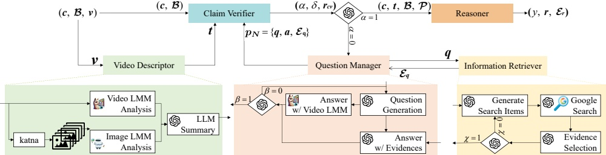

Figure 4: Overview of the proposed 3MFact framework, comprising five components: Video Descriptor (video-to-text conversion), Claim Verifier (assesses evidence sufficiency), Question Manager (generates questions and retrieves answers), Information Retriever (searches for evidence), and Reasoner (synthesizes judgment with rationale and evidence).

### 4.4 Question Manager

The Question Manager formulates questions  $ q $ when existing information is insufficient to verify the claim  $ c $, subsequently deriving answers  $ a $ and evidences  $ \mathcal{E}_q $ via video content  $ v $ or online retrieval, producing new QA&Evidence pairs  $ p_N $ for further claim verification. Once a question  $ q $ is generated, the Question Manager decides how to proceed:

• If $q$ pertains to the video content, the Question Manager forwards the question $q$ and video $v$ to VideoLMM. VideoLMM processes $v$ to generate both the answer and direct evidence from the video, resulting in a new QA&Evidence pair $p_N = (q, \text{videolmm}(v)).$

• If $q$ requires online retrieval, the Information Retriever module searches for relevant evidence based on the question $q$ and selects evidences $\mathcal{E}_q$. The Question Manager then uses $\mathcal{E}_q$ to generate an answer $a$, resulting in a new QA&Evidence pair $p_N = (q, a, \mathcal{E}_q)$.

The Question Manager validates the usefulness of the generated QA&Evidence pair  $ p_N $ by outputting  $ \beta \in \{0, 1\} $, enhancing the framework's accuracy and efficiency. If  $ \beta = 0 $, the new  $ p_N $ is not useful, so the process reiterates with a newly generated question  $ q $. If  $ \beta = 1 $,  $ p_N $ is considered useful and passed to the Claim Verifier for further processing.

### 4.5 Information Retriever

The Information Retriever module extracts key search items from the raw question  $ q $, facilitating the retrieval of diverse and credible evidence needed for a well-supported answer. Specifically,  $ q $ is decomposed into key items  $ \mathcal{K} = \{k_1, k_2, \ldots, k_m\} $, where  $ m $ defaults to 2 to balance workload and result quality. The module then conducts parallel online searches, retrieving up to 10 evidence links per item and subsequently evaluating the results based on website quality, recency, and relevance, scoring each item according to the following criteria:

• Website Quality Score:  $ s_{wq} $ evaluates the reliability and quality of the website content.

• Newness Score:  $ s_{new} $ assesses the recency of the evidence, favoring more recent information to the claim.

• Relevance Score:  $ s_{rlv} $ measures how closely the content matches the search query, focusing on relevant sentences within 250 tokens of the identified key phrases extracted from the Google search snippet.

The overall score s for each piece of raw evidence is:

 $$ s=w_{1}\cdot s_{\mathrm{w q}}+w_{2}\cdot s_{\mathrm{n e w}}+w_{3}\cdot s_{\mathrm{r l v}}, $$ 

where  $ w_{1}=0.25 $,  $ w_{2}=0.25 $, and  $ w_{3}=0.5 $. We prioritize relevance by assigning a higher weight to  $ w_{3} $ to ensure the retrieved content closely aligns with the query.

After scoring, the Information Retriever selects the top 3 pieces of evidence  $ \mathcal{E}_q $ to balance precision and coverage within LLMs' context length limits. Before passing them to the Question Manager, the relevance and usefulness of  $ \mathcal{E}_q $ are additionally validated by assessing whether the evidence can adequately address the query. The validation output is  $ \chi \in \{0,1\} $, where  $ \chi = 1 $ means the evidence is valid and can be passed on. If  $ \chi = 0 $, the evidence is deemed invalid, triggering a new retrieval cycle until a valid  $ \mathcal{E}_q $ appears.

### 4.6 Reasoner

The Reasoner serves as the final decision-making module, tasked with determining the truthfulness and providing explanations based on the existing available information. The information encompasses the claim c, the textual video description t, the video background information B, and the set of question-answer-evidence pairs  $ \mathcal{P} = \{p_1, p_2 \ldots p_N\} $, where N is the number of effective QA&Evidence pairs. The Reasoner is activated after the Claim Verifier has validated the sufficiency of information or when the system reaches the maximum allowable iterations, ensuring a definitive and informed judgment is rendered.

To guide the LLM in this crucial evaluation, we employ a meticulously designed prompt based on CoT strategy to enhance the reasoning capabilities, enabling it to integrate relevant information and obtain a well-substantiated decision with evidence cited for each rationale. The output of this module includes the binary truthfulness label  $ y \in \{0,1\} $, where  $ y = 1 $ indicates that the claim is true, and  $ y = 0 $ indicates that it is false. Additionally,  $ r $ provides the rationale