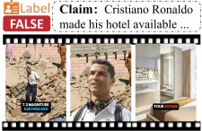
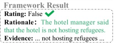

from the Question Manager unexpectedly improves some evidence-related metrics. This could because excluding VideoLMM forced the framework to rely solely on the Information Retriever to gather evidences for answering questions, which places more focus on evidence-based explanations. Conversely, eliminating the Information Retriever leads to less detailed explanations and higher conciseness scores. The results reflect the optimal performance of the complete 3MFact, where all modules work together to achieve a balanced and comprehensive explanation quality.

<table border=1 style='margin: auto; word-wrap: break-word;'><tr><td style='text-align: center; word-wrap: break-word;'>Model</td><td style='text-align: center; word-wrap: break-word;'>Acc.</td><td style='text-align: center; word-wrap: break-word;'>Recall</td><td style='text-align: center; word-wrap: break-word;'>Prec.</td><td style='text-align: center; word-wrap: break-word;'>F1</td></tr><tr><td style='text-align: center; word-wrap: break-word;'>3MFact $ _{(M+M)} $</td><td style='text-align: center; word-wrap: break-word;'>79.63%</td><td style='text-align: center; word-wrap: break-word;'>87.23%</td><td style='text-align: center; word-wrap: break-word;'>71.93%</td><td style='text-align: center; word-wrap: break-word;'>78.85%</td></tr><tr><td style='text-align: center; word-wrap: break-word;'>w/o IR</td><td style='text-align: center; word-wrap: break-word;'>69.98%</td><td style='text-align: center; word-wrap: break-word;'>60.12%</td><td style='text-align: center; word-wrap: break-word;'>63.03%</td><td style='text-align: center; word-wrap: break-word;'>61.54%</td></tr><tr><td style='text-align: center; word-wrap: break-word;'>w/o QA $ _{LMM} $</td><td style='text-align: center; word-wrap: break-word;'>76.18%</td><td style='text-align: center; word-wrap: break-word;'>81.58%</td><td style='text-align: center; word-wrap: break-word;'>66.31%</td><td style='text-align: center; word-wrap: break-word;'>73.16%</td></tr><tr><td style='text-align: center; word-wrap: break-word;'>w/o VD</td><td style='text-align: center; word-wrap: break-word;'>79.42%</td><td style='text-align: center; word-wrap: break-word;'>85.71%</td><td style='text-align: center; word-wrap: break-word;'>68.67%</td><td style='text-align: center; word-wrap: break-word;'>76.25%</td></tr><tr><td style='text-align: center; word-wrap: break-word;'>w/o 2Val</td><td style='text-align: center; word-wrap: break-word;'>72.09%</td><td style='text-align: center; word-wrap: break-word;'>74.85%</td><td style='text-align: center; word-wrap: break-word;'>64.00%</td><td style='text-align: center; word-wrap: break-word;'>69.00%</td></tr></table>

Table 5: Ablation Study on Different Modules. IR: Information Retriever module, QA $ _{LMM} $: Question Answering with VideoLMM, VD: Video Descriptor module, 2Val: Validation of P and Validation of  $ E_{q} $

### 5.4 The Performance on Different Rationales

In this section we compare the 3MFact framework on both Expert-Crafted Rationale (ECR) and LLM-Summary-Rationale (LSR). The results of the 3MFact $ _{(M+M)} $ framework are shown in Table 7. The results indicate that the 3MFact framework's performance on the original rationale is also fairly good, demonstrating its alignment with human explanations. The lower scores for the ECR compared to LSR may be due to some inaccuracies in the currently collected rationales (as shown in Table 2). Nevertheless, ECR can largely avoid fact-hallucination flaws while retaining the nuances of human reasoning. We believe that this part of the dataset can be further refined in the future, collaborating with LSR to provide a more reliable and comprehensive set of ground-truth rationales.

### 5.5 Case study

In addition to the quantitative analysis, we conducted a qualitative analysis with selected successful and unsuccessful cases to visually showcase the capabilities of our 3MFact framework. Figure 5(a) shows an example of successful detection. In this case, our framework successfully predicted the falsity of a claim by retrieving related news articles from the web that effectively refuted the claim. This demonstrates the framework's ability to utilize external evidence to challenge and verify claims. Conversely, as shown in Figure 5(b), a failed case is illustrated where an accurate claim was incorrectly classified by our framework. The error arose from inaccurate analysis of video details, leading to a miscued caption and a subsequent misjudgment. This highlights a current limitation in our framework's video detailed content analysis and the need for further improvements.

<table border=1 style='margin: auto; word-wrap: break-word;'><tr><td rowspan="2">Model</td><td style='text-align: center; word-wrap: break-word;'>Trad.</td><td colspan="4">Content Credibility Analysis(G-E.)</td></tr><tr><td style='text-align: center; word-wrap: break-word;'>B</td><td style='text-align: center; word-wrap: break-word;'>RG</td><td style='text-align: center; word-wrap: break-word;'>R-O</td><td style='text-align: center; word-wrap: break-word;'>LC</td><td style='text-align: center; word-wrap: break-word;'>SoE</td></tr><tr><td style='text-align: center; word-wrap: break-word;'>3MFact $ _{(M+M)} $</td><td style='text-align: center; word-wrap: break-word;'>0.04</td><td style='text-align: center; word-wrap: break-word;'>0.25</td><td style='text-align: center; word-wrap: break-word;'>2.37</td><td style='text-align: center; word-wrap: break-word;'>4.47</td><td style='text-align: center; word-wrap: break-word;'>3.96</td></tr><tr><td style='text-align: center; word-wrap: break-word;'>w/o IR</td><td style='text-align: center; word-wrap: break-word;'>0.03</td><td style='text-align: center; word-wrap: break-word;'>0.24</td><td style='text-align: center; word-wrap: break-word;'>1.70</td><td style='text-align: center; word-wrap: break-word;'>4.22</td><td style='text-align: center; word-wrap: break-word;'>2.72</td></tr><tr><td style='text-align: center; word-wrap: break-word;'>w/o QA $ _{LMM} $</td><td style='text-align: center; word-wrap: break-word;'>0.03</td><td style='text-align: center; word-wrap: break-word;'>0.25</td><td style='text-align: center; word-wrap: break-word;'>2.30</td><td style='text-align: center; word-wrap: break-word;'>4.46</td><td style='text-align: center; word-wrap: break-word;'>4.24</td></tr><tr><td style='text-align: center; word-wrap: break-word;'>w/o VD</td><td style='text-align: center; word-wrap: break-word;'>0.03</td><td style='text-align: center; word-wrap: break-word;'>0.26</td><td style='text-align: center; word-wrap: break-word;'>2.25</td><td style='text-align: center; word-wrap: break-word;'>4.41</td><td style='text-align: center; word-wrap: break-word;'>4.01</td></tr><tr><td style='text-align: center; word-wrap: break-word;'>w/o 2Val</td><td style='text-align: center; word-wrap: break-word;'>0.04</td><td style='text-align: center; word-wrap: break-word;'>0.25</td><td style='text-align: center; word-wrap: break-word;'>2.17</td><td style='text-align: center; word-wrap: break-word;'>4.41</td><td style='text-align: center; word-wrap: break-word;'>3.92</td></tr></table>

Table 6: Ablation Study Evaluation on Explanation Metrics.

<table border=1 style='margin: auto; word-wrap: break-word;'><tr><td style='text-align: center; word-wrap: break-word;'>GT-R type</td><td style='text-align: center; word-wrap: break-word;'>BLEU-4</td><td style='text-align: center; word-wrap: break-word;'>ROUGE-L</td><td style='text-align: center; word-wrap: break-word;'>R-O(G-E.)</td></tr><tr><td style='text-align: center; word-wrap: break-word;'>ECR+LSR</td><td style='text-align: center; word-wrap: break-word;'>0.024</td><td style='text-align: center; word-wrap: break-word;'>0.242</td><td style='text-align: center; word-wrap: break-word;'>2.157</td></tr><tr><td style='text-align: center; word-wrap: break-word;'>ECR</td><td style='text-align: center; word-wrap: break-word;'>0.021</td><td style='text-align: center; word-wrap: break-word;'>0.194</td><td style='text-align: center; word-wrap: break-word;'>2.166</td></tr><tr><td style='text-align: center; word-wrap: break-word;'>LSR</td><td style='text-align: center; word-wrap: break-word;'>0.037</td><td style='text-align: center; word-wrap: break-word;'>0.252</td><td style='text-align: center; word-wrap: break-word;'>2.370</td></tr></table>

Table 7: Comparison of Results on Different GT-R (Ground Truth Rationale) type. GT-R type: Ground Truth Rationale Type. ECR: the Expert-Crafted Rationale, LSR: the specific LLM-Summary-Rationale

(a) Successful detection example

<table border=1 style='margin: auto; word-wrap: break-word;'><tr><td style='text-align: center; word-wrap: break-word;'>Framework Result</td></tr><tr><td style='text-align: center; word-wrap: break-word;'>Rating: False ✗</td></tr><tr><td style='text-align: center; word-wrap: break-word;'>Rationale: The video shows no interaction between ...</td></tr><tr><td style='text-align: center; word-wrap: break-word;'>Evidence: The video portrays an ...</td></tr></table>

(b) Failed detection due to video miscaption

Figure 5: Examples of successful and failed claim detection by the 3MFact framework.

## 6 Conclusion

We explored the first dataset TRUE for explainable video fact-checking, which emphasizes the essential of resummarized rationale. It includes abundant multimodal information, providing an exploratory way for supporting explainable fact-checking research. The in-depth statistical analysis highlighted the necessity and practicality of TRUE. Based on this, we proposed an innovative multi-role structure 3MFact, tackling unseen misinformation among multimodals via diverse sources. We also established novel metrics to evaluate both accuracy and reasoning. Extensive experiments demonstrated the effectiveness of 3MFact in both misinformation detection and explanation. Nevertheless, significant room for improvement remains. LMMs, in particular, face challenges in fact-checking subtasks such as answering fact-related questions and generating video descriptions. Furthermore, the human-crafted rationales in our dataset require further refinement to enhance their completeness and accuracy.