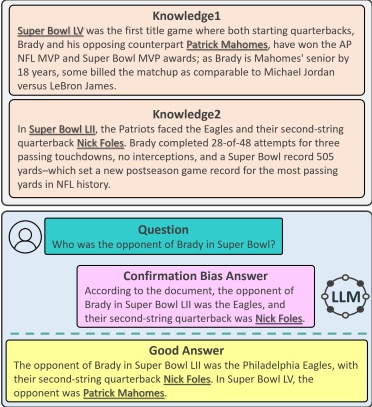

# Synthetic Paths to Integral Truth: Mitigating Hallucinations Caused by Confirmation Bias with Synthetic Data

Changwon Ok $ ^{*} $

KT Corporation,

Republic of Korea

ok.changwon@kt.com

Eunkyeong Lee $ ^{*} $

KT Corporation,

Republic of Korea

ek.lee@kt.com

Dongsuk Oh $ ^{\dagger} $

Department of

English Language and Literature,

Kyungpook National University,

Republic of Korea

inow3555@knu.ac.kr

## Abstract

Recently, large language models (LLMs) have made significant progress through retrieval-augmented generation (RAG) and preference learning. However, they still exhibit issues such as confirmation bias, the tendency to favor information that confirms one's beliefs, which remains largely unexplored in current research. In this paper, we propose a novel approach to mitigate confirmation bias-induced hallucination in LLMs through a synthetic data construction pipeline and Direct Preference Optimization (DPO) training. Our method enhances the integration of diverse and complementary information from multiple passages retrieved by RAG, enabling more balanced and accurate reasoning. Experimental results demonstrate significant improvements in response accuracy and reduced hallucination on benchmarks such as Natural Questions Open and HaluBench. These findings suggest that our approach effectively mitigates confirmation bias in long-context question answering, with potential applications to other NLP tasks. We release our data, and evaluation/train code for public access.

## 1 Introduction

Recently, large language models (LLMs) (Jiang et al., 2024a; Dubey et al., 2024; Minaee et al., 2024) have demonstrated remarkable success in various natural language processing (NLP) tasks, ranging from machine translation (Pourkamali and Sharifi, 2024) and summarization (Ravaut et al., 2024) to complex question answering and reasoning (Jiang et al., 2024b; Zhu et al., 2024). Despite these achievements, challenges persist, particularly when these models generate responses based on incomplete or ambiguous inputs (Tomoy et al., 2024).

Figure 1: Example of Confirmation Bias in LLMs (Llama-3-8B) using RAG-retrieved Knowledge about Brady's Super Bowl appearances. The LLMs typically generate a biased answer by focusing only on one event, such as Super Bowl LII, while ignoring other relevant information like Super Bowl LV. The good answer represents the ideal response the model should generate, referencing both events to provide a complete and accurate answer.

Methods like retrieval-augmented generation (RAG) (Lewis et al., 2020a; Fan et al., 2024) have been developed to address these limitations. RAG enhances the accuracy of LLMs by incorporating external knowledge sources during the generation process. By retrieving relevant information from large databases or documents, RAG systems improve the model's ability to produce factually accurate outputs and mitigate hallucinations by grounding responses in external data. However, while RAG improves the factual accuracy of responses, LLMs may still suffer from confirmation bias, which leads them to generate biased responses by favoring specific retrieved information over others.