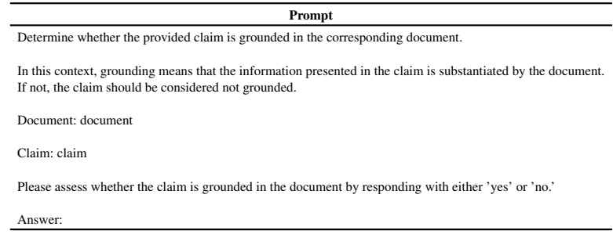

<table border=1 style='margin: auto; word-wrap: break-word;'><tr><td style='text-align: center; word-wrap: break-word;'>Type</td><td style='text-align: center; word-wrap: break-word;'>Prompt</td></tr><tr><td rowspan="4">Knowledge Segment Relevance Tagging</td><td style='text-align: center; word-wrap: break-word;'>Please identify the given knowledge segment is related to the given question. Make answer just TRUE or FALSE. JUST answer the question. DO NOT say the explanation.</td></tr><tr><td style='text-align: center; word-wrap: break-word;'>Provide your response as follows: Answer: (TRUE or FALSE)</td></tr><tr><td style='text-align: center; word-wrap: break-word;'>Now here are the passage and question.</td></tr><tr><td style='text-align: center; word-wrap: break-word;'>Knowledge segment: {knowledge segment} Question: {question} Answer:</td></tr><tr><td style='text-align: center; word-wrap: break-word;'>Chosen Responses</td><td style='text-align: center; word-wrap: break-word;'>Answer the question based on the context. You SHOULD use all the information in the context to answer the question. SHOULD NOT say that you answered based on the given context. Context: {context} Question: {question} Answer:</td></tr><tr><td rowspan="2">Distorted Evidence-Based Responses</td><td style='text-align: center; word-wrap: break-word;'>The Given context is UNRELATED to the question. Make WRONG answer to the question based on the UNRELATED context. SHOULD NOT say that you answered based on the given context.</td></tr><tr><td style='text-align: center; word-wrap: break-word;'>UNRELATED Context: {context} Question: {question} WRONG Answer:</td></tr></table>

Table 5: Prompts used in the dataset generation pipeline.

Table 6: Prompts used in LLM as judge to evaluate groundness in the given claim (generated text) to the given document. To obtain more accurate results, we sequentially provided the model with only the passages related to the question from the given context as prompts.

