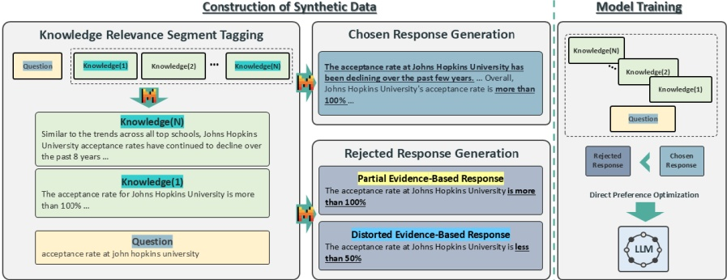

Figure 2: Synthetic Paths to Integral Truth. The process of constructing synthetic data to mitigate confirmation bias has a total of three steps. (i) Knowledge Segment Relevance Tagging: Tagging the knowledge related to the question using LLM. The knowledge highlighted in blue green represents the knowledge segments related to the question. (ii) Chosen Response Generation: Generating a chosen response using only the knowledge related to the question (iii) Rejected Response Generation: Partial Evidence-Based Response, Distorted Evidence-Based Response using two methods to make rejected responses. The pair dataset is then used to optimize the LLM's preference.

We hypothesize that responses that reflect and integrate all relevant knowledge segments (referred to as chosen responses) are of higher quality, while those exhibiting confirmation bias (referred to as rejected responses) lead to low quality outputs.

### 3.2 Generating Synthetic Dataset

The dataset is generated automatically, following a process designed to meet the criteria outlined in §3.1. This process is organized into a three-stage pipeline: (1) Knowledge Segment Relevance Tagging, (2) Chosen Response Generation, and (3) Rejected Response Generation.

To process each step, we utilize prompt engineering with LLM, and further details used in this process are provided in Table 5. We use Mixtral-8x7B-Instruct-v0.1 for this process (Jiang et al., 2024a).

Knowledge Segment Relevance Tagging Our task is question answering using a given context. We first need to identify question-related knowledge segments from the given context to generate chosen/rejected responses. Since human annotation is time-consuming and expensive, we use an LLM to automatically annotate the question-related knowledge segments. For example, as shown in Figure 2, knowledge relevance tagging involves identifying and tagging the two knowledge segments in the given context that are relevant to the question, "acceptance rate at Johns Hopkins University." These knowledge segments contain information that can be used to infer the correct answer to the question. Specifically, "Knowledge (N)" mentions the trend of declining acceptance rates at Johns Hopkins University over the past 8 years, offering contextual information about the university's competitive admissions process. Meanwhile, "Knowledge (1)" directly addresses the acceptance rate of "more than 100%".

Chosen Response Generation A chosen response reflects and integrates all relevant knowledge segments in the given context. We select the question-related knowledge segments in the given context and prompt an LLM with the knowledge segments and the question itself to generate these chosen responses. As shown in Figure 2, the chosen response generation considers both question-related knowledge segments, "Knowledge (1)" and "Knowledge (N)" to generate the final answer, reflecting the information that the acceptance rate is "more than 100%" and has been "declining over the past few years.".

Rejected Response Generation To create rejected responses, we generate two types of outputs. The first type, Partial Evidence-Based Response is a response generated by providing the LLM with a prompt containing only a single knowledge segment related to the question, along with