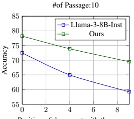
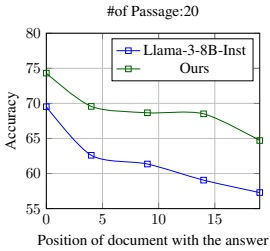
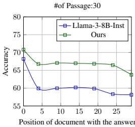

Figure 3: Comparison between our model and the Llama-8B-Inst baseline as the position of the document containing the answer increases in Lost in the Middle setting. The index on the x-axis represents the position of the gold passage among the total knowledge segments, and the index starts at 0.

<table border=1 style='margin: auto; word-wrap: break-word;'><tr><td style='text-align: center; word-wrap: break-word;'>Model</td><td style='text-align: center; word-wrap: break-word;'>Type</td><td style='text-align: center; word-wrap: break-word;'>Accuracy</td><td style='text-align: center; word-wrap: break-word;'>KF1</td><td style='text-align: center; word-wrap: break-word;'>LLM as Judge</td></tr><tr><td rowspan="2">Llama-3-8B-Inst</td><td style='text-align: center; word-wrap: break-word;'>Single</td><td style='text-align: center; word-wrap: break-word;'>86.80</td><td style='text-align: center; word-wrap: break-word;'>28.04</td><td style='text-align: center; word-wrap: break-word;'>90.00</td></tr><tr><td style='text-align: center; word-wrap: break-word;'>Multiple</td><td style='text-align: center; word-wrap: break-word;'>63.60</td><td style='text-align: center; word-wrap: break-word;'>32.49</td><td style='text-align: center; word-wrap: break-word;'>48.71</td></tr><tr><td rowspan="2">Ours</td><td style='text-align: center; word-wrap: break-word;'>Single</td><td style='text-align: center; word-wrap: break-word;'>94.20</td><td style='text-align: center; word-wrap: break-word;'>54.52</td><td style='text-align: center; word-wrap: break-word;'>96.20</td></tr><tr><td style='text-align: center; word-wrap: break-word;'>Multiple</td><td style='text-align: center; word-wrap: break-word;'>73.00</td><td style='text-align: center; word-wrap: break-word;'>55.99</td><td style='text-align: center; word-wrap: break-word;'>58.56</td></tr></table>

Table 3: Experiment results on the Scaling with the number of relevant passages, showing model performance based on the number of query-related passages. Single refers to instances with only one related passage, while Multiple indicates instances with multiple related passages. The results compare accuracy, KF1 score, and LLM-as-Judge evaluations between the Llama-3-8B-Inst and our model. Bold text indicates superior performance in the same condition.

the Single category, where only one passage is relevant, our model achieves an accuracy of 94.20 and a KF1 score of 54.52, significantly higher than the baseline's 86.80 accuracy and 28.04 KF1. For the Multiple category, which involves synthesizing information from multiple passages, our model achieves 73.00 accuracy and a KF1 of 55.99, compared to the baseline's 63.60 accuracy and 32.49 KF1. These results suggest that, even though we trained the model to mitigate confirmation bias, especially to avoid using partial evidence in the given context, it primarily learned to effectively utilize the correct knowledge segment when present.

In LLM as Judge score in Single category, the score improves from 90.0 to 96.20 (+Δ6.2) while the score improves from 48.71 to 58.56 (+Δ9.85) in Multiple. These results imply that our model effectively integrates information from all relevant sources, mitigating partial evidence-based responses. Furthermore, this suggests that our methodology can achieve a stronger effect in long-context scenarios.

Overall, these results show that our model successfully reduces hallucination related to confirmation bias, both in straightforward and more complex scenarios, by incorporating comprehensive evidence during response generation. We show model outputs in Appendix.

### 4.5 Assessing the Quality of Synthetic Data

<table border=1 style='margin: auto; word-wrap: break-word;'><tr><td style='text-align: center; word-wrap: break-word;'>Model</td><td style='text-align: center; word-wrap: break-word;'>Accuracy</td><td style='text-align: center; word-wrap: break-word;'>KF1</td></tr><tr><td style='text-align: center; word-wrap: break-word;'>Llama-3-8B-Inst</td><td style='text-align: center; word-wrap: break-word;'>58.68</td><td style='text-align: center; word-wrap: break-word;'>28.62</td></tr><tr><td style='text-align: center; word-wrap: break-word;'>Llama-3-8B-Inst (chosen)</td><td style='text-align: center; word-wrap: break-word;'>62.64</td><td style='text-align: center; word-wrap: break-word;'>40.40</td></tr><tr><td style='text-align: center; word-wrap: break-word;'>Llama-3-8B-Inst (rejected)</td><td style='text-align: center; word-wrap: break-word;'>39.59</td><td style='text-align: center; word-wrap: break-word;'>27.86</td></tr><tr><td style='text-align: center; word-wrap: break-word;'>Ours</td><td style='text-align: center; word-wrap: break-word;'>65.76</td><td style='text-align: center; word-wrap: break-word;'>43.78</td></tr></table>

Table 4: Experiment results in assessing the quality of synthetic data. Llama-3-8B-Inst (chosen) refers to the Llama-3-8B Inst model fine-tuned exclusively on the chosen data, while Llama-3-8B-Inst (rejected) refers to the same model fine-tuned exclusively on the rejected data. Bold text indicates the best performance, while underlined text indicates the second-best performance.

We did not directly evaluate the synthetic data we generated. Instead, we assessed its effectiveness indirectly by fine-tuning the Llama-3-8B-Inst model using synthetic data. Specifically, we trained models using only the chosen data, only the rejected data, and compared these with the original