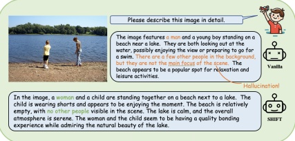

# SHIFT: Smoothing Hallucinations by Information Flow Tuning for Multimodal Large Language Models

Sudong Wang $ ^{1,2} $, Yunjian Zhang $ ^{3,*} $, Yao Zhu $ ^{3,*} $, Enci Liu $ ^{4} $

Jianing Li $ ^{3} $, Yanwei Liu $ ^{1} $, Xiangyang Ji $ ^{3} $

 $ ^{1} $Institute of Information Engineering, Chinese Academy of Sciences;

 $ ^{2} $Nanyang Technological University;  $ ^{3} $Tsinghua University;  $ ^{4} $Columbia University

SWANG049@e.ntu.edu.sg, sdtczyj@gmail.com, ee_zhuy@zju.edu.cn

## Abstract

Despite the remarkable progress of Multimodal Large Language Models (MLLMs) in recent years, the persistent challenge of “hallucination” has surfaced as a major barrier, sharply constraining their practical applicability and reliability in real-world systems. In this paper, we provide a novel perspective for the causes and mitigations for hallucinations by tracking the information flow within MLLMs. We find that information in MLLMs does not flow in a strictly continuous manner, instead, they may mutate abruptly in deep layers. The mutated information does not originate from shallow layers, on the contrary, it is directly injected into the model, which may cause the model's outputs to deviate from the input, leading to hallucinations. Inspired by this observation, we propose a hallucination mitigation method that directly operates on the mutated information, named Smoothing Hallucinations by Information Flow Tuning (SHIFT). In this method, the differences of feature encodings between adjacent layers are monitored, and once the mutated information is detected, the knowledge from shallow layers is used to tune it. This process filters out hallucinated knowledge, aligning features more faithfully with the input and effectively reducing hallucinations. Extensive experiments on multiple benchmarks have demonstrated the superior performance in terms of accuracy and efficiency of SHIFT on mitigating hallucinations compared with baselines.

### 1. Introduction

Recently, Multimodal Large Language Models (MLLMs) have advanced significantly in understanding and interpreting natural images, driving breakthroughs across various vision-language tasks [2, 4, 5, 9, 12, 17, 26, 34, 35, 47, 50–52, 55]. Despite the remarkable success in processing multimodal information, MLLMs still struggle with the "hallucination" challenge [16, 22, 29, 33, 36, 43]. Specifically, MLLMs may attach incorrect attributes (e.g. color, quantity) to objects in the input image, and might even fabricate non-existent objects, resulting in plausible-sounding but ridiculous responses. This phenomenon has raised concerns about the safety and accuracy of MLLMs, limiting their applications in commercial scenarios.

Existing mitigating MLLM hallucination methods mainly fall into two categories: training-based and training-free. The former attributes hallucinations to cross-modal misalignment, and thus finetunes the model using hallucination-targeted datasets or Reinforcement Learning with Human Feedback (RLHF) [3, 16, 23, 32, 41, 54]. While these approaches have shown effectiveness in reducing hallucinations, they rely heavily on manual data annotation and knowledge base integration, and the training process also incurs additional computational costs. By contrast, training-free methods address hallucinations during the inference stage, without requiring additional training costs. Currently, these methods operate at the token level, either performing contrastive decoding on token probabilities [25, 46] or penalizing over-trust tokens [19].

Figure 1. SHIFT is effective for mitigating hallucinations.

Current methods do not consider how hallucinated information appears during the model’s processing, which