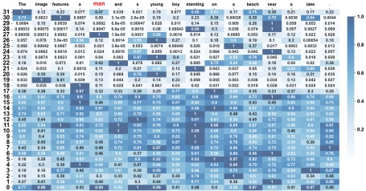
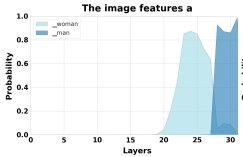
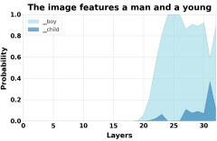
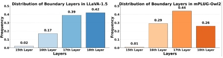

Figure 2. JSDs of the probability distributions between two adjacent layers in LLaVA-1.5.

#### 3.1. Information Flow across Layers

Early exiting [14, 39] has been proven to be effective in observing the hidden representations in language models [11]. [45] employs this tool to devise a series of methods for tracking information flow, leading to the observation of several intriguing phenomena. Inspired by that, we begin by investigating the origin of hallucinations. In MLLMs, the aligned features from multimodal encoders are first embedded into a sequence of vectors  $ V_0 = \{v_1^0, ..., v_{n-1}^0\} $, we apply the affine function  $ \phi(\cdot) $ on each hidden transformer block. Denoting the output of the  $ i $-th layer as  $ V_i $, then the next token predicted with it can be calculated as

 $$ p_{i}(x_{t}|x_{0,\ldots,t-1})=softmax(\phi(V_{i}))_{x_{t}}, $$ 

where  $ i \in \{0, ..., N-1\} $. The probability distribution of all candidate tokens  $ p_i(\cdot | x_0, ..., t-1) $ in the vocabulary set  $ X $ represents the information contained in the  $ i $-th layer. We calculate the Jensen-Shannon Divergence (JSD) between the token probability distributions of two adjacent layers, which provides an intuitive display for the information difference between layers. It can be formulated as:

 $$ \begin{align*}d(p_{i}(\cdot|x_{0,\ldots,t-1}),p_{j}(\cdot|x_{0,\ldots,t-1}))\\=JSD(p_{i}(\cdot|x_{0,\ldots,t-1})||p_{j}(\cdot|x_{0,\ldots,t-1})),\end{align*} $$ 

where i and j are two adjacent layers. JSDs for the hallucinated example in Figure 1 are shown in Figure 2, revealing two key patterns. Pattern 1: JSDs exhibit a clear hierarchical trend. In shallow layers, values are relatively high, reflecting significant information shifts as the model rapidly forms local representations. In contrast, deeper layers show much lower JSDs, suggesting convergence toward stable, global representations. Pattern 2: For some tokens like “man”, “young”, and “standing”, we observe sudden JSD spikes in deep layers, indicating abrupt information injections that drastically alter the predicted token distribution.

We refer to the layers exhibiting significant JSD changes as mutation layers. To analyze the nature of injected information, we trace the probability evolution of affected tokens

(a) Hallucination token.

(b) Correct token.

Figure 3. The probability changes of tokens across different layers.

across layers. For hallucinated predictions, such as “man” are shown in Figure 3(a), the token initially has low probability, with “woman” as the top prediction. After 27-th layer, the probability of “man” rises sharply and surpasses “woman”, indicating that contradictory information is injected at this stage, ultimately leading to hallucination. In contrast, for correct predictions (Figure 3(b)), probability fluctuations remain within semantically related tokens (e.g., “boy” and “child”), suggesting that the injected information is correlated with the original context and does not impair prediction accuracy. Among 1206 manually identified hallucinated tokens, 1062 exhibit mutations in deep layers, indicating that hierarchical mutation is a widespread phenomenon in MLLMs. Our analysis reveals a consistent pattern: when the injected knowledge contradicts prior context, hallucinations emerge; when it is semantically aligned, the model maintains faithful outputs by preserving contextual consistency.

Figure 4. We randomly select 400 images from the MSCOCO dataset and conduct statistical analyses on LLaVA-1.5 and mPLUG-owl2, and the hierarchical phenomenon in all images

Furthermore, as shown in Figure 5, we examine attention maps at the mutation layers and observe substantial shifts in attention distribution. Compared to earlier layers, attention in deeper layers drifts from the original semantics, influenced by the injected concepts. This redistribution suggests that mutation layers not only cause token-level deviations but also reshape the model's internal visual grounding. These findings support our hypothesis that mutation layers serve as integration points for new information, with their impact depending on the semantic alignment between the injected knowledge and the model's prior context.

New dominant tokens may emerge in mutation layers, falling into four categories: both original and new tokens are correct (Type 1), correct-to-hallucinated (Type