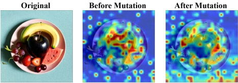
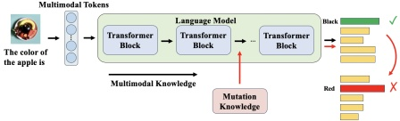
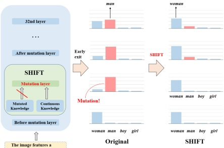

Figure 5. Visualization of attention maps before and after mutation shows that the original distribution aligns with input semantics, while the mutated version significantly deviates.

Figure 6. Mutation knowledge may differ significantly from the original, leading the model to make predictions faithless to the input image, such as describing a “black” apple as “red”.

2), hallucinated-to-correct (Type 3), and both hallucinated (Type 4). We randomly sample 100 images from the MSCOCO dataset [31] and tally these cases. As shown in Table 1, among the changed tokens (Types 2 and 3), correct tokens are more often replaced by hallucinations than vice versa, indicating that mutation layers tend to introduce hallucinated content. While not all mutations lead to hallucinations, most hallucinated tokens stem from such mutations. This suggests that smoothing mutation layers with information from preceding layers can help retain correct tokens and suppress hallucinations.

Table 1. After the mutation layers, most tokens either remain correct or change from correct to hallucinated.

<table border=1 style='margin: auto; word-wrap: break-word;'><tr><td style='text-align: center; word-wrap: break-word;'>Type 1</td><td style='text-align: center; word-wrap: break-word;'>Type 2</td><td style='text-align: center; word-wrap: break-word;'>Type 3</td><td style='text-align: center; word-wrap: break-word;'>Type 4</td><td style='text-align: center; word-wrap: break-word;'>Total</td></tr><tr><td style='text-align: center; word-wrap: break-word;'>78.6%</td><td style='text-align: center; word-wrap: break-word;'>14.9%</td><td style='text-align: center; word-wrap: break-word;'>3.36%</td><td style='text-align: center; word-wrap: break-word;'>3.14%</td><td style='text-align: center; word-wrap: break-word;'>100%</td></tr></table>

#### 3.2. Smoothing Hallucinations by Information Flow Tuning (SHIFT)

Inspired by the analyses above, we propose to tune the information in the mutation layers with the continuous information from earlier layers. As illustrated in Figure 7, this approach ensures that the visual information extracted by the shallow layers can be effectively transmitted to the deep layers, thereby reducing hallucinated information.

Assuming we are currently predicting the t-th token, the predicted distributions of all layers for the output token are

Figure 7. The continuous information from preceding layers is used to tune the mutated information, and therefore the injected hallucinated knowledge can be smoothed.

calculated with the affine layer, denoted as

 $$ P_{l}=p_{i}(\cdot|x_{0},...,x_{t-1}),l\in[0,N-1], $$ 

where  $ P_{l} $ is the probability distribution of the l-th layer. After that, the JSD between the probability distributions of any two adjacent layers is calculated, then the mutation layer  $ L_{mutation} $ with the maximum JSD is selected by

 $$ L_{mutation}=\underset{l^{*}<l<N-1}{\arg\max}JSD(P_{l-1}||P_{l}), $$ 

where the  $ l^{*} $-th layer is the boundary of the hierarchical phenomenon in Figure 2. In SHIFT, only those mutation layers with larger mutation values are retained for further processing. This is because when the mutation values are smaller, the injected knowledge is likely more similar to the original, making it less likely to cause hallucinations. The retained mutation layer  $ L^{*}_{mutation} $ can be calculated as

 $$ \begin{aligned}L_{mutation}^{*}=\{l\mid\exists\epsilon,\delta>0such that JSD(P_{l-1}||P_{l})>\epsilon\\ and\left|\frac{JSD(P_{l}||P_{l+1})-JSD(P_{l-1}||P_{l})}{JSD(P_{l-1}||P_{l})}\right|>\delta\right\},\end{aligned} $$ 

where  $ \epsilon $ and  $ \delta $ are two controlling parameters.

For any retained mutation layer, adjustments need to be made using the continuous information transmitted from the shallow layers to reduce the potential hallucinations caused by the injected knowledge. Since the JSD values typically converge before the mutation layer, we choose the layer preceding the mutation layer to smooth it. It is important to note that this operation is performed on the encoding vectors before applying the affine layer, rather than on the token probabilities. The feature vectors are computed as

 $$ V_{l}^{*}=\begin{cases}V_{l}&if l<L_{mutation}^{*}\\ \alpha\cdot V_{l-1}+(1-\alpha)\cdot V_{l}&if l=L_{mutation}^{*}\\ V_{l-1}&if l>L_{mutation}^{*}\end{cases}, $$ 