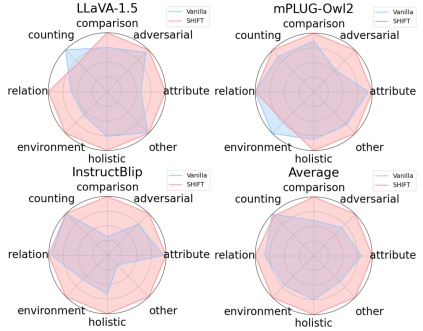

Table 2. CHAIR hallucination evaluation results on three MLLMs, where a smaller number indicates less hallucinations.

<table border=1 style='margin: auto; word-wrap: break-word;'><tr><td rowspan="2">Decoding</td><td rowspan="2">Method</td><td colspan="2">LLaVA-1.5 [34]</td><td colspan="2">mPLUG-Owl2 [47]</td><td colspan="2">InstructBlip [12]</td></tr><tr><td style='text-align: center; word-wrap: break-word;'>CHAIR $ _{S} $</td><td style='text-align: center; word-wrap: break-word;'>CHAIR $ _{I} $</td><td style='text-align: center; word-wrap: break-word;'>CHAIR $ _{S} $</td><td style='text-align: center; word-wrap: break-word;'>CHAIR $ _{I} $</td><td style='text-align: center; word-wrap: break-word;'>CHAIR $ _{S} $</td><td style='text-align: center; word-wrap: break-word;'>CHAIR $ _{I} $</td></tr><tr><td rowspan="2">Greedy</td><td style='text-align: center; word-wrap: break-word;'>Vanilla</td><td style='text-align: center; word-wrap: break-word;'>49.6</td><td style='text-align: center; word-wrap: break-word;'>13.1</td><td style='text-align: center; word-wrap: break-word;'>59.8</td><td style='text-align: center; word-wrap: break-word;'>15.8</td><td style='text-align: center; word-wrap: break-word;'>56.4</td><td style='text-align: center; word-wrap: break-word;'>23.2</td></tr><tr><td style='text-align: center; word-wrap: break-word;'>SHIFT</td><td style='text-align: center; word-wrap: break-word;'>43.8</td><td style='text-align: center; word-wrap: break-word;'>12.4</td><td style='text-align: center; word-wrap: break-word;'>50.2</td><td style='text-align: center; word-wrap: break-word;'>15.2</td><td style='text-align: center; word-wrap: break-word;'>44.0</td><td style='text-align: center; word-wrap: break-word;'>19.9</td></tr><tr><td rowspan="3">Beam Search</td><td style='text-align: center; word-wrap: break-word;'>Vanilla</td><td style='text-align: center; word-wrap: break-word;'>49.2</td><td style='text-align: center; word-wrap: break-word;'>12.9</td><td style='text-align: center; word-wrap: break-word;'>57.8</td><td style='text-align: center; word-wrap: break-word;'>14.9</td><td style='text-align: center; word-wrap: break-word;'>56.0</td><td style='text-align: center; word-wrap: break-word;'>15.3</td></tr><tr><td style='text-align: center; word-wrap: break-word;'>OPERA [19]</td><td style='text-align: center; word-wrap: break-word;'>45.4</td><td style='text-align: center; word-wrap: break-word;'>12.3</td><td style='text-align: center; word-wrap: break-word;'>51.6</td><td style='text-align: center; word-wrap: break-word;'>14.2</td><td style='text-align: center; word-wrap: break-word;'>50.4</td><td style='text-align: center; word-wrap: break-word;'>14.1</td></tr><tr><td style='text-align: center; word-wrap: break-word;'>SHIFT</td><td style='text-align: center; word-wrap: break-word;'>36.7</td><td style='text-align: center; word-wrap: break-word;'>10.5</td><td style='text-align: center; word-wrap: break-word;'>47.4</td><td style='text-align: center; word-wrap: break-word;'>13.7</td><td style='text-align: center; word-wrap: break-word;'>39.0</td><td style='text-align: center; word-wrap: break-word;'>13.3</td></tr><tr><td rowspan="4">Nucleus</td><td style='text-align: center; word-wrap: break-word;'>Vanilla</td><td style='text-align: center; word-wrap: break-word;'>48.4</td><td style='text-align: center; word-wrap: break-word;'>13.6</td><td style='text-align: center; word-wrap: break-word;'>63.8</td><td style='text-align: center; word-wrap: break-word;'>18.1</td><td style='text-align: center; word-wrap: break-word;'>55.0</td><td style='text-align: center; word-wrap: break-word;'>24.9</td></tr><tr><td style='text-align: center; word-wrap: break-word;'>VCD [25]</td><td style='text-align: center; word-wrap: break-word;'>56.4</td><td style='text-align: center; word-wrap: break-word;'>16.0</td><td style='text-align: center; word-wrap: break-word;'>60.8</td><td style='text-align: center; word-wrap: break-word;'>16.5</td><td style='text-align: center; word-wrap: break-word;'>63.0</td><td style='text-align: center; word-wrap: break-word;'>19.2</td></tr><tr><td style='text-align: center; word-wrap: break-word;'>ICD [46]</td><td style='text-align: center; word-wrap: break-word;'>48.4</td><td style='text-align: center; word-wrap: break-word;'>12.6</td><td style='text-align: center; word-wrap: break-word;'>62.4</td><td style='text-align: center; word-wrap: break-word;'>19.6</td><td style='text-align: center; word-wrap: break-word;'>67.8</td><td style='text-align: center; word-wrap: break-word;'>21.5</td></tr><tr><td style='text-align: center; word-wrap: break-word;'>SHIFT</td><td style='text-align: center; word-wrap: break-word;'>42.0</td><td style='text-align: center; word-wrap: break-word;'>11.6</td><td style='text-align: center; word-wrap: break-word;'>47.2</td><td style='text-align: center; word-wrap: break-word;'>14.4</td><td style='text-align: center; word-wrap: break-word;'>47.0</td><td style='text-align: center; word-wrap: break-word;'>19.3</td></tr></table>

operate with any decoding method and effectively reduce hallucinations. For instance, on the MSCOCO dataset, SHIFT achieves accuracy improvements of up to 5.59%, 5.43%, and 7.6% compared to the original LLaVA-1.5, mPLUG-Owl2, and InstructBlip models under different settings, with F1 scores also improving by 4.31%, 4.24%, and 5.87%. Additionally, as the difficulty increases from random to popular and then to adversarial settings, models experience noticeable performance drops. Nevertheless, our method continues to enhance the model's resistance to hallucinations, demonstrating its robustness in challenging scenarios. Compared to other hallucination mitigation methods, SHIFT still demonstrates superior performance across different datasets and settings. Taking the MSCOCO dataset as an example, SHIFT achieves maximum accuracy and F1 score improvements of up to 2.6%/1.97%, 4.1%/2.34%, and 0.94%/0.89% across the three models compared to OPERA, which is based on Beam Search. In comparison with the nucleus-based VCD and ICD methods, SHIFT shows performance advantages of 3.8%/2.3%, 4.08%/2.88%, and 11.53%/6.76%. Notably, as the setting difficulty increases, SHIFT's performance lead becomes even more pronounced, further highlighting its enhanced capability to handle complex tasks compared to baselines.

##### 4.2.3. Results on MMHal-Bench

The performance of SHIFT is tested on more challenging and comprehensive VQA scenarios with the MMHal-Bench benchmark. In this experiment, we first answer questions about the input image, and responses are scored by GPT-4 based on ground-truth answers. The average scores of the vanilla MLLMs and our proposed methods are shown in Figure 8. It is evident that, SHIFT offers more comprehensive hallucination mitigation capabilities compared to the original MLLMs. Across various question types, including relation, comparison, adversarial, attribute, holistic, and other categories, SHIFT consistently outperforms the vanilla model. Therefore, it can be derived that SHIFT offers superior performances when solving difficult VQA.

Figure 8. Experimental results on the MMHal-Bench benchmark.

tasks, and incorporating SHIFT can improve the hallucination mitigation capability for the vanilla MLLMs.

##### 4.2.4. Results on GPT-4v Assisted

We further use GPT-4v to evaluate the quality of descriptions generated by SHIFT. Two metrics are considered, including correctness (C) and detailedness (D). As shown in Table 4, the proposed method outperforms the vanilla models up to 0.84% and 0.24% in terms of correctness and detailedness, respectively, indicating that SHIFT can provide accurate and detailed descriptions even on more challenging hallucination evaluation scenarios. Given GPT-4V's perception and reasoning abilities, which closely resemble those of humans, the evaluation results based on it provide a meaningful indication of SHIFT's effectiveness in reducing hallucinations from a human-centered perspective.

##### 4.2.5. Efficiency Comparisons

In addition to accuracy, time complexity is also an essential metric for evaluating hallucination mitigation methods. The lower the complexity, the smaller its impact on the normal inference. We compare the inference time and mem