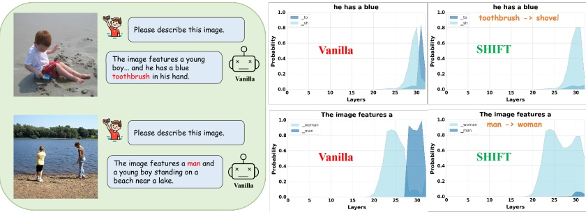

Figure 9. SHIFT effectively suppresses token probability mutations caused by injected hallucinated information.

Table 4. GPT-4v assisted hallucination evaluation results on the MSCOCO dataset. The average scores of the three decoding methods are reported, and higher scores indicate less hallucinations.

<table border=1 style='margin: auto; word-wrap: break-word;'><tr><td rowspan="2">Method</td><td colspan="2">LLaVA-1.5 [34]</td><td colspan="2">mPLUG-Owl2 [47]</td><td colspan="2">InstructBlip [12]</td></tr><tr><td style='text-align: center; word-wrap: break-word;'>C</td><td style='text-align: center; word-wrap: break-word;'>D</td><td style='text-align: center; word-wrap: break-word;'>C</td><td style='text-align: center; word-wrap: break-word;'>D</td><td style='text-align: center; word-wrap: break-word;'>C</td><td style='text-align: center; word-wrap: break-word;'>D</td></tr><tr><td style='text-align: center; word-wrap: break-word;'>Vanilla</td><td style='text-align: center; word-wrap: break-word;'>5.72</td><td style='text-align: center; word-wrap: break-word;'>5.58</td><td style='text-align: center; word-wrap: break-word;'>5.16</td><td style='text-align: center; word-wrap: break-word;'>5.48</td><td style='text-align: center; word-wrap: break-word;'>5.98</td><td style='text-align: center; word-wrap: break-word;'>5.72</td></tr><tr><td style='text-align: center; word-wrap: break-word;'>SHIFT</td><td style='text-align: center; word-wrap: break-word;'>6.56</td><td style='text-align: center; word-wrap: break-word;'>5.82</td><td style='text-align: center; word-wrap: break-word;'>5.84</td><td style='text-align: center; word-wrap: break-word;'>5.64</td><td style='text-align: center; word-wrap: break-word;'>6.82</td><td style='text-align: center; word-wrap: break-word;'>5.80</td></tr></table>

ory usage of various methods on LLaVA-1.5, with the results shown in Table 5. SHIFT significantly outperforms the baselines in inference speed, being approximately 1.5 times faster than VCD/ICD and 6 times faster than OPERA. Contrastive decoding methods like VCD and ICD require inference on both the original input and a perturbed one, doubling the inference time. OPERA reduces hallucinations by penalizing overconfident candidates and performing iterative backtracking, which involves multiple rollbacks, significantly increasing time costs. In contrast, SHIFT fuses consistent features from shallow layers, allowing it to work with any decoding, while requiring only a single backtracking step and re-inferring from the mutation layers, which minimally impacts the inference speed. When the mutation layers are near the output layer, the inference time is almost identical to that of the vanilla.

Table 5. Average cost on the CHAIR benchmark, using an NVIDIA A6000 GPU.

<table border=1 style='margin: auto; word-wrap: break-word;'><tr><td style='text-align: center; word-wrap: break-word;'>Method</td><td style='text-align: center; word-wrap: break-word;'>Vanilla</td><td style='text-align: center; word-wrap: break-word;'>VCD [25]</td><td style='text-align: center; word-wrap: break-word;'>ICD [46]</td><td style='text-align: center; word-wrap: break-word;'>OPERA [19]</td><td style='text-align: center; word-wrap: break-word;'>SHIFT</td></tr><tr><td style='text-align: center; word-wrap: break-word;'>Time (ms)</td><td style='text-align: center; word-wrap: break-word;'>1700</td><td style='text-align: center; word-wrap: break-word;'>3582</td><td style='text-align: center; word-wrap: break-word;'>3580</td><td style='text-align: center; word-wrap: break-word;'>16657</td><td style='text-align: center; word-wrap: break-word;'>2519</td></tr><tr><td style='text-align: center; word-wrap: break-word;'>Memory (MB)</td><td style='text-align: center; word-wrap: break-word;'>15296</td><td style='text-align: center; word-wrap: break-word;'>16100</td><td style='text-align: center; word-wrap: break-word;'>16072</td><td style='text-align: center; word-wrap: break-word;'>27748</td><td style='text-align: center; word-wrap: break-word;'>15746</td></tr></table>

#### 4.3. Visualization of Token Probabilities

To more intuitively demonstrate SHIFT's hallucination mitigation capabilities, we visualize the probability changes of hallucinated tokens before and after applying our method in Figure 9. For both images, the probabilities of hallucinated tokens ("toothbrush" and "man") suddenly rises in deeper layers, indicating that mutated information contains hallucinated knowledge, causing the model's output to deviate from the input features. Fortunately, after applying SHIFT, the disruptive information is smoothed using continuous knowledge from the model's earlier layers. This effectively eliminates the hallucinated information, significantly lowering the probability of hallucinated tokens and enabling the model to produce accurate descriptions. We must admit a challenge of SHIFT is that when hallucinations occur in very early layers, a secondary mutation may appear in deeper layers after applying SHIFT, thus further processing is needed to prevent re-introducing hallucinations.

### 5. Conclusion

This paper deeply analyzes information flow within MLLMs, revealing information mutations in deep layers by examining differences of representation between adjacent layers. The mutations may contain hallucinated knowledge, potentially leading the model to produce outputs not faithful to the input. Therefore, we propose SHIFT, which aims to mitigate hallucinations by tuning the information flow. This method identifies mutation layers by tracking the differences in information across layers, and smooths out the injected knowledge using continuous information from the previous layers. Experimental results demonstrate SHIFT's superior hallucination mitigation performance across various benchmarks and metrics.

## Acknowledgements

This work was supported in part by National Natural Science Foundation of China under grant No.62371450.