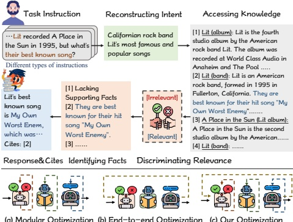

# Synergistic Multi-Agent Framework with Trajectory Learning for Knowledge-Intensive Tasks

Shengbin Yue $ ^{1} $, Siyuan Wang $ ^{2} $, Wei Chen $ ^{3} $, Xuanjing Huang $ ^{1} $, Zhongyu Wei $ ^{1*} $

 $ ^{1} $ Fudan University, Shanghai, China

 $ ^{2} $ University of Southern California, Los Angeles, USA

 $ ^{3} $ Huazhong University of Science and Technology, Wuhan, China

sbyue23@m.fudan.edu.cn, sw_641@usc.edu, lemuria_chen@hust.edu.cn, {xjhuang,zywei}@fudan.edu.cn

## Abstract

Recent advancements in Large Language Models (LLMs) have led to significant breakthroughs in various natural language processing tasks. However, generating factually consistent responses in knowledge-intensive scenarios remains a challenge due to issues such as hallucination, difficulty in acquiring long-tailed knowledge, and limited memory expansion. This paper introduces SMART, a novel multi-agent framework that leverages external knowledge to enhance the interpretability and factual consistency of LLM-generated responses. SMART comprises four specialized agents, each performing a specific sub-trajectory action to navigate complex knowledge-intensive tasks. We propose a multi-agent co-training paradigm, Long Short-Trajectory Learning, which ensures synergistic collaboration among agents while maintaining fine-grained execution by each agent. Extensive experiments on five knowledge-intensive tasks demonstrate SMART's superior performance compared to widely adopted knowledge internalization and knowledge enhancement methods. Our framework can extend beyond knowledge-intensive tasks to more complex scenarios.

Code — https://github.com/yueshengbin/SMART

## Introduction

Researchers continue to pursue empowering intelligent systems to generate factually consistent responses in knowledge-intensive tasks (Singhal et al. 2022; Yue et al. 2023a; Wang et al. 2022a). Although Large Language Models (LLMs) internalize substantial world knowledge within their parameter memory, they still suffer from fabricating facts, due to their inherent drawbacks, e.g., hallucination (Ji et al. 2023), trouble in acquiring long-tailed knowledge (Kandpal et al. 2023) and struggle to expand their memory (De Cao, Aziz, and Titov 2021). These issues significantly underscore the necessity of incorporating external knowledge from non-parametric (i.e., retrieval-based) memories.

Current methods typically augment LLMs with retrieved knowledge to generate responses, which face three main challenges. (1) Complex query intent: the diverse nature (semantics and form) of instructions (e.g., multiple choice,

Figure 1: Example of our long trajectory for knowledge-intensive scenarios (Top) and optimization comparison of multi-agent frameworks (Bottom). Solid and dashed arrows indicate inference and optimization paths, respectively.

multi-turn dialogue, and complex questions) leads to confusion regarding the query intent of knowledge. (2) Distractors in retrieved knowledge: knowledge retrieval inevitably introduces noises of varying granularity (document and sentence), with irrelevant documents and superfluous spans distracting the response and resulting in more severe hallucinations. (3) Insufficient knowledge utilization: LLMs tend to rely more on their implicit knowledge (parameter memory) rather than fully exploiting provided external facts (Huang et al. 2023). This fact-following disloyalty invalidates the knowledge incorporation process. Existing knowledge enhancement efforts (Shi et al. 2023; Ma et al. 2023; Asai et al. 2023) do not comprehensively address these multi-stage challenges. To this end, we propose a multi-agent framework, SMART, to integrate different actions to tackle all challenges within complex knowledge-intensive tasks, where each agent performs a specific action. This comprises an Intent Reconstructor to clarify knowledge intents, a Knowledge Retriever to access external knowledge based on intent, a Fact Locator to evaluate retrieved knowledge and