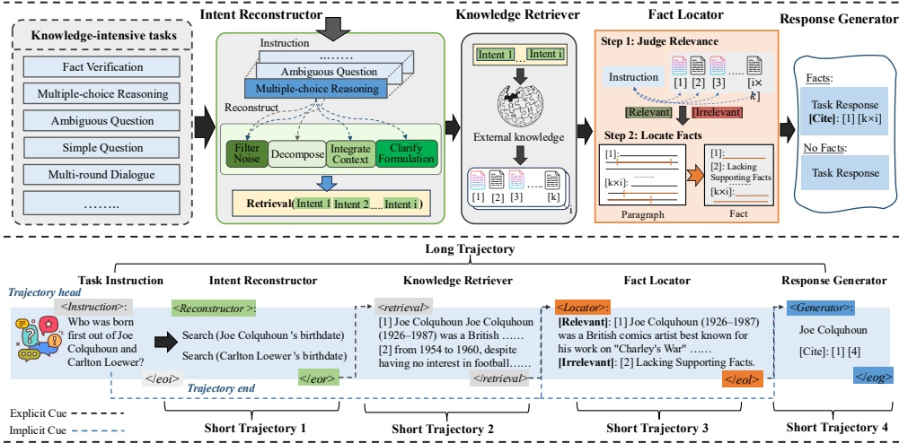

Figure 2: Overview of our multi-agent framework with long- and short-trajectory learning. This framework incorporates four agents: intent reconstructor, knowledge retriever, fac locator, and response generator.

Response Generator. The  $ A_{g} $ agent finally generates responses to user instructions. When facts are provided, it adjusts its knowledge preferences to adhere to them, and ultimately outputs citations to validate loyalty further. In the absence of such information, the response generator relies on its knowledge memory to formulate responses.

Inference Overview. The systematic procedure is delineated in the following steps:  $ A_i $ first mines the explicit intent  $ \bar{q} = \{q_1, q_2, ..., q_m\} $ from the instruction  $ x $. Next,  $ A_r $ retrieves top- $ k $ knowledge documents  $ \bar{d} = \{d_1, d_2, ..., d_{k \times m}\} $ using each intent  $ q_m $. Then,  $ A_l $ determines each relevant knowledge passage and further locates the fact span  $ f \subset d_{k \times m} $. Finally,  $ A_g $ utilizes the previous execution trajectory to generate response  $ y $ and citations when facts exist, otherwise  $ A_g $ utilizes only  $ x $. In the  $ t $-th step, the Agent  $ A $ generates a response  $ r_t $ and a head token  $ h_{t+1} $ of the next trajectory based on the current state of the system:

 $$ r_{t},h_{t+1}=\mathcal{A}\left(x,\tau_{t-1}\right), $$ 

where  $ \tau_{t-1} = \{h_1, r_1, e_1, ..., h_{t-1}, r_{t-1}, e_{t-1}\} $ denotes the previous execution trajectory.  $ e $ denotes the trajectory end token. In addition,  $ A_i $,  $ A_l $ and  $ A_g $ are built upon same LLMs to fulfill their roles. The pseudo-code for inference is referenced in Appendix.

## Trajectory Dataset Construction

To implement long-short trajectory learning to optimize our multi-agent framework, we construct the Trajectory dataset. We collect samples from over 12 knowledge-intensive tasks to ensure coverage of various instruction semantics and formats, such as fact verification (Thorne et al. 2018), dialogue (Dinan et al. 2018; Anantha et al. 2021), open-domain Q&A (Kwiatkowski et al. 2019; Stelmakh et al. 2022; Geva et al. 2021), and commonsense reasoning (Mihaylov et al. 2018; Huang et al. 2019). Detailed statistics are in Table 5 of Appendix. Our dataset contains two components: the long-trajectory subset and the short-trajectory subset. The data construction follows two distinct principles:

Long-trajectory subset. The long-trajectory subset aims to precisely mimic our multi-agent framework inference-time process, which emphasizes the synergy and logical interaction between agents. Existing work (Asai et al. 2023) has demonstrated the effectiveness of the powerful LLM (e.g., GPT3.5, GPT4 (Achiam et al. 2023)) as a critic model. Given an input-output pair  $ (x, y) $, we create supervised data under the guide of the retrieval (R) and critic model (C). We enable C to unleash the knowledge intents  $ \bar{q} $ in x according to the instruction type. Then, R retrieves the top-k knowledge documents based on every  $ \bar{q} $. For each document, C further evaluates whether the passage is relevant based on  $ (x, y) $. If a passage is relevant, C further locates and extracts the fact spans. Finally, we combine the data and insert the trajectory header and end token (e.g., ⟨Reconstructor⟩, ⟨/eor⟩) into each trajectory. Trajectory tokens are identifiers that serve as the skeleton of the multi-agent framework. In total, we construct 142,507 elaborated instances.

Short-trajectory subset. Unlike the long-trajectory subset, the short-trajectory subset facilitates the training of individual capabilities for each intelligent agent. This isolation allows us to acquire data directly from a huge amount of existing knowledge-intensive tasks through some simple processing. Thus, we sample from the established NLP and SFT datasets, appending the requisite trajectory header and