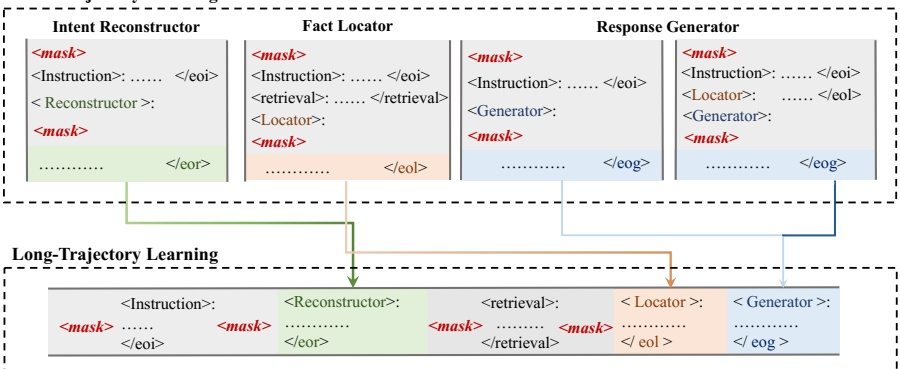

Figure 3: Overview of Long-Short Trajectory Learning. It consists of two stages, for short trajectory learning, under a given trajectory head, requires insight into the various explicit and implicit signals in each particular task. For long-trajectory learning, LLM executes the entire process by predicting different trajectory tokens, ensuring the synergism of different short-trajectories.

<table border=1 style='margin: auto; word-wrap: break-word;'><tr><td rowspan="2">Type</td><td colspan="2">Trajectory Tokens</td><td rowspan="2">Input</td><td rowspan="2">Output</td></tr><tr><td style='text-align: center; word-wrap: break-word;'>Head</td><td style='text-align: center; word-wrap: break-word;'>End</td></tr><tr><td style='text-align: center; word-wrap: break-word;'>$ \mathcal{A}_i $</td><td style='text-align: center; word-wrap: break-word;'>&lt;Reconstructor&gt;</td><td style='text-align: center; word-wrap: break-word;'>&lt;/eor&gt;</td><td style='text-align: center; word-wrap: break-word;'>x</td><td style='text-align: center; word-wrap: break-word;'>$ \bar{q} $</td></tr><tr><td style='text-align: center; word-wrap: break-word;'>$ \mathcal{A}_r $</td><td style='text-align: center; word-wrap: break-word;'>&lt;retrieval&gt;</td><td style='text-align: center; word-wrap: break-word;'>&lt;/retrieval&gt;</td><td style='text-align: center; word-wrap: break-word;'>$ \bar{q} $</td><td style='text-align: center; word-wrap: break-word;'>$ \bar{d} $</td></tr><tr><td style='text-align: center; word-wrap: break-word;'>$ \mathcal{A}_l $</td><td style='text-align: center; word-wrap: break-word;'>&lt;Locator&gt;</td><td style='text-align: center; word-wrap: break-word;'>&lt;/eol&gt;</td><td style='text-align: center; word-wrap: break-word;'>x,  $ \bar{d} $</td><td style='text-align: center; word-wrap: break-word;'>$ \gamma,\bar{f} $</td></tr><tr><td style='text-align: center; word-wrap: break-word;'>$ \mathcal{A}_g $</td><td style='text-align: center; word-wrap: break-word;'>&lt;Generator&gt;</td><td style='text-align: center; word-wrap: break-word;'>&lt;/eog&gt;</td><td style='text-align: center; word-wrap: break-word;'>x,  $ \bar{d}/x $</td><td style='text-align: center; word-wrap: break-word;'>y</td></tr></table>

Table 1: Four types of trajectory tokens.  $ x $,  $ \bar{q} $,  $ \bar{d} $,  $ \gamma $,  $ \bar{f} $ and  $ \bar{y} $ indicate instruction, intent, knowledge document, relevance tag, fact evidence and response, respectively.

end token. Note that the existing NLP datasets do not fulfill our requirements for intent reconstructing, we employ the methodology utilized in the long-trajectory subset collection. Table 1 exhibits the inputs and outputs of each short trajectory under the responsibility of each agent. In addition, the response generator contains two types of inputs to help adapt its knowledge preferences. We construct a total of 359,791 instances.

To summarize. Two keys are in the construction: the Long-trajectory subset is crafted to emphasize synergy, and the Short-trajectory subset can be easily accessed in large quantities to emphasize uniqueness. Refer to Appendix Sec.A for the detail of data construction.

## Long-Short Trajectory Learning

Effectively fine-tuning a trajectory system consisting of multi-agents is a complex task: on the one hand, each agent has its specific trajectory signals of attention. On the other hand, the transformation between different trajectories requires the collaboration of the agents. In addition, the cost of trajectory data construction for a multi-agent framework greatly hinders the development of such systems. To this end, we propose Long-Short Trajectory Learning for our multi-agent framework, which consists of two stages, Short Trajectory and Long Trajectory Learning. As shown in Figure 3, Under the guidance of the trajectory head-end token pairs, the intuition is that Short Trajectory Learning first delineates the responsibilities of each agent to develop their unique capabilities, and then Long Trajectory Learning learns the interactions between them. This can be understood as initially activating each agent that masters short trajectories within a broader trajectory framework, and then exploring the interconnections between those agents to navigate the full long trajectory.

Short Trajectory Learning. Short Trajectory Learning is the training of individual capabilities for a single agent. In the context of a long trajectory, it is important to note that short trajectories spanning multiple steps do not necessarily exhibit a strong dependence on preceding short trajectories. To illustrate this point, consider the case of a fact locator, which primarily relies on the original user query and the retrieved results, rather than having a strict dependence on the queries generated in Intent Reconstructor. Similarly, the Response Generator necessitates only the question itself or a combination of the question and the located facts. As shown in Figure 3, the short trajectory learning first activates each short agent in the framework to focus on the fine-grained signals. Given the short-trajectory subset  $ \mathcal{D}_{\text{short}} = \{\mathcal{D}_{\text{intent}}, \mathcal{D}_{\text{locator}}, \mathcal{D}_{\text{generator}}\} $, we initialize a pre-trained LLM and train it on  $ \mathcal{D}_{\text{short}} $. For each example  $ \{(x_i; h_i), (y_i; e_i)\} \subset \mathcal{D}_{\text{short}} $, we use a standard conditional language modeling objective, maximizing likelihood:

 $$ \mathcal{L}\left(\mathcal{D}_{s h o r t}\right)=\sum_{i}\log P_{L M}\left(y_{i};e_{i}\mid x_{i};h_{i}\right), $$ 

Given the inputs and trajectory header, the agent learns to predict the outputs, i.e., delineate different belonging trajectories for the agent to make them understand the fine-grained