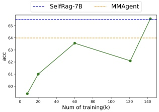
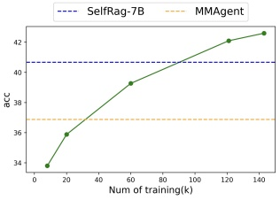
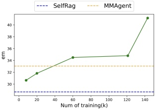

(a) ARC-C

(b) PopQA

(c) ASQA

Figure 4: Effects of long-trajectory training data size (K) on three tasks, ARC-C, PopQA and ASQA.

and ASQA with our SelfRAG and MMagent models. As shown in Figure 4, an increase in data size generally leads to improved performance across all datasets. Notably, by utilizing 60k data instances, SMART outperformed SelfRAG, which employs 120k samples. This demonstrates the significant advantage of our learning approach in markedly enhancing the performance of multi-agent framework.

## Related Work

Trajectory Learning. Trajectory learning aims to allow agent systems to complete a complex task or scenario through a series of interconnected phases, which requires a profound understanding of both global and local dimensions. Some methods (Chen et al. 2023; Song et al. 2023; Kong et al. 2023; Asai et al. 2023; Sun et al. 2022; Mou, Wei, and Huang 2024) enable agent learning trajectory via providing crafted prompt or tuning, which may not consistently yield high performance in every phase. Moreover, independently modules (Liu et al. 2023; Shen et al. 2024; Ma et al. 2023; Xu, Shi, and Choi 2023; Wang et al. 2023) can be combined with agent to implement trajectory inference, while this integration confers robust isolated capabilities, the gap between modules might lead to cumulative errors throughout the trajectory process. In this paper, we introduce long-short trajectory learning, which equips multiagent systems with the ability to not only grasp the logic connecting steps but also to refine each step. Our approach is scalable to increasingly complex scenarios.

Knowledge Enhancement Methods. Ensuring fact-consistent responses is a core goal of intelligent systems research (Wang et al. 2022b; Tu et al. 2024b,a, 2023; Yue et al. 2024, 2023b; Gao et al. 2024). LLMs parameterize knowledge by training on gargantuan textual corpora. However, LLMs suffer from hallucination (Ji et al. 2023), trouble in acquiring long-tailed fact (Kandpal et al. 2023) and struggle to expand their parametric knowledge. For knowledge-intensive scenarios, existing methods (Izacard et al. 2023; Sun et al. 2020) usually assist LLMs by integrating non-parametric knowledge. Recent advances incorporated retrievers (Asai et al. 2023; Shi et al. 2023; Lin et al. 2023) to augment LLMs. The efficacy of non-parametric knowledge collaboration in improving task performance significantly relies on the relevance of the acquired knowledge and the level of knowledge utilization by the LLM itself. However, existing work has not comprehensively confronted these challenges. Some works (Xu, Shi, and Choi 2023; Ma et al. 2023) simply select relevant knowledge and demonstrate better intentions by combining separate modules. Self-RAG (Asai et al. 2023) integrates specialized feedback tokens into the language model to assess the necessity for retrieval and to verify the relevance, support, or completeness of the output. Unlike existing approaches, we introduce a novel multi-agent framework that addresses these challenges with trajectory learning.

## Conclusions

In this paper, we introduce SMART, a novel multi-agent framework that addresses the challenges of generating factually consistent responses in knowledge-intensive tasks. By leveraging external knowledge and employing specialized agents, SMART enhances the interpretability and factual consistency of LLMs generated responses. Our proposed Long- and Short-Trajectory Learning paradigm ensures synergistic collaboration among agents while maintaining fine-grained execution, enabling the framework to navigate complex knowledge-intensive tasks effectively. Empirical results on five diverse tasks demonstrate SMART's superior performance compared to SOTA pre-trained and instruction-tuned LLMs, as well as widely adopted methods. SMART highlights the importance of integrating external knowledge and employing multi-agent systems to tackle the limitations of LLMs in knowledge-intensive scenarios.

Future work. One is that our framework currently executes sequentially without iterative optimization, which may lead to insufficient knowledge retrieval for multi-hop problems. However, this can be addressed by adding loop arrows between the Fact Locator and Intent Reconstructor agents. Another is that our retriever is not trained in the whole process, although it can be incorporated into the training process using existing techniques. We envision our framework as a general paradigm that extends beyond knowledge-intensive tasks to more complex scenarios, enabling any multi-agent framework to internalize tailored trajectories.