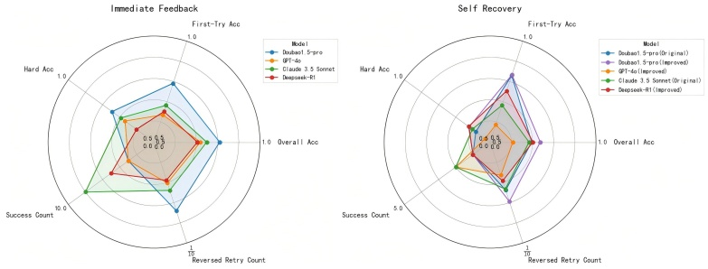
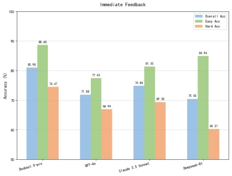
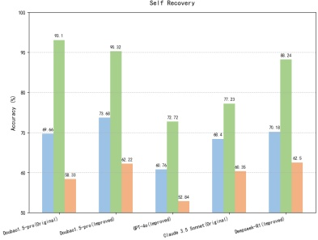

Figure 6: Model multidimensional performance in Immediate Feedback and Self Recovery modes.

Figure 7: Accuracy disparities across Models: overall, easy & hard tasks.

#### 5.2.2 Insights of Distinctions Between Two Modes

To investigate how short-term and long-term memory settings affect model behavior, we compare performance under two task modes. Immediate Feedback mode provides corrective signals after each wrong choice, effectively mimicking short-term memory and aiding models in adjusting quickly. In contrast, Self Recovery better simulates real long-term memory scenarios by removing such signals, requiring the model to navigate the narrative without external guidance.

Unsurprisingly, all models perform worse under Self Recovery mode, as shown by the consistent drop in Overall Accuracy and Success Count. This highlights the increased difficulty of sustained sequential reasoning and knowledge retention without short-term feedback. To alleviate task failure in extreme cases, we introduce an auxiliary intervention metric: Number of Choices Reaching Error Threshold (we set the threshold to 9). If a model makes the same mistake more than 9 times, it is prompted with the correct answer. Only Claude 3.5 and GPT-4o never reach this threshold, suggesting that their task completions in Self Recovery mode are entirely due to self-correction and internal reasoning without any artificial hints. This contrasts sharply with other models, indicating that they excel in sustained sequential reasoning and knowledge retention.

Surprisingly, despite the overall decline in performance across models in Self Recovery, two metrics: Longest Consecutive Correct Sequence and First-Try Accuracy actually increase for several models (Figure 8). This amazing trend emphasizes that while short-term feedback aids local correction, it may also disrupt long-horizon coherence. By removing it, models foster a deeper narrative understanding (knowledge retention) and more coherent reasoning (sequential reasoning) and we better expose the true limitations and strengths of long-term memory in different models.