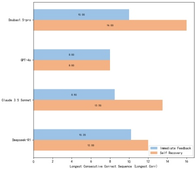
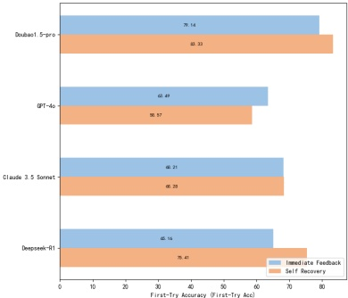

Figure 8: Mode impact on models: First-Try Accuracy & Longest Consecutive Correct Sequence metrics.

A notable case is Deepseek-R1. While it does not lead in most individual metrics, it demonstrates remarkable consistency across both Immediate Feedback and Self Recovery modes. This stable performance suggests that the model is capable of making accurate revisions during backtracking.

### 5.3 Failure Case Study

In evaluating long-term memory capabilities with StoryBench, we identified two principal types of failure that reflect limitations in current language models, corresponding to the core dimensions of knowledge retention and sequential reasoning.

The most prominent issue in knowledge retention was the failure to preserve contextual consistency over extended narratives. Models frequently made decisions that contradicted earlier story events, character motivations, or established world logic. This suggests difficulty in integrating and maintaining distributed information over long spans of interaction, especially when the necessary context spans dozens of turns. Even when the relevant facts appeared in the prompt, models struggled to apply them coherently, indicating limitations beyond simple factual recall.

In terms of sequential reasoning, a critical failure case was the inability to repair long-term or multi-error decisions. In Self Recovery mode, successful completion often required models to trace errors back across multi-step causal chains and revise earlier decisions (even multiple choices in combination) that affected downstream outcomes. However, most models exhibited shallow search strategies, typically backtracking only one or two steps rather than engaging in deeper reasoning about the narrative structure or goal shifts. This myopic behavior led to persistent failure when task success depended on understanding and correcting long-term dependencies. We retained such failures to reflect the true upper-bound difficulty of long-term memory reasoning.

Other failures such as format mismatches (e.g., returning option indices instead of decision point IDs), content filtering blocks, server timeouts, or rare instances of hallucinated explanations were also observed but were comparatively infrequent. These were retained in evaluation for completeness but are not the focus of our analysis.

These diverse failure cases underscore the challenge of StoryBench and emphasize the need for more robust memory integration, format alignment, and long-range error correction in current foundation models.

## 6 Limitations

While our benchmark provides a comprehensive evaluation of long-term memory capabilities in large language models through complex, branching narrative tasks, it has several limitations. First, the scenarios are derived from a single interactive fiction domain and the interactive environment is