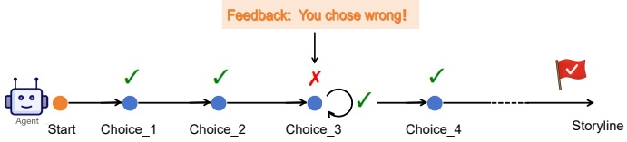
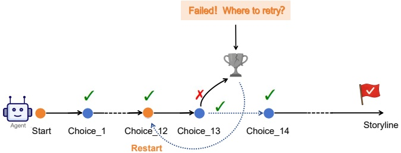

### 3.3 Two Task Modes for Evaluating LTM

To explore different aspects of memory utilization, we design two complementary task modes. The dual-mode setup allows StoryBench to probe both short-horizon reactive memory and long-horizon strategic recall (LTM), offering a comprehensive view of how models navigate extended, decision-heavy interactions and revealing not just whether a model can remember facts, but whether it can strategically reason across time, self-correct, and navigate branching storylines over extended sequences.

Immediate Feedback: Designed to evaluate a model’s responsiveness to error signals, this mode simulates situations where feedback is available at each turn. After a wrong choice, the model is told the outcome and prompted to retry (Figure 1), allowing us to examine its short-term adjustment ability and interactive learning dynamics.

Figure 1: Immediate Feedback. The model is informed immediately after each incorrect choice and prompted to retry until the correct option is selected.

Self Recovery: This mode suppresses feedback, mimicking scenarios where incorrect decisions propagate through multiple scenes, potentially ending the game. The model is then challenged to trace back to the error's origin and recover (Figure 2). This stresses long-term causal reasoning and memory retention under uncertainty.

Figure 2: Self Recovery. An incorrect choice leads to a failure ending either immediately or after several scenes. The model is then asked to identify the earliest point in the story where it believes the incorrect decision occurred and to attempt recovery from that point.

### 3.4 Tailored Metrics for Assessing LTM Models

To comprehensively evaluate long-term memory (LTM) capabilities in language models, StoryBench introduces a set of targeted metrics covering two essential cognitive dimensions: knowledge retention and sequential reasoning.

We define a decision sequence $\{c_1, c_2, ..., c_T\}$, where $c_t \in \{0, 1\}$ denotes whether the model selected the correct option (1) or not (0) at step $t$.